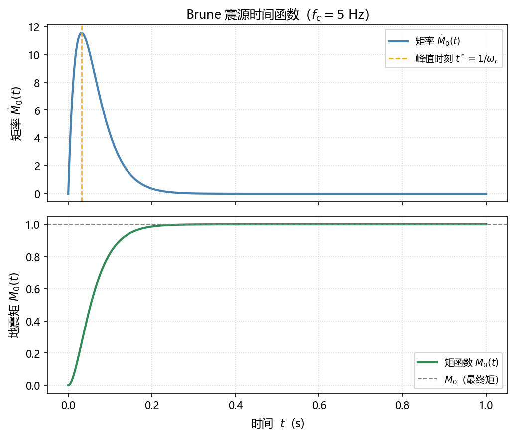
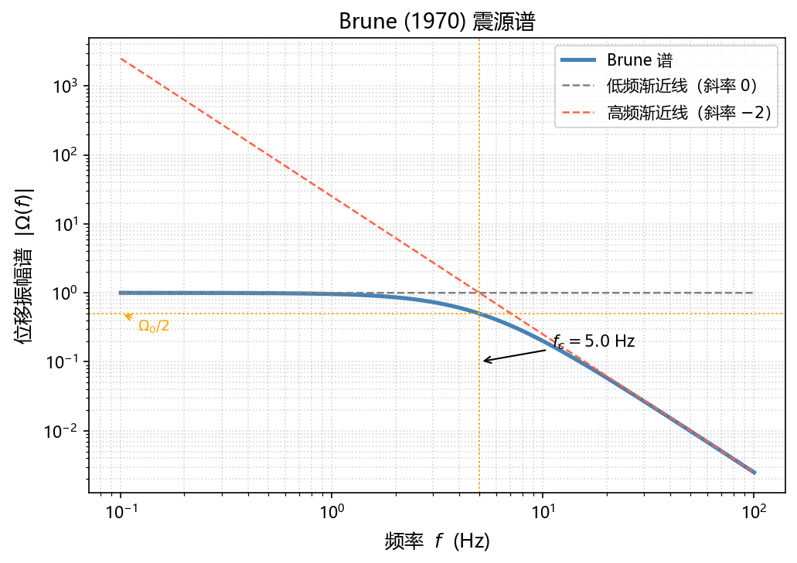
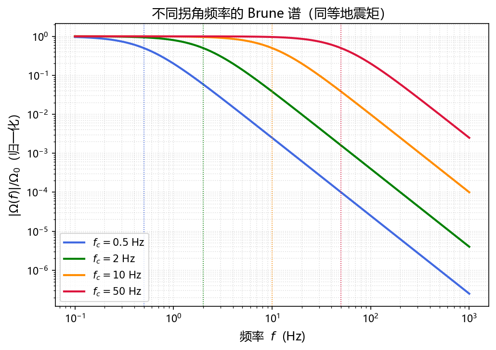

# Brune Source Spectrum Model

## Introduction

The Brune model, proposed by Brune (1970, 1971), is the most widely used source spectrum model in seismology. It simplifies fault rupture as an **instantaneous stress drop on a circular crack**, describing far-field radiated displacement with just a few parameters — seismic moment $M_0$, corner frequency $f_c$, and stress drop $\Delta\sigma$.

The model's core prediction is that the far-field S-wave displacement amplitude spectrum follows:

$$
\boxed{|\Omega(f)| = \frac{\Omega_0}{1 + (f/f_c)^2}}
$$

Flat at low frequencies, decaying as $f^{-2}$ at high frequencies — hence the name **$\omega^{-2}$ model** or **omega-square model**.

---

## Physical Model

### Basic Assumptions

| Assumption | Description |
|------------|-------------|
| Circular fault | Fault plane is a circular crack of radius $r$ |
| Instantaneous uniform stress drop | Full fault plane unloads simultaneously at $t=0$; stress drop $\Delta\sigma$ is constant |
| Infinite homogeneous medium | Velocity gradients and heterogeneity are neglected |
| Far-field approximation | Observation distance $R \gg r$; only the radiation field is considered |
| S-wave dominant | Displacement spectrum is dominated by S-waves; P-waves have a similar form with different constants |

### Source Geometry

The fault plane is a disk of radius $r$ with area $S = \pi r^2$. The seismic moment is determined by slip $D$ and shear modulus $\mu = \rho\beta^2$:

$$
M_0 = \mu \bar{D} S = \rho\beta^2 \bar{D} \pi r^2
$$

where $\bar{D}$ is the average slip over the fault plane, $\rho$ is medium density, and $\beta$ is S-wave velocity.

---

## Far-field Displacement and Seismic Moment

### Far-field Displacement of a Point Source

For a point source, the far-field S-wave displacement is (Aki & Richards, 2002):

$$
u^S(\mathbf{x}, t) = \frac{\mathcal{R}_{\theta\phi}}{4\pi\rho\beta^3 R}\, \dot{M}_0\!\left(t - \frac{R}{\beta}\right)
$$

where:

- $\mathcal{R}_{\theta\phi}$: S-wave radiation pattern coefficient
- $R$: hypocentral distance
- $\dot{M}_0(t)$: seismic moment rate (time derivative of seismic moment)
- $t - R/\beta$: travel-time delay for S-wave propagation

!!! note "Physical Meaning"
    Far-field displacement is proportional to the moment rate $\dot{M}_0(t)$, not the moment $M_0(t)$ itself. The moment rate reflects the **velocity** of fault slip — how fast the source radiates energy.

### Frequency-Domain Expression

Taking the Fourier transform of both sides (the phase factor $e^{-i\omega R/\beta}$ affects only phase, not amplitude):

$$
|\Omega^S(\omega)| = \frac{\mathcal{R}_{\theta\phi}}{4\pi\rho\beta^3 R}\, |\dot{M}_0(\omega)|
$$

Therefore, **the shape of the amplitude spectrum is entirely determined by the Fourier transform of the moment rate** $|\dot{M}_0(\omega)|$.

---

## Derivation of the Source Time Function

### Moment Function and Moment Rate Function

Brune's physical picture: at $t=0$, stress on the fault plane drops instantaneously and the fault slips freely. He argued that the moment function satisfies a critically damped oscillator response:

$$
M_0(t) = M_0 \left[1 - (1 + \omega_c t)\,e^{-\omega_c t}\right] H(t)
$$

where $H(t)$ is the Heaviside step function and $\omega_c = 2\pi f_c$ is the corner angular frequency.

**Verification of boundary conditions:**

- At $t = 0$: $M_0(0) = M_0[1 - 1 \cdot 1] = 0$ ✓ (no slip before rupture)
- As $t \to \infty$: $e^{-\omega_c t} \to 0$, so $M_0(\infty) = M_0$ ✓ (full seismic moment achieved)

The **moment rate function** is the time derivative of the moment function:

$$
\dot{M}_0(t) = \frac{d M_0(t)}{dt} = M_0\, \omega_c^2\, t\, e^{-\omega_c t}\, H(t)
$$

**Derivation:**

$$
\frac{d}{dt}\left[(1 + \omega_c t) e^{-\omega_c t}\right]
= \omega_c e^{-\omega_c t} + (1 + \omega_c t)(-\omega_c)e^{-\omega_c t}
= -\omega_c^2 t\, e^{-\omega_c t}
$$

Therefore:

$$
\dot{M}_0(t) = M_0 \cdot \omega_c^2 t\, e^{-\omega_c t}\, H(t)
$$

The moment rate starts at zero, peaks at $t^* = 1/\omega_c$, then decays exponentially:

$$
\dot{M}_0(t^*) = M_0\, \omega_c^2 \cdot \frac{1}{\omega_c} \cdot e^{-1} = \frac{M_0 \omega_c}{e}
$$

The figure below shows the time histories of moment rate and moment function for $f_c = 5\,\text{Hz}$:



### Fourier Transform of the Moment Rate Function

Taking the Fourier transform of $\dot{M}_0(t) = M_0\,\omega_c^2\, t\, e^{-\omega_c t}\, H(t)$:

$$
\dot{M}_0(\omega) = M_0\,\omega_c^2 \int_0^{+\infty} t\, e^{-\omega_c t}\, e^{-i\omega t}\, dt
= M_0\,\omega_c^2 \int_0^{+\infty} t\, e^{-(\omega_c + i\omega)\, t}\, dt
$$

Using the Laplace integral $\displaystyle\int_0^{+\infty} t\, e^{-at}\, dt = \frac{1}{a^2}$ with $a = \omega_c + i\omega$:

$$
\dot{M}_0(\omega) = M_0\,\omega_c^2 \cdot \frac{1}{(\omega_c + i\omega)^2}
$$

Amplitude spectrum:

$$
|\dot{M}_0(\omega)| = \frac{M_0\,\omega_c^2}{|\omega_c + i\omega|^2} = \frac{M_0\,\omega_c^2}{\omega_c^2 + \omega^2}
$$

Dividing numerator and denominator by $\omega_c^2$:

$$
|\dot{M}_0(\omega)| = \frac{M_0}{1 + (\omega/\omega_c)^2}
$$

---

## Brune Displacement Spectrum

### Amplitude Spectrum

Substituting the moment rate spectrum into the far-field displacement spectrum:

$$
|\Omega(\omega)| = \frac{\mathcal{R}_{\theta\phi}}{4\pi\rho\beta^3 R} \cdot \frac{M_0}{1 + (\omega/\omega_c)^2}
$$

Define the **low-frequency plateau**:

$$
\Omega_0 \equiv \frac{\mathcal{R}_{\theta\phi}\, M_0}{4\pi\rho\beta^3 R}
$$

Then the displacement amplitude spectrum is:

$$
\boxed{|\Omega(\omega)| = \frac{\Omega_0}{1 + (\omega/\omega_c)^2}}
$$

or equivalently, in terms of frequency $f$ ($\omega = 2\pi f$, $\omega_c = 2\pi f_c$):

$$
|\Omega(f)| = \frac{\Omega_0}{1 + (f/f_c)^2}
$$

### Asymptotic Behavior

**Low frequencies** ($f \ll f_c$):

$$
|\Omega(f)| \approx \Omega_0 = \text{const.}
$$

The spectrum is flat; the plateau $\Omega_0$ directly reflects $M_0$.

**High frequencies** ($f \gg f_c$):

$$
|\Omega(f)| \approx \Omega_0 \cdot \frac{f_c^2}{f^2} \propto f^{-2}
$$

The spectrum decays as $f^{-2}$ — the origin of the name "$\omega^{-2}$ model".

**At the corner** ($f = f_c$):

$$
|\Omega(f_c)| = \frac{\Omega_0}{2}
$$

Amplitude drops to half the plateau, corresponding to the $-3\,\text{dB}$ point.

### Log-log Spectral Slope

On a log-log plot:

$$
\log|\Omega(f)| = \log\Omega_0 - \log\left[1 + (f/f_c)^2\right]
$$

- $f \ll f_c$: slope $\approx 0$ (horizontal)
- $f \gg f_c$: slope $\approx -2$ (drops 2 decades per decade of frequency)
- Inflection point at $f_c$

---

## Low-frequency Plateau and Seismic Moment

### Inversion Formula

Starting from the definition of the low-frequency plateau:

$$
\Omega_0 = \frac{\mathcal{R}_{\theta\phi}\, M_0}{4\pi\rho\beta^3 R}
$$

Solving for seismic moment:

$$
M_0 = \frac{4\pi\rho\beta^3 R\, \Omega_0}{\mathcal{R}_{\theta\phi}}
$$

### Radiation Pattern Correction

In practice, the radiation pattern $\mathcal{R}_{\theta\phi}$ varies with station azimuth. It is typically averaged over multiple stations or azimuths, and a free-surface amplification factor $S_{\text{fs}}$ (usually 2) is applied:

$$
\boxed{M_0 = \frac{4\pi\rho\beta^3 R\, \Omega_0}{F \cdot S_{\text{fs}}}}
$$

where $F$ is the azimuthally averaged radiation pattern value (≈ 0.63 for S-waves).

!!! tip "Practical Significance"
    Reading the low-frequency plateau $\Omega_0$ (in m·s) from a spectrum, together with medium parameters and hypocentral distance, directly yields the seismic moment, and hence moment magnitude: $M_w = \frac{2}{3}\log_{10}M_0 - 6.07$.

---

## Corner Frequency and Source Dimension

### Physical Derivation

Brune (1970) argued that the time for S-waves to traverse the fault (the rupture rise time) determines the corner frequency:

For a circular fault of radius $r$, the S-wave travel time across the fault is approximately:

$$
t_r \sim \frac{r}{\beta}
$$

Therefore the corner frequency scales as:

$$
f_c \sim \frac{\beta}{r}
$$

Through a more rigorous radiation field calculation, Brune (1970) obtained the precise coefficient:

$$
f_c = \frac{0.37\,\beta}{r}
$$

or equivalently:

$$
r = \frac{k\,\beta}{f_c}, \quad k = 0.37
$$

The constant $k$ differs slightly across studies:

| Source | Wave type | $k$ |
|--------|-----------|-----|
| Brune (1970) | S-wave | 0.37 |
| Madariaga (1976) | S-wave | 0.21 |
| Madariaga (1976) | P-wave | 0.32 |

!!! warning "Important"
    Different references use different $k$ values. When computing stress drop, the $k$ value must be consistent throughout; they cannot be mixed.

### Source Radius and Moment Magnitude

When stress drop is approximately constant ($\Delta\sigma \sim 1\text{--}10\,\text{MPa}$), a larger seismic moment implies a larger source radius and lower corner frequency:

$$
M_0 \uparrow \implies r \uparrow \implies f_c \downarrow
$$

---

## Stress Drop

### Circular Crack Theory (Eshelby 1957)

For a circular crack in a homogeneous elastic medium, Eshelby (1957) gives the slip distribution under uniform stress drop $\Delta\sigma$:

$$
D(\xi) = \frac{24}{7\pi} \frac{\Delta\sigma}{\mu} \sqrt{r^2 - \xi^2}, \quad \xi \leq r
$$

where $\xi$ is the radial distance from the fault center.

### Calculation of Mean Slip

Integrating over the fault area to find the mean slip:

$$
\bar{D} = \frac{1}{\pi r^2}\int_0^r D(\xi) \cdot 2\pi\xi\, d\xi
= \frac{2}{r^2} \cdot \frac{24}{7\pi} \frac{\Delta\sigma}{\mu} \int_0^r \xi\sqrt{r^2 - \xi^2}\, d\xi
$$

Evaluating the inner integral with substitution $u = r^2 - \xi^2$, $du = -2\xi\,d\xi$:

$$
\int_0^r \xi\sqrt{r^2 - \xi^2}\, d\xi = \frac{1}{2}\int_0^{r^2} u^{1/2}\, du = \frac{r^3}{3}
$$

Substituting back:

$$
\bar{D} = \frac{2}{r^2} \cdot \frac{24}{7\pi} \cdot \frac{\Delta\sigma}{\mu} \cdot \frac{r^3}{3} = \frac{16}{7\pi} \cdot \frac{\Delta\sigma\, r}{\mu}
$$

### Derivation of Stress Drop from Seismic Moment

$$
M_0 = \mu\,\bar{D}\,\pi r^2 = \mu \cdot \frac{16}{7\pi}\frac{\Delta\sigma\, r}{\mu} \cdot \pi r^2 = \frac{16}{7}\,\Delta\sigma\, r^3
$$

Solving for stress drop:

$$
\boxed{\Delta\sigma = \frac{7}{16}\frac{M_0}{r^3}}
$$

### Expression in Terms of Observables

Substituting $r = k\beta/f_c$:

$$
\Delta\sigma = \frac{7}{16}\,\frac{M_0}{(k\beta/f_c)^3} = \frac{7}{16k^3}\,\frac{M_0\,f_c^3}{\beta^3}
$$

With Brune (1970)'s $k = 0.37$, $k^3 = 0.0507$:

$$
\Delta\sigma \approx 8.6\,\frac{M_0\,f_c^3}{\beta^3}
$$

This is the practical formula: given seismic moment $M_0$, corner frequency $f_c$, and S-wave velocity $\beta$, stress drop can be estimated directly.

### Typical Values

Crustal earthquake stress drops typically fall in the range:

$$
\Delta\sigma \sim 0.1 \text{--} 50\,\text{MPa}
$$

Most tectonic earthquakes cluster around $1\text{--}10\,\text{MPa}$, with a weak dependence on seismic moment — evidence of **earthquake self-similarity**: earthquakes of different sizes share similar stress drops.

---

## Network of Parameter Relationships

The three core parameters $M_0$, $f_c$, $\Delta\sigma$ are mutually constrained:

$$
\underbrace{M_0 = \frac{16}{7}\Delta\sigma\,r^3}_{\text{moment–stress–size}} \qquad
\underbrace{r = \frac{k\beta}{f_c}}_{\text{size–corner frequency}} \qquad
\underbrace{\Omega_0 = \frac{\mathcal{R}M_0}{4\pi\rho\beta^3 R}}_{\text{moment–plateau}}
$$

Given any two, the third can be derived — the basis of source parameter inversion.

---

## Python Examples

### Plotting the Brune Displacement Spectrum

```python
import numpy as np
import matplotlib.pyplot as plt

def brune_spectrum(f, omega0, fc):
    """
    Brune (1970) displacement amplitude spectrum

    Parameters
    ----------
    f      : frequency array (Hz)
    omega0 : low-frequency plateau (m·s)
    fc     : corner frequency (Hz)

    Returns
    -------
    amplitude spectrum array
    """
    return omega0 / (1 + (f / fc) ** 2)


# Parameters
f = np.logspace(-1, 2, 2000)   # 0.1 ~ 100 Hz
omega0 = 1.0                    # low-frequency plateau (normalized)
fc = 5.0                        # corner frequency 5 Hz

spec = brune_spectrum(f, omega0, fc)

# Asymptotes
low_freq_asymptote  = np.full_like(f, omega0)
high_freq_asymptote = omega0 * (fc / f) ** 2

# Plot
fig, ax = plt.subplots(figsize=(7, 5))

ax.loglog(f, spec,                lw=2.5, color='steelblue', label='Brune spectrum')
ax.loglog(f, low_freq_asymptote,  lw=1,   color='gray',   ls='--', label='Low-freq asymptote (slope 0)')
ax.loglog(f, high_freq_asymptote, lw=1,   color='tomato', ls='--', label=r'High-freq asymptote (slope $-2$)')

ax.axvline(x=fc, color='orange', lw=1, ls=':')
ax.axhline(y=omega0 / 2, color='orange', lw=1, ls=':')
ax.annotate(f'$f_c = {fc}$ Hz', xy=(fc, omega0/10),
            xytext=(fc*2, omega0/6), fontsize=10,
            arrowprops=dict(arrowstyle='->', color='k'))

ax.set_xlabel('Frequency $f$ (Hz)', fontsize=12)
ax.set_ylabel(r'Displacement spectrum $|\Omega(f)|$', fontsize=12)
ax.set_title('Brune (1970) Source Spectrum', fontsize=13)
ax.legend(fontsize=10)
ax.grid(True, which='both', ls=':', alpha=0.5)

plt.tight_layout()
plt.show()
```



### Comparing Multiple Corner Frequencies

```python
import numpy as np
import matplotlib.pyplot as plt

f = np.logspace(-1, 3, 3000)
fc_list = [0.5, 2, 10, 50]    # Hz
colors = ['royalblue', 'green', 'orange', 'crimson']

fig, ax = plt.subplots(figsize=(7, 5))

for fc, color in zip(fc_list, colors):
    spec = 1.0 / (1 + (f / fc) ** 2)
    ax.loglog(f, spec, lw=2, color=color, label=f'$f_c = {fc}$ Hz')
    ax.axvline(x=fc, color=color, lw=0.8, ls=':')

ax.set_xlabel('Frequency $f$ (Hz)', fontsize=12)
ax.set_ylabel(r'$|\Omega(f)| / \Omega_0$ (normalized)', fontsize=12)
ax.set_title('Brune spectra for different corner frequencies (same $M_0$)', fontsize=13)
ax.legend(fontsize=10)
ax.grid(True, which='both', ls=':', alpha=0.4)

plt.tight_layout()
plt.show()
```



### Computing Source Parameters from Spectral Measurements

```python
import numpy as np

def compute_source_params(omega0, fc, R,
                          rho=2700, beta=3500,
                          F=0.63, S_fs=2.0, k=0.37):
    """
    Compute source parameters from Brune spectral measurements.

    Parameters
    ----------
    omega0 : low-frequency plateau (m·s)
    fc     : corner frequency (Hz)
    R      : hypocentral distance (m)
    rho    : density (kg/m^3), default 2700
    beta   : S-wave velocity (m/s), default 3500
    F      : mean radiation pattern, default 0.63
    S_fs   : free-surface amplification, default 2.0
    k      : Brune constant, default 0.37

    Returns
    -------
    dict: M0 (N·m), Mw, r (m), delta_sigma (Pa)
    """
    M0 = 4 * np.pi * rho * beta**3 * R * omega0 / (F * S_fs)
    Mw = (2/3) * np.log10(M0) - 6.07
    r  = k * beta / fc
    delta_sigma = (7/16) * M0 / r**3

    return {"M0": M0, "Mw": Mw, "r": r, "delta_sigma": delta_sigma}


# Example
result = compute_source_params(
    omega0=1e-8,   # m·s
    fc=5.0,        # Hz
    R=100e3,       # 100 km
)

print(f"Seismic moment  M0 = {result['M0']:.3e} N·m")
print(f"Moment magnitude Mw = {result['Mw']:.2f}")
print(f"Source radius    r  = {result['r']:.0f} m")
print(f"Stress drop     Δσ  = {result['delta_sigma']/1e6:.2f} MPa")
```

---

## Corrections in Practice

The ideal Brune spectrum must be corrected for several effects before it can be compared with recorded seismograms.

### Path Effects

**Geometric Spreading:** Body wave amplitude decays as $1/R$, already included in the formula.

**Anelastic Attenuation:** The medium quality factor $Q$ causes exponential amplitude decay with propagation distance:

$$
|\Omega_{\text{obs}}(f)| = |\Omega_{\text{src}}(f)| \cdot \exp\!\left(-\frac{\pi f R}{\beta Q}\right)
= |\Omega_{\text{src}}(f)| \cdot e^{-\pi f t^*}
$$

where $t^* = R/(\beta Q)$ is the **attenuation operator**.

### High-frequency Cutoff (κ Attenuation)

Observed spectra often show a steeper rolloff above some frequency $f_{\max}$, described by the parameter $\kappa$ (kappa):

$$
|\Omega_{\text{obs}}(f)| \propto e^{-\pi \kappa f}
$$

$\kappa$ mainly reflects attenuation in the shallow low-$Q$ layer and is a station property ($\approx 10\text{--}100\,\text{ms}$).

### Complete Observed Spectrum Model

Combining all corrections, the observed amplitude spectrum is:

$$
|\Omega_{\text{obs}}(f)| = \frac{\mathcal{R}_{\theta\phi}\,M_0}{4\pi\rho\beta^3 R}
\cdot \frac{1}{1+(f/f_c)^2}
\cdot e^{-\pi f t^*}
\cdot e^{-\pi \kappa f}
\cdot I(f)
$$

where $I(f)$ is the inverse instrument response (instrument correction term).

### Site Effects

Near-surface soft sediments amplify ground motion and must be corrected empirically. Common methods include the horizontal-to-vertical spectral ratio (HVSR) or reference-site approaches.

---

## Extended and Alternative Models

### Boatwright (1980) Model

Changes the high-frequency decay to a steeper $f^{-4}$:

$$
|\Omega(f)| = \frac{\Omega_0}{\left[1 + (f/f_c)^4\right]^{1/2}}
$$

- High-frequency decay $\propto f^{-2}$ (same as Brune)
- Sharper spectral corner
- Better suited to some short-period radiation characteristics

### Madariaga (1976) Dynamic Rupture Model

Based on numerical simulations of fault dynamics, gives separate corner frequencies for P and S waves:

$$
f_c^P = \frac{0.32\,\alpha}{r}, \qquad f_c^S = \frac{0.21\,\beta}{r}
$$

where $\alpha$ is the P-wave velocity. P and S corner frequencies differ; their ratio is approximately 1.5.

### Double Corner Frequency Model

For complex rupture processes, two corner frequencies $f_1 < f_2$ are introduced:

$$
|\Omega(f)| = \frac{\Omega_0}{\left[1+(f/f_1)^2\right]^{1/2}\left[1+(f/f_2)^2\right]^{1/2}}
$$

Applicable to: multi-segment rupture, slow-slip events, secondary stress-drop processes.

### Model Comparison

| Model | High-freq slope | Key feature |
|-------|----------------|-------------|
| Brune (1970) | $-2$ | Simplest; most widely used |
| Boatwright (1980) | $-2$ | Sharper corner |
| Madariaga (1976) | $-2$ | Separate P/S corner frequencies |
| $\omega^{-3}$ model | $-3$ | Suited to some deep earthquakes |
| Double corner frequency | $-2$ | Multi-segment rupture |

---

## References

Brune, J. N. (1970). Tectonic stress and the spectra of seismic shear waves from earthquakes. *Journal of Geophysical Research*, 75(26), 4997–5009.

Brune, J. N. (1971). Correction. *Journal of Geophysical Research*, 76, 5002.

Aki, K. (1967). Scaling law of seismic spectrum. *Journal of Geophysical Research*, 72(4), 1217–1231.

Eshelby, J. D. (1957). The determination of the elastic field of an ellipsoidal inclusion, and related problems. *Proceedings of the Royal Society of London*, 241(1226), 376–396.

Madariaga, R. (1976). Dynamics of an expanding circular fault. *Bulletin of the Seismological Society of America*, 66(3), 639–666.

Boatwright, J. (1980). A spectral theory for circular seismic sources: simple estimates of source dimension, dynamic stress drop, and radiated seismic energy. *Bulletin of the Seismological Society of America*, 70(1), 1–27.

Aki, K., & Richards, P. G. (2002). *Quantitative Seismology* (2nd ed.). University Science Books.
