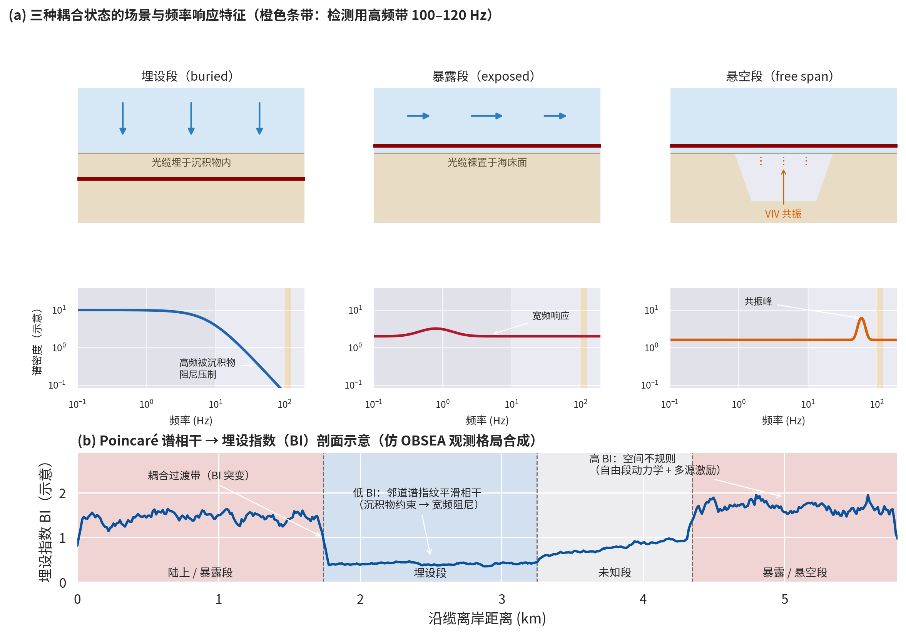

# DAS 光缆耦合状态的检测与评估

> 关键词：DAS、光缆耦合（cable coupling）、埋设状态（burial state）、Poincaré 谱相干、埋设指数（BI）、涡激振动（VIV）

## 引言

[DAS 基本原理](das.md)一章从理论上建立了光缆耦合的传递函数模型（套-芯耦合 $\eta_\text{fiber}$、介质耦合 $C_\text{med}(f)$ 与耦合刚度 $k_s$）。但在实际部署中，**耦合状态沿光缆是空间变化且未知的**：海底光缆可能一段埋于沉积物、一段暴露于海床、一段悬空跨越海沟；陆地光缆可能一段浅埋、一段裸铺、一段穿管。同一物理激励在不同耦合段产生截然不同的响应，若不掌握耦合状态的空间分布，环境噪声解释、事件检测和结构成像都会被系统性地误导。

本章关注的问题是：**如何直接从 DAS 数据本身检测和评估光缆的耦合状态**——无需人工震源、无需潜水员巡检、无需先验地质知识，实现近实时的自动化耦合制图。

## 四种耦合状态及其物理效应

海底光缆的耦合状态通常分为四类，各自的力学约束与频率响应截然不同：

| 耦合状态 | 力学约束 | 频率响应特征 |
|---------|---------|-------------|
| **埋设**（buried） | 沉积物围限增加有效质量、刚度与阻尼 | 低通型：中高频被沉积物阻尼压制，低频（重力波频段）保留且空间平滑 |
| **部分埋设**（partially buried） | 约束介于埋设与暴露之间，可能存在间歇性接触 | 过渡型，频响介于两者之间 |
| **暴露**（exposed） | 仅受水动力压力直接驱动 | 宽频敏感，对波浪、海流、船只等激励响应强，但宽带噪声也大 |
| **悬空**（suspended / free span） | 几乎无机械约束 | 宽频 + 共振：海流诱发**涡激振动**（vortex-induced vibration，VIV），出现窄带共振峰 |

!!! note "耦合对观测的双刃剑效应"
    埋设抑制高频水体信号的同时，可能**增强**对固体地球波场（Scholte 波、Rayleigh 波、体波）的耦合——埋设段反而可能更适合区域与远震监测（Taweesintananon et al.）；暴露段对水动力与人为激励灵敏，但容易引入共振假象。因此耦合制图不仅是数据质量控制的工具，也是**选配观测段**的依据。

*图 1：(a) 三种典型耦合状态的场景与频率响应示意——埋设段呈低通特征（高频被沉积物阻尼压制）、暴露段宽频敏感、悬空段出现涡激振动共振峰（橙色条带为检测用高频带 100–120 Hz）；(b) 由 Poincaré 谱相干导出的埋设指数（BI）剖面示意：低 BI 对应邻道谱指纹平滑相干的埋设段，高 BI 对应空间不规则的暴露/悬空段，BI 突变标示耦合过渡带。（合成示意图，观测格局仿 OBSEA 数据集；据 Shiri & Belal, 2026）*

## 耦合状态检测方法概览

| 方法 | 观测量 | 优点 | 局限 |
|------|--------|------|------|
| 船只激励频带能量（Harmon et al.） | 船只通过时各频带能量沿缆分布 | 信号强、对比明显 | 依赖船只通过；需人工解释；非连续监测 |
| 共振频率偏移（Taweesintananon et al.） | 近地表剪切波共振频率随耦合的变化 | 物理意义直接的独立代理 | 需可识别的共振峰；对浅层结构敏感 |
| 频率依赖振幅调制（Bakulin et al.） | 亚波长尺度海底刚度引起的振幅调制 | 揭示耦合与波型（Scholte/Rayleigh/体波）的关系 | 定性为主，未给出分段耦合图 |
| 同址点式地震仪对比 | 经验传递函数 $T(f)$ | 可直接读出截止频率 $f_c$（见 [DAS：耦合质量的现场评估](das.md)） | 需要额外布设参考台站 |
| **Poincaré 谱相干**（Shiri & Belal, 2026） | 邻道谱指纹的空间不规则性 | 无监督、近实时、轻量级、连续制图 | 频带需按站点调节；BI 是相对指标而非埋深 |

## Poincaré 谱相干框架

Shiri & Belal (2026) 提出的框架将 DAS 差分相位测量 $Y(t, x)$ 转化为沿缆的耦合状态指标，共四个阶段，全部只需短时 FFT 与块统计，**无需训练、无迭代优化**，可在单 CPU 核上近实时运行。

### 阶段 1：双频带谱指纹

将数据切分为 2–4 s 的重叠时窗（窗长 $N_t^{(w)}$），加 Hanning 锥抑制谱泄漏：

$$
h[n] = \frac{1}{2}\left(1 - \cos\frac{2\pi n}{N_t^{(w)} - 1}\right), \qquad \tilde{y}_i^{(w)}[n] = y_i^{(w)}[n]\, h[n]
$$

离散傅里叶变换后，在两个物理意义互补的频带上计算**频带能量**（Frequency Band Energy，FBE，即带内周期图功率之和）：

$$
P_{i,k}^{(w)} = \sum_{\ell \in K_k} \left|\hat{y}_i^{(w)}[\ell]\right|^2
$$

- **低频带** $B_1$（如 0.01–10 Hz）：捕捉表面重力波、涌浪、潮汐等持续性大尺度强迫——空间平滑、时间稳定，提供一致的背景参考；
- **高频带** $B_2$（如 100–120 Hz）：捕捉间歇性激励（船只谐波、涡激振动、流致颤动）——埋设时被沉积物阻尼强烈衰减，**对耦合状态最敏感**。

将两个带功率归一化为二维**谱指纹**：

$$
\mathbf{f}_i^{(w)} = \frac{1}{P_{i,1}^{(w)} + P_{i,2}^{(w)} + \varepsilon_1} \begin{bmatrix} P_{i,1}^{(w)} \\ P_{i,2}^{(w)} \end{bmatrix}
$$

!!! note "频带选择是站点相关的"
    最优频带取决于环境强迫、沉积物性质、光缆结构（铠装、刚度、直径）与采集参数（标距、道间距），需通过系统检视各站点的 DAS 频谱来经验选取——目标是最大化空间对比度与时间稳定性。但双频带框架本身是通用的，更换频带无需改动方法。

### 阶段 2：Poincaré 型空间相干系数

将光缆分为 $M$ 道的空间块 $I_b$，计算块内指纹均值 $\bar{\mathbf{f}}^{(w,b)}$，然后定义两个统计量：

**谱散布**（块内指纹对均值的 L2 偏差）：

$$
\mathrm{Spread}_{L2}^{(w,b)} = \sqrt{\frac{1}{M} \sum_{i \in I_b} \left\| \mathbf{f}_i^{(w)} - \bar{\mathbf{f}}^{(w,b)} \right\|_2^2}
$$

**谱梯度**（相邻道指纹差分的 L2 范数）：

$$
\mathrm{Grad}_{L2}^{(w,b)} = \sqrt{\frac{1}{M-1} \sum_{i \in I_b \setminus \{\text{last}\}} \left\| \Delta \mathbf{f}_i^{(w)} \right\|_2^2}, \qquad \Delta\mathbf{f}_i^{(w)} = \mathbf{f}_{i+1}^{(w)} - \mathbf{f}_i^{(w)}
$$

为防止散布与梯度都极小的块产生虚高相干值，引入与块能量成比例的**梯度地板**：

$$
\mathrm{Grad}_\text{floor}^{(w,b)} = \alpha\, \mathrm{Scale}_{L2}^{(w,b)}, \quad \alpha = 0.05; \qquad \mathrm{Grad}_\text{eff} = \max\left(\mathrm{Grad}_{L2},\, \mathrm{Grad}_\text{floor}\right)
$$

灵敏度测试表明结果在 $\alpha \in [0.01, 0.1]$ 内稳定。最终的**有效相干系数**：

$$
\boxed{\; C_\text{eff}^{(w,b)} = \frac{\mathrm{Spread}_{L2}^{(w,b)}}{\mathrm{Grad}_\text{eff}^{(w,b)} + \varepsilon_2} \;}
$$

!!! tip "为什么叫 Poincaré 型？"
    该比值的构造受 **Poincaré 型不等式**启发——这类不等式把函数在域上的变差与其空间梯度的幅度联系起来。此处散布量化块内变异性，梯度量化邻道特征变化率，二者之比给出无量纲的**空间不规则度**：$C_\text{eff}$ 大 → 邻道指纹差异大（暴露/悬空，自由段动力学 + 空间非均匀激励）；$C_\text{eff}$ 小 → 平滑相干（埋设，沉积物约束使邻道共享相近的边界条件）。由于它度量的是**相对**空间变化而非绝对能量，对全局激励强度的起伏不敏感。

### 阶段 3：log–MAD–exp 稳健归一化

原始 $C_\text{eff}$ 非负但动态范围大、分布重尾（极端值来自强暴露/悬空段）。依次施加：

1. **对数变换**压缩大值：$L[w,b] = \log(C_\text{raw}[w,b] + \varepsilon_3)$；
2. **中位数–MAD 归一化**（消除潮汐、环境强迫、询问器漂移等大尺度时间变化）：

$$
Z_L[w,b] = \frac{L[w,b] - m_L}{1.4826\,\mathrm{MAD}_L + \varepsilon_3}, \qquad m_L = \mathrm{median}(L), \quad \mathrm{MAD}_L = \mathrm{median}\left(|L - m_L|\right)
$$

其中 1.4826 是高斯假设下 MAD 与标准差的一致性常数——此处仅作参考标度，**不对数据施加正态假设**，选用 MAD 正是为了抗离群值与非高斯性；

3. **指数映射**回正数域：$C_\text{norm}[w,b] = \exp(Z_L[w,b])$。

### 阶段 4：空间平滑与埋设指数（BI）

对归一化相干场做**空间高斯平滑**（$\sigma = L_\text{smooth}/\Delta x$，缆端反射边界），抑制道尺度假象、突出埋设尺度结构：

$$
C_\text{smooth}[w,b] = \sum_k g_\sigma(b - k)\, C_\text{norm}[w,k], \qquad g_\sigma(\ell) \propto e^{-\ell^2 / 2\sigma^2}
$$

最后对时间窗取**中位数**，得到一维**埋设指数**（Burial Index）剖面：

$$
\boxed{\; \mathrm{BI}(b) = \operatorname*{median}_{w}\, C_\text{smooth}[w, b] \;}
$$

!!! warning "BI 是耦合指标，不是埋深"
    BI 量化的是光缆-海床耦合响应的**空间不规则性**。埋设是主控因素，但沉积物非均匀性、水深与地形坡度、海底粗糙度（通过湍流与散射影响激励场）、防护结构、局部悬空与安装过渡带都会贡献 BI 异常。解释时应结合测深与地质背景，且把 BI 视为**相对**指标。

## 实例验证

| 参数 | EMEC Eday（英国奥克尼） | OBSEA（西班牙巴塞罗那） |
|------|------------------------|------------------------|
| 光缆长度 | ~2.2 km（复合电力缆） | ~5.8 km（通信-电力缆） |
| 道数 / 道间距 | 1083 / 2.04 m | 4560 / 1.275 m |
| 采样率 / 标距 | 1 kHz / 10 m | 2 kHz / 20 m |
| 环境 | 强潮流（至 4 m/s）、基岩-沙波纹-侵蚀崖交替 | 沉积物为主、较平缓 |
| 独立验证 | 地质单元界线（RF/LE/EF/ME）+ 航拍 | **潜水员/船员报告的埋设分段** |

**EMEC Eday**：BI 剖面与地质单元界线高度对应——近岸 200–350 m 持续低 BI（埋设/良好支撑段）；450–900 m 的 Eday  Flagstones 岩崖区 BI 升高且波动大（弱支撑/悬空段）；LE–RF、EF–LE 等岩性过渡带附近 BI 升高（刚度突变产生耦合对比），而 ME–EF 过渡渐变。与 Harmon et al. 基于船只频带能量判读的"部分埋设"区间一致。

**OBSEA**：BI 与潜水员验证的分段强吻合——0–1743.5 m 陆上段高 BI；1743.5–3300 m "疑似埋设"段 BI 持续低值；3242.9–4342.3 m "未知"段 BI 缓升；4442.5 m 以远 "未埋设"段 BI 高且强波动。四个代表位置的波形与频谱图印证：埋设段高频（100–140 Hz）几乎消失、低频（< 30 Hz）强；暴露段高频调制明显。

**计算性能**（单 vCPU，Google Colab Pro）：数公里光缆的完整耦合图 < 20 s，约 50 s/km·h，1.3–2.0 CPU-hours/TB——比深度学习管线轻量几个量级。

## 假象与注意事项

!!! danger "别把仪器假象当成耦合信号"
    - **Fresnel 反射**：光纤末端（尤其水下未受控端接）的不良端接产生全频带持续高能量带，在原始热图、FBE 图与距离剖面上都可见——这是采集边界效应，切勿解释为环境或耦合特征；两端都可能出现（近端取决于连接器状态，随采集期次变化）；
    - **相位衰落（phase fading / Rayleigh fading）**：相干后向散射的相消干涉导致局部信号丢失、信噪比局部退化，在高频带尤为明显；
    - 松弛段（slack）、粘滑、增益变化、掉道等仪器问题也会产生类似耦合过渡的虚假相干间断。

- **原始时距图无法直接判读**：高采样率 DAS 数据是非平稳、噪声主导的，埋设特征在原始 t–x 图中基本不可见，必须借助谱指纹与相干类诊断；
- **频带需按站点调节**（环境强迫、缆结构、标距、道间距都会移动最优频带；更长标距降低对短波长振动的灵敏度）；
- **水深与粗糙度的混淆**：水深既通过埋设持续性（沉积物输运路径）也通过激励环境（重力波轨道运动随深度衰减）影响 BI，粗糙海底即使无埋设变化也可因湍流非均匀性抬升 BI。

## 局限与展望

- **从分类走向定量**：当前框架给出耦合状态的相对分段，未来可结合空间全变分（total variation）、曲率（弯曲能）罚、多频带谱比等更一般的正则性诊断，配合标定的衰减模型与独立测量（ROV/潜水员），走向**定量埋深估计**；
- **共振类代理与波型依赖相干属性**可提供对耦合刚度的独立约束；
- **应用闭环**：BI 图可反向用于 DAS 观测质量控制——筛选稳定、耦合良好的道段用于地球物理监测，标记弱耦合段以谨慎解释其水动力/人为信号。

## 参考文献

- Shiri, H., & Belal, M. (2026). A real-time framework for mapping subsea cable burial state using Poincaré spectral coherence of DAS measurements. *Scientific Reports*, 16, 23647.
- Harmon, M., et al. 浅水陆缆船只信号的频带能量耦合模式研究（EMEC Eday 数据集的来源研究之一；转引自 Shiri & Belal, 2026）.
- Taweesintananon, K., et al. 海底 DAS 耦合对近地表剪切波共振频率的影响（共振行为作为埋设状态的独立代理；转引自 Shiri & Belal, 2026）.
- Bakulin, A., et al. 亚波长尺度海底刚度变化引起的频率依赖振幅调制（耦合效应依赖主导波型：Scholte/Rayleigh/体波；转引自 Shiri & Belal, 2026）.
- Martin, E. R., et al. 光缆-介质耦合的分布式弹簧-质量模型与低通传递函数（见 [DAS 基本原理](das.md)）.
