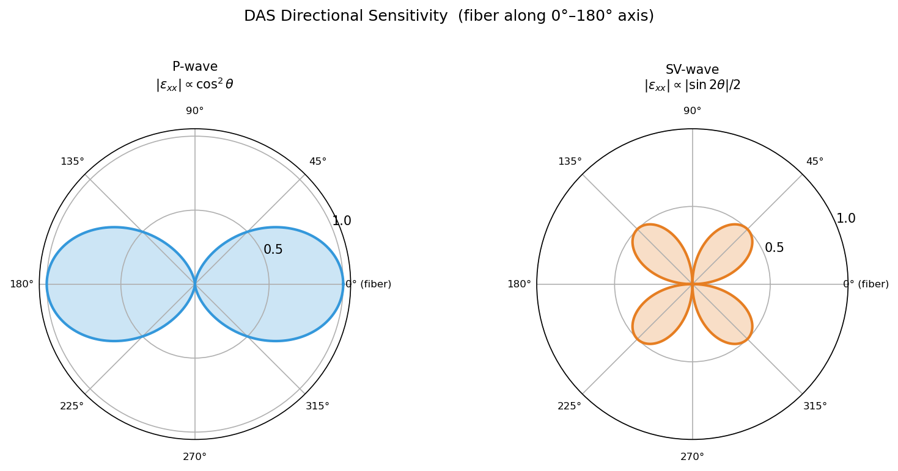
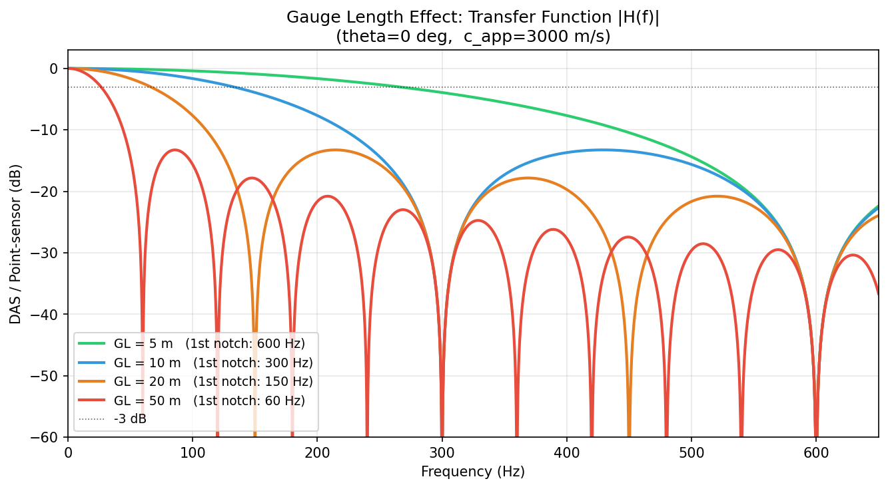
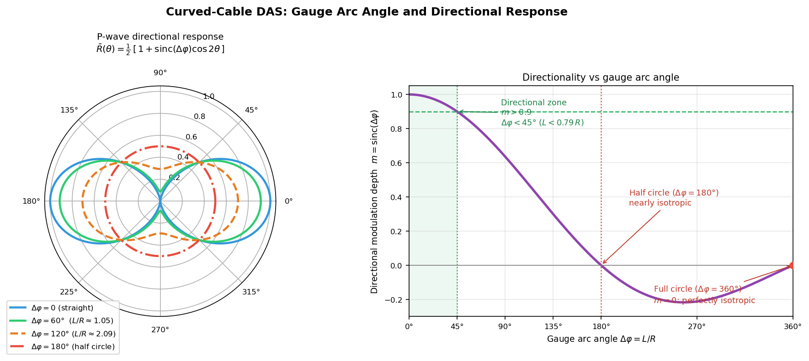

# DAS – Distributed Acoustic Sensing

## Introduction

**Distributed Acoustic Sensing (DAS)** is a fiber-optic seismic sensing technology that converts an ordinary optical fiber cable into a continuous, dense seismic array. A single fiber tens of kilometers long can simultaneously provide tens of thousands of virtual sensors with channel spacings as small as 1 m and sampling rates of several kHz.

Compared with conventional seismometers, DAS offers three core advantages:

| Feature | Conventional geophone | DAS |
|---------|----------------------|-----|
| Deployment cost | Each sensor installed separately | Cable laid in one pass |
| Spatial density | Limited stations (tens–hundreds) | Thousands to tens of thousands of channels |
| Low-frequency limit | Constrained by natural frequency (e.g., 4.5 Hz) | Responds from DC to high frequency (flat response) |
| Environment | Requires power, waterproofing | All-optical passive; can use submarine cables |

DAS measures the **dynamic axial strain** (or strain rate) along the fiber, not particle velocity. This fundamental difference gives rise to its distinctive directional response pattern and gauge length effect.

---

## Basic Principle

### Rayleigh Scattering and Phase-Sensitive OTDR

DAS operates by combining **Rayleigh backscattering** in optical fiber with **phase-sensitive Optical Time Domain Reflectometry (φ-OTDR)**:

1. **Pulse injection**: A coherent laser pulse is sent into the fiber (pulse width sets spatial resolution).
2. **Rayleigh backscattering**: Along the fiber, light scatters from random refractive-index inhomogeneities; a fraction returns to the interrogator.
3. **Phase detection**: The interrogator coherently demodulates the returned light to measure the **phase** of backscattered light at each depth.
4. **Phase → strain**: Phase shifts are proportional to changes in optical path length, i.e., to axial strain.

$$
\Delta\phi = \frac{4\pi n}{\lambda} \cdot \Delta L
$$

where $n$ is the fiber refractive index, $\lambda$ is the laser wavelength, and $\Delta L$ is the change in physical path length caused by strain.

!!! note "What DAS Measures"
    DAS measures the **axial dynamic strain** $\varepsilon_{xx}$ (or strain rate $\dot{\varepsilon}_{xx}$) along the fiber—that is, relative elongation/compression along the fiber axis. The response to seismic waves depends strongly on the angle between the wave propagation direction and the fiber axis.

### Key System Parameters

| Parameter | Typical values | Description |
|-----------|---------------|-------------|
| Channel spacing | 1–10 m | Distance between adjacent virtual sensors |
| Gauge length (GL) | 5–50 m | Strain integration length; governs spatial resolution and SNR |
| Sampling rate | 1–10 kHz | Temporal resolution |
| Maximum cable length | 10–100 km | Limited by laser power and fiber attenuation |
| Dynamic range | ~80–100 dB | Related to laser coherence |

---

## Typical Applications

### Vertical Seismic Profiling (VSP)

The first large-scale application of DAS in oil and gas exploration was **Vertical Seismic Profiling (VSP)**. Fiber cables cemented behind well casing record seismic wavefields over hundreds of meters depth simultaneously.

- **Advantages**: No repeated tripping; covers the entire well at high resolution.
- **Typical gauge length**: 5–10 m.
- **Signal types**: Direct P/S waves, reflections, converted waves.

### Urban Shallow Subsurface Imaging

Fiber cables in urban telecommunications conduits (existing infrastructure) use **ambient noise** from traffic and machinery as passive seismic sources to invert for shallow S-wave velocity structure.

- Representative work: Lindsey et al. (2017) imaged subsurface structure under the Stanford campus using telecom fiber.
- No active source required; near-zero marginal cost.

### Submarine Seismic Monitoring

**Existing submarine communication cables** serve as seismic sensors, filling the large gaps in ocean-bottom seismic networks.

- Detects microearthquakes, submarine landslides, and tsunami precursors.
- Representative work: Marra et al. (2018, *Science*) used a transatlantic cable to detect earthquakes.

### Microseismic and Induced Seismicity Monitoring

In geothermal energy, hydraulic fracturing, and CO₂ storage, DAS provides real-time monitoring of **microseismic activity** to track fracture propagation and induced seismicity.

---

## Sensitivity to Incident Angles

### Geometry

Let the fiber lie along the $x$-axis. A seismic plane wave propagates in the $x$–$z$ plane, with its propagation direction making angle $\theta$ to the fiber axis.

Wave vector:

$$
\mathbf{k} = k(\cos\theta\,\hat{x} + \sin\theta\,\hat{z}), \quad k = \frac{2\pi f}{c}
$$

Component along the fiber: $k_x = k\cos\theta$.

DAS measures axial strain $\varepsilon_{xx} = \partial u_x / \partial x$.

### P-Wave Directional Response

P-wave particle displacement is parallel to the propagation direction:

$$
\mathbf{u} = A\hat{k}\,e^{i(\mathbf{k}\cdot\mathbf{x} - \omega t)}
= A(\cos\theta\,\hat{x} + \sin\theta\,\hat{z})\,e^{i(k_x x + k_z z - \omega t)}
$$

The $x$-component: $u_x = A\cos\theta \cdot e^{i(\cdots)}$

Axial strain:

$$
\varepsilon_{xx}^{P} = \frac{\partial u_x}{\partial x} = ik_x A\cos\theta \cdot e^{i(\cdots)} = ik\cos\theta \cdot A\cos\theta \cdot e^{i(\cdots)}
$$

Therefore:

$$
\boxed{|\varepsilon_{xx}^{P}| \propto \cos^2\theta}
$$

- $\theta = 0°$ (wave propagates along fiber): **maximum response**
- $\theta = 90°$ (wave propagates perpendicular to fiber): $\varepsilon_{xx} = 0$, **no response**

### SV-Wave Directional Response

SV-wave particle displacement is perpendicular to the propagation direction, within the $x$–$z$ plane:

$$
\mathbf{u} = A(-\sin\theta\,\hat{x} + \cos\theta\,\hat{z})\,e^{i(k_x x + k_z z - \omega t)}
$$

The $x$-component: $u_x = -A\sin\theta \cdot e^{i(\cdots)}$

Axial strain:

$$
\varepsilon_{xx}^{SV} = \frac{\partial u_x}{\partial x} = ik_x(-A\sin\theta) = -ik\cos\theta \cdot A\sin\theta
$$

Therefore:

$$
\boxed{|\varepsilon_{xx}^{SV}| \propto |\sin\theta\cos\theta| = \frac{1}{2}|\sin 2\theta|}
$$

- $\theta = 0°$ or $\theta = 90°$: zero response
- $\theta = 45°$: **maximum response**

!!! note "SH-Wave Blind Spot"
    SH-wave particle displacement is perpendicular to the $x$–$z$ plane (along $y$), producing no $x$-direction displacement component. DAS is therefore **completely insensitive** to SH waves when the fiber lies in the $x$–$z$ plane. This is an inherent limitation.

### Directional Sensitivity Polar Diagram

Taking $\theta$ as the polar angle and $|\varepsilon_{xx}|$ as the radius, the polar diagrams for P-wave ($\cos^2\theta$) and SV-wave ($|\sin 2\theta|/2$) responses are shown in Figure 1.


*Figure 1: Polar diagrams of DAS directional sensitivity for P-waves (blue) and SV-waves (orange). Shaded area represents relative response amplitude. The fiber axis lies along the horizontal (0°–180°).*

---

## Flat Frequency Response

### Strain-to-Particle-Velocity Conversion

DAS measures axial strain, while seismology conventionally works with particle velocity. Their relationship determines DAS's frequency characteristics.

For a plane P-wave propagating along $x$ with displacement $u_x = A e^{i(kx - \omega t)}$:

$$
v_x = \frac{\partial u_x}{\partial t} = -i\omega A e^{i(\cdots)}
$$

$$
\varepsilon_{xx} = \frac{\partial u_x}{\partial x} = ikA e^{i(\cdots)} = \frac{ik}{-i\omega} \cdot v_x = -\frac{k}{\omega} v_x = -\frac{v_x}{c_P}
$$

Including the directional factor $\cos^2\theta$ for a general incident angle $\theta$:

$$
\varepsilon_{xx} = -\frac{\cos^2\theta}{c_P} \cdot v_P
$$

Solving for particle velocity:

$$
\boxed{v_P = -\frac{c_P}{\cos^2\theta} \cdot \varepsilon_{xx}}
$$

**Key property: the conversion factor $c_P / \cos^2\theta$ is frequency-independent.**

### Why It Is Called "Flat Response"

This frequency independence gives DAS a **flat frequency response** — unlike traditional geophones:

| Instrument | Measures | Frequency response | Low-frequency behavior |
|------------|----------|-------------------|----------------------|
| Short-period geophone | Particle velocity | Flat above $f_0$, rolls off below | 12 dB/octave roll-off below natural frequency |
| Accelerometer | Particle acceleration | Flat below resonance | Requires integration for velocity |
| **DAS (strain)** | **Axial strain** | **Flat from DC to $f_{\rm notch}$** | **No low-frequency cutoff** |

!!! tip "Practical Significance"
    DAS strain records can be converted to particle velocity with a single **frequency-independent** constant ($c_P/\cos^2\theta$) across the full band from 0 Hz to the gauge-length notch frequency. No frequency correction is needed. This makes DAS naturally suited for recording low-frequency seismic signals — surface waves, slow earthquakes, tidal deformation — that fall below the natural frequency of short-period geophones.

!!! warning "Strain vs. Strain Rate"
    Many DAS systems output **strain rate** $\dot{\varepsilon}$ (time derivative of strain) rather than strain. Strain rate relates to particle velocity as $\dot{\varepsilon} = -(\cos^2\theta / c_P) \cdot \dot{v}_P$, i.e., proportional to **acceleration** — not flat in velocity. To recover the flat velocity response, integrate in time (divide by $i\omega$ in the frequency domain) to obtain strain first.

---

## Gauge Length Effect

### Spatial Integration Filter

DAS does not measure strain at a true point. Instead, it measures the phase difference between the two ends of a gauge-length segment of length $L$, equivalent to **spatial averaging** of the strain over that segment:

$$
\varepsilon_\mathrm{GL}(x_0, t) = \frac{u_x(x_0 + L/2,\, t) - u_x(x_0 - L/2,\, t)}{L}
$$

### Transfer Function Derivation

For a plane wave $u_x = A e^{i(k_x x - \omega t)}$:

$$
\varepsilon_\mathrm{GL} = \frac{Ae^{ik_x(x_0+L/2)} - Ae^{ik_x(x_0-L/2)}}{L} \cdot e^{-i\omega t}
= \frac{2i\sin(k_x L/2)}{L} \cdot Ae^{ik_x x_0} e^{-i\omega t}
$$

Since the point strain is $\varepsilon_\mathrm{point} = ik_x Ae^{ik_x x_0}e^{-i\omega t}$, the gauge-length transfer function is:

$$
H(k_x) = \frac{\varepsilon_\mathrm{GL}}{\varepsilon_\mathrm{point}} = \frac{\sin(k_x L/2)}{k_x L/2} = \mathrm{sinc}\!\left(\frac{k_x L}{2\pi}\right)
$$

In terms of frequency (substituting $k_x = 2\pi f \cos\theta / c$):

$$
\boxed{H(f, \theta) = \mathrm{sinc}\!\left(\frac{f L \cos\theta}{c}\right)}
$$

### Notch Frequencies

The sinc function is zero at $k_x L/2 = n\pi$ ($n = 1, 2, 3, \ldots$), giving **notch frequencies**:

$$
f_n = \frac{n \cdot c}{L\cos\theta} = \frac{n \cdot c_\mathrm{app}}{L}
$$

where $c_\mathrm{app} = c/\cos\theta$ is the **apparent velocity** along the fiber.

!!! note "Physical Interpretation"
    When the apparent wavelength along the fiber $\lambda_\mathrm{app} = c_\mathrm{app}/f$ equals the gauge length $L$ (i.e., $f = c_\mathrm{app}/L$), displacements at the two gauge endpoints are **equal in magnitude but opposite in sign**, so their difference is exactly zero — producing the first notch.

### Gauge Length Trade-offs

| Gauge length $L$ | First notch $f_1$ ($c$ = 3000 m/s, $\theta$ = 0°) | SNR |
|------------------|----------------------------------------------------|-----|
| 5 m | 600 Hz | Low (short integration) |
| 10 m | 300 Hz | Medium |
| 20 m | 150 Hz | Higher |
| 50 m | 60 Hz | High, but significant high-frequency loss |

!!! warning "Gauge Length Selection Is Critical"
    A gauge length that is too large lowers the notch frequency, causing high-frequency signal loss. Too small a gauge length reduces the per-channel SNR. In practice, $L = 5$–$20$ m is typical, chosen based on the target signal band and deployment geometry.

The angular dependence: larger $\theta$ (wave more perpendicular to fiber) → smaller $k_x$ → higher notch frequency (better high-frequency preservation), but weaker amplitude (smaller $\cos^2\theta$ factor).


*Figure 2: DAS transfer function $|H(f)|$ for different gauge lengths ($\theta = 0°$, $c = 3000$ m/s). Larger gauge lengths shift the first notch to lower frequencies.*

### Optimum Gauge Length: SNR–Resolution Trade-off

The analysis above reveals two opposing effects: **too short a gauge length → poor SNR; too long a gauge length → reduced resolution and wavelet distortion**. Dean, Cuny & Hartog (2017) provide a quantitative treatment for axially incident P-waves ($\theta = 0°$, the VSP geometry).

#### SNR Analysis

For a P-wave propagating along the fiber axis, the strain waveform is a spatial **Ricker wavelet**:

$$
\varepsilon(x) = \left(1 - 2\pi^2 k^2 x^2\right) e^{-\pi^2 k^2 x^2}, \quad k = \frac{\pi f_p}{v}
$$

The total fiber length change $\Delta L$ measured by DAS is the integral of strain over the gauge length:

$$
\Delta L = \int_{-L/2}^{L/2} \varepsilon(x)\,\mathrm{d}x = L\, e^{-\pi^2 k^2 (L/2)^2}
$$

The phase measurement error $E(\Delta L)$ is independent of gauge length (determined by laser coherence), so **SNR ∝ $\Delta L$**. Maximizing $\Delta L$ with respect to $L$:

$$
\boxed{L_\mathrm{SNR} = \frac{\lambda_s}{\sqrt{3}} \approx 0.577\,\lambda_s}
$$

where the spatial wavelength is $\lambda_s = v\lambda_t = v\sqrt{6}/(\pi f_p)$.

#### Resolution Analysis — Wavelet Distortion Modes

The gauge-length integration acts as a **box-car (moving-average) filter**, whose frequency response is the sinc function. As $L$ increases, the notch frequency moves into the signal band:

| GL/$\lambda_s$ ratio | Wavelet state | SNR |
|---------------------|---------------|-----|
| $< 0.40$ | Normal, high resolution | Low (weak signal) |
| $0.40$–$0.54$ | **Optimal zone**: high SNR + good resolution | > 90 % of maximum |
| $\approx 0.577$ | Peak SNR; slight wavelet broadening | Maximum |
| $\approx 1.0$ | Notch enters main bandwidth; **flat-topped** wavelet | High but poor resolution |
| $> 1.0$ | **Double-lobed** (two peaks) wavelet; severe distortion | Avoid |

#### Optimum Gauge Length Formula

Combining SNR > 90% of maximum and wavelength error < 15%, the optimal ratio is $GL/\lambda_s \approx 0.40$–$0.54$; the recommended value is 0.5, giving (Dean et al. 2017, eq. 18):

$$
\boxed{L_\mathrm{opt} = \frac{\mathrm{ratio} \times v}{f_p} \approx \frac{0.5\,v}{f_p} = \frac{\lambda_s}{2}}
$$

!!! tip "Practical Example"
    In a VSP survey, a zone with apparent velocity $v = 3000$ m/s and peak frequency $f_p = 50$ Hz:
    $$L_\mathrm{opt} \approx \frac{0.5 \times 3000}{50} = 30\text{ m}, \quad \lambda_s \approx 46.8\text{ m}$$
    If apparent velocities range from 2900 to 5900 m/s over the full well, **apply different optimum gauge lengths at different depths** to maintain optimal SNR and resolution throughout.

!!! warning "Hardware Lower Bound"
    When $L$ approaches the laser pulse width (~8 m), the phase–strain relationship becomes nonlinear and the DAS measurement breaks down. Thus $L_\mathrm{min} \approx 8$ m is a hard lower limit regardless of the theoretical optimum.


*Figure 3: Left — normalised $\Delta L$ (SNR proxy) vs $GL/\lambda_s$; the green region marks SNR > 90 % of the maximum, and the red region marks the wavelet-distortion zone. Right — normalised DAS wavelet output for five GL/$\lambda_s$ ratios ($f_p$ = 40 Hz, $v$ = 1000 m/s, $\lambda_s \approx$ 19.5 m). After Dean et al. (2017).*

---

## Combined Instrument-Response Model

In practice, the DAS-recorded displacement spectrum is the product of **source spectrum, path attenuation, site response, and instrument response**. Combining all effects — directional sensitivity ($\cos^2\theta$), gauge-length sinc filter, κ operator, and t\* path attenuation — the complete forward model for a P-wave DAS displacement spectrum is (Bakku 2015; Chang et al. 2026):

$$
\boxed{
d_m\Omega(f) = (2\pi f)^m \cdot \Omega_0 \cdot e^{-\pi f \kappa}
\cdot \underbrace{v\cos^2\theta}_{\text{flat response}}
\cdot \underbrace{\mathrm{sinc}\!\left(\frac{\pi f L}{v\cos\theta}\right)}_{\text{gauge length}}
\cdot e^{-\pi f t^*}
}
$$

| Factor | Formula | Physical meaning |
|--------|---------|-----------------|
| $(2\pi f)^m$ | $m = 0, 1, 2$ for displacement, velocity, acceleration | DAS output integration order |
| $\Omega_0$ | Low-frequency plateau | Source spectrum (seismic moment) |
| $e^{-\pi f\kappa}$ | $\kappa = \int_\text{path} dt/Q_s$ | Near-surface integrated kappa |
| $v\cos^2\theta$ | Directional factor | P-wave angular sensitivity along fiber |
| sinc$(\pi fL/v\cos\theta)$ | Gauge-length transfer function | Spatial averaging low-pass filter |
| $e^{-\pi f t^*}$ | $t^* = \int_\text{path} dt/Q$ | Anelastic path attenuation |

For S-waves: replace $v\cos^2\theta$ with $v\cos\theta\sin\theta$; the sinc argument is unchanged.

!!! note "Depth Differential in Borehole DAS"
    In channel-wise borehole analysis, the differential travel time between two channels separated by depth $\mathrm{d}z$ is:
    $$\mathrm{d}t_m = \frac{\mathrm{d}z}{v\cos\theta}$$
    This relates depth increment to travel-time increment and depends on the incident angle.

### Incident Angle Constraint on Response Corrections

Before using DAS for Q inversion or source parameter estimation, the instrument response ($v\cos^2\theta \cdot \mathrm{sinc}(\cdots)$) must be removed. This correction becomes unreliable at large incident angles:

| Factor | Small angle $\theta \ll 45°$ | Large angle $\theta \to 90°$ |
|--------|------------------------------|------------------------------|
| Flat-response divisor $1/\cos^2\theta$ | Near 1, stable | Diverges, amplifies noise |
| Gauge-length notch $v\cos\theta/L$ | Near $v/L$, high band preserved | Moves to low frequencies, narrows usable band |
| Signal sensitivity $v\cos^2\theta$ | Near $v$, good SNR | Near 0, very poor SNR |

**Practical threshold** (Chang et al. 2026):

$$
\boxed{\theta < 45°}
$$

Channels violating this criterion are excluded from spectral fitting.

!!! tip "Geometry for Vertical Wells"
    For a DAS channel at depth $z_\text{ch}$ and an event at horizontal offset $r_H$, depth $z_\text{src}$ ($z_\text{src} > z_\text{ch}$):
    $$\theta = \arctan\!\left(\frac{r_H}{z_\text{src} - z_\text{ch}}\right)$$
    The condition $\theta < 45°$ requires $r_H < z_\text{src} - z_\text{ch}$: **horizontal offset less than the vertical separation**. Q inversion therefore works best with events located nearly below the well bottom.

---

## Cable Coupling

Before a seismic ground-strain signal reaches the DAS interrogator, it must pass through two mechanical interfaces in series:

$$
\underbrace{\varepsilon_\text{formation}}_{\text{free-field strain}}
\xrightarrow{C_\text{med}(f)}
\underbrace{\varepsilon_\text{jacket}}_{\text{cable-jacket strain}}
\xrightarrow{\eta_\text{fiber}}
\underbrace{\varepsilon_\text{fiber}}_{\text{DAS measurement}}
$$

Both factors are ≤ 1 and have independent frequency responses and engineering controls.

---

### Jacket-to-Fiber Coupling

#### Cable Structure and Strain Transfer Efficiency

The mechanical structure of the fiber-optic cable determines whether jacket strain is transferred to the fiber — the most fundamental hardware constraint on DAS sensing.

**Loose-tube cable**

The fiber(s) float inside a hollow tube filled with **filling compound (thixotropic gel)**. The fiber has a slight excess length (0.1–0.5%) so it experiences no axial tension from tube elongation.

- No radial or axial mechanical constraint on the fiber → **dynamic strain transfer efficiency $\eta_\text{fiber} \approx 0$**
- Designed for telecommunications: prevents thermal stress from straining the fiber, protecting transmission performance
- **Unsuitable for DAS seismic sensing** — when a loose-tube cable is interrogated by DAS, every channel records near-zero seismic signal

**Tight-buffered cable**

A polymer buffer layer (typically 0.9 mm thick) is heat-extruded directly onto the fiber cladding, forming a rigid bond.

$$\varepsilon_\text{fiber} = \eta_\text{fiber} \cdot \varepsilon_\text{jacket}, \qquad \eta_\text{fiber} \approx 0.7\text{–}0.9$$

Under quasi-static loading $\eta \to 1$; at higher frequencies, viscoelastic lag of the buffer slightly reduces $\eta$.

**Strain-sensing cables**

Optimized for DAS / distributed strain sensing (DSS) through one or more structural features:
- **Reinforced tight-buffer**: higher-stiffness polymer, $\eta \approx 0.9$–$1.0$
- **Helically wound steel wires**: distribute strain uniformly to the fiber while providing mechanical protection
- **Direct bonding**: fiber epoxy-bonded to the inner wall of a metallic sheath for maximum strain coupling

| Cable type | Typical $\eta_\text{fiber}$ | DAS suitability | Common use |
|------------|---------------------------|----------------|-----------|
| Loose-tube | ≈ 0 | ❌ Unsuitable | Long-haul telecom, submarine |
| Tight-buffered | 0.7–0.9 | ✓ Suitable | Premises, short-range sensing |
| Strain-sensing | 0.9–1.0 | ✓ Optimal | DAS / DSS dedicated |
| Armored† | 0.5–0.8 | △ Depends on core | Downhole / harsh environments |

†If armored over a loose-tube core, the steel armour senses strain but the fiber inside does not.

!!! warning "The telecom cable reuse trap"
    Many urban DAS studies repurpose existing telecom infrastructure. Most urban telecom cables are **loose-tube** designs: although the DAS interrogator operates normally, all channels carry essentially zero seismic signal. Only cables that include a **tight-buffered core** are suitable. Always obtain the cable datasheet from the network operator before deploying DAS on third-party infrastructure.

#### Frequency-Domain Jacket-to-Fiber Coupling Model

For a tight-buffered cable, the viscoelastic shear stiffness of the buffer layer governs the frequency-dependent strain transfer (Kuvshinov 2016):

$$
\eta_\text{fiber}(f) = \frac{k_b}{k_b + k_f \cdot (i 2\pi f \tau_b)}
$$

where $k_b = G_b / \ln(r_b/r_f)$ is the buffer shear stiffness ($G_b$ = buffer shear modulus, $r_f$ and $r_b$ = fiber and buffer radii), $\tau_b$ is the viscoelastic relaxation time of the buffer material (~$10^{-4}$–$10^{-3}$ s), and $k_f = E_f \pi r_f^2$ is the fiber axial stiffness.

For typical tight-buffer materials (polyimide / ETFE, $G_b \sim 0.5$–$2$ GPa), the high-frequency roll-off of $\eta_\text{fiber}$ occurs at several kHz, well above the seismic band. In practice, $\eta_\text{fiber}$ can be treated as a frequency-independent constant within the seismic band.

---

### Cable-to-Medium Coupling

#### Physical Mechanism

The **interface shear stiffness** $k_s$ (per unit cable length, N/m²) between the cable jacket and the surrounding medium determines how efficiently the free-field strain $\varepsilon_g$ enters the cable:

- $k_s \to \infty$ (fully bonded): $C_\text{med}(f) = 1$ — perfect coupling at all frequencies
- $k_s = 0$ (frictionless): $C_\text{med}(f) = 0$ — zero coupling

For finite $k_s$, the coupled cable–medium system is equivalent to a distributed spring-mass model, giving an approximately first-order low-pass transfer function (Martin et al. 2021):

$$
\boxed{C_\text{med}(f) = \frac{1}{\sqrt{1 + \left(\dfrac{f}{f_c}\right)^2}}}
$$

with cut-off frequency:

$$
\boxed{f_c = \frac{1}{2\pi}\sqrt{\frac{k_s}{m_c}}}
$$

where $m_c$ is the cable mass per unit length (kg/m). **For $f \gg f_c$, cable inertia prevents it from following ground motion and coupling rolls off at −20 dB/decade.**

#### Four Deployment Scenarios

**Cemented borehole**

The cable is placed in the annulus between casing and formation and fixed with cement or fast-set epoxy. Shear stiffness (Kuvshinov 2016):

$$k_s \approx \frac{2\pi G_g}{\ln(r_\text{bh}/r_c)}$$

where $G_g \sim 5$–$20$ GPa for cement grout, $r_\text{bh}$ = borehole radius, $r_c$ = cable radius. Typically $f_c \gg 1000$ Hz → **effectively perfect coupling across the entire seismic band**.

**Frozen into ice or permafrost**

Cable inserted into a hot-water-drilled hole and allowed to freeze in place. Ice shear modulus $G_\text{ice} \approx 3.5$ GPa → $f_c \sim 1000$–$3000$ Hz, comparable to cemented borehole. Effective coupling is essentially complete across the seismic band. Freeze–thaw cycles can degrade the bond and should be monitored.

**Buried in soil**

Interface shear stiffness scales with soil shear modulus $G_s$ and burial depth:

$$k_s \approx \frac{2\pi G_s}{\ln(D_\infty / r_c)}, \qquad D_\infty \approx 10\, r_c$$

| Soil type | $G_s$ | Burial 0.1 m | Burial 0.3 m | Burial 1.0 m |
|-----------|--------|------------|------------|------------|
| Soft clay | 5 MPa | ~30 Hz | ~80 Hz | ~200 Hz |
| Sand | 50 MPa | ~120 Hz | ~300 Hz | ~800 Hz |
| Hard soil / weathered rock | 200 MPa | ~400 Hz | ~1000 Hz | >2000 Hz |

**Practical rule**: burial depth ≥ 0.3 m ensures $C > -1$ dB below 100 Hz in most soil conditions.

**Surface-laid cable**

Coupling relies only on **self-weight friction** with the ground surface. Effective $k_s$ is set by cable weight and surface roughness, typically very low. $f_c$ may be as low as 20–100 Hz, severely attenuating signals above ~100 Hz.

!!! warning "Submarine telecom cables for DAS"
    Submarine cables are usually **laid on the seafloor** with no burial. Coupled with a loose-tube internal structure, they suffer two simultaneous penalties: $\eta_\text{fiber} \approx 0$ and $f_c \sim 50$ Hz. The usable band is typically < 20 Hz and amplitudes are far below standard seismometers. Yet over thousands of kilometres of cable and exploiting ultra-low-frequency surface waves, submarine cable DAS has still produced important global seismology results (Marra et al. 2018).


*Figure 4: (Left) Loose-tube vs tight-buffered cable cross-sections — in the loose-tube design the fiber floats freely in gel ($\eta_\text{fiber} \approx 0$); in the tight-buffered design the polymer buffer is bonded directly to the fiber ($\eta_\text{fiber} \approx 0.8$–$1.0$). (Right) Cable-to-medium coupling transfer functions $C_\text{med}(f) = [1+(f/f_c)^2]^{-1/2}$ for four deployment scenarios: cemented borehole ($f_c \to \infty$) and frozen coupling ($f_c \approx 3000$ Hz) are transparent across the seismic band; burial 0.3 m ($f_c \approx 300$ Hz) is reliable below 1 kHz; surface-laid cable ($f_c \approx 30$ Hz) attenuates significantly above 100 Hz.*

---

### Updated Combined Instrument Response

Adding both coupling factors to the forward model from the previous section:

$$
\boxed{
d_m\Omega(f) = (2\pi f)^m \cdot \Omega_0 \cdot e^{-\pi f \kappa}
\cdot \underbrace{C_\text{med}(f)}_{\substack{\text{medium–cable}\\\text{coupling}}}
\cdot \underbrace{\eta_\text{fiber}}_{\substack{\text{jacket–fiber}\\\text{coupling}}}
\cdot \underbrace{v\cos^2\theta}_{\text{directional}}
\cdot \underbrace{\mathrm{sinc}\!\left(\frac{\pi fL}{v\cos\theta}\right)}_{\text{gauge length}}
\cdot e^{-\pi ft^*}
}
$$

Each coupling factor is associated with a distinct physical interface and can be assessed or controlled independently:

| Factor | Engineering control | Residual uncertainty |
|--------|---------------------|---------------------|
| $C_\text{med}(f)$ | Cementing / burial depth | Grout porosity, cure quality |
| $\eta_\text{fiber}$ | Select tight-buffered / sensing cable | Buffer ageing, temperature |
| $v\cos^2\theta$ | Incidence-angle cut ($\theta < 45°$) | Velocity model error |
| $\mathrm{sinc}(\cdots)$ | Gauge-length selection | See gauge-length section |

!!! tip "Coupling correction order before inversion"
    1. **Confirm cable type** (loose vs tight) — reject channels where $\eta_\text{fiber} \approx 0$
    2. **Assess deployment state** — estimate $f_c$ and set the upper usable frequency limit
    3. If broadband inversion is needed, compensate the spectrum by $1/C_\text{med}(f)$ (avoid over-amplifying noise above $f_c$)
    4. Then proceed with joint inversion of gauge-length, directional, and $t^*$ effects

---

### In-Situ Coupling Assessment

Co-locate a standard seismometer with the DAS cable and compute the empirical transfer function:

$$
T(f) = \frac{U_\text{DAS}(f)}{U_\text{ref}(f)}
$$

After correcting for directional sensitivity and gauge-length response, the expected value is $T(f) \propto C_\text{med}(f) \cdot \eta_\text{fiber}$. A −20 dB/decade roll-off in $|T(f)|$ above some frequency directly reveals $f_c$, from which the coupling stiffness $k_s$ can be estimated.

---

## Curved Cables: Curvature and Gauge-Length Selection

The directional response and gauge-length analyses above all assume a **straight** fibre. In practice cables are often curved — ring arrays, helical winding, road corners, routing around obstacles — and a single gauge length $L$ then spans an **arc** over which the fibre tangent direction rotates. Both the directional pattern and the gauge filter change as a result.

### Gauge Arc Angle: the Key Dimensionless Parameter

For a local curvature radius $R$ (the ring radius for a circular cable), the gauge length subtends a central angle (**gauge arc angle**):

$$
\boxed{\Delta\varphi = \frac{L}{R}}
$$

This single dimensionless parameter controls curved-cable DAS behaviour:

- $\Delta\varphi \to 0$: the gauge is locally straight; the straight-cable theory applies
- Increasing $\Delta\varphi$: the tangent rotates significantly within one gauge; the directional pattern is smeared
- $\Delta\varphi = 2\pi$: the gauge wraps a full circle; the response is perfectly isotropic

### Arc-Averaged Directional Response

For a P wave arriving at azimuth $\theta$ (measured from the tangent at the arc midpoint), the local tangent at arc-length coordinate $s$ is rotated by $\varphi(s) = s/R$, $s \in [-L/2, L/2]$. The DAS channel output averages the axial strain over the gauge:

$$
\bar{R}(\theta) = \frac{1}{L}\int_{-L/2}^{L/2} \cos^2\!\big(\theta - \varphi(s)\big)\, \mathrm{d}s
$$

Substituting $\cos^2 x = \tfrac{1}{2}(1+\cos 2x)$ and integrating gives the closed form:

$$
\boxed{\bar{R}(\theta) = \frac{1}{2}\Big[1 + \mathrm{sinc}(\Delta\varphi)\cos 2\theta\Big]},
\qquad \mathrm{sinc}(x) = \frac{\sin x}{x}
$$

where $m = \mathrm{sinc}(\Delta\varphi)$ is the **directional modulation depth**:

| $\Delta\varphi$ | $m = \mathrm{sinc}(\Delta\varphi)$ | Pattern |
|------------------|-----------------------------------|---------|
| 0° (straight) | 1.000 | Standard $\cos^2\theta$ two-lobe |
| 45° | 0.900 | Nearly straight-cable, slightly blunted lobes |
| 90° | 0.637 | Visibly broadened lobes |
| 180° (half circle) | 0.000* | Nearly isotropic |
| 360° (full circle) | 0.000 | Perfectly isotropic, $\bar{R} \equiv 1/2$ |

*$\mathrm{sinc}(\pi) = 0$ exactly.

!!! note "Directionality: feature or bug?"
    - **When direction matters** (beamforming, back-azimuth estimation): curvature is **harmful** — the smeared pattern broadens the slowness-spectrum main lobe and degrades location accuracy
    - **When omnidirectional coverage matters** (event detection, amplitude monitoring): curvature is **beneficial** — channels with arc angles above a half circle respond almost isotropically, removing the straight-cable blind spot for broadside arrivals ($\cos^2 90° = 0$)

### Gauge-Length Selection Under Curvature

**Criterion 1 — preserve directionality** (beamforming, F-K analysis, moment-tensor inversion)

Require modulation depth $m > 0.9$:

$$
\boxed{\Delta\varphi < 45° \iff L < 0.79\, R}
$$

**Criterion 2 — combine with the straight-cable optimum** (Dean et al. 2016)

Straight-cable analysis gives the SNR-optimal gauge $L_\text{opt} \approx 0.577\,\lambda_s$ ($\lambda_s$ = shortest target wavelength). Intersecting with the curvature constraint:

$$
\boxed{L = \min\big(0.577\,\lambda_s,\ 0.79\,R\big)}
$$

- For $R > 0.73\,\lambda_s$ curvature is not binding — use the straight-cable rule
- For small $R$ (compact ring arrays) the curvature constraint dominates, forcing a shorter gauge → SNR loss, compensated by stacking multiple channels

**Criterion 3 — deliberate isotropy** (omnidirectional detection)

Set $\Delta\varphi \geq 180°$ (i.e. $L \geq \pi R$) so that single-channel patterns are nearly omnidirectional. The extreme case — gauge wrapping the full ring ($L = 2\pi R$) — measures the rate of change of ring circumference, i.e. the areal strain enclosed by the ring: the working principle of a **ring strain gauge**.


*Figure 5: (Left) P-wave directional response for several gauge arc angles — straight cable (blue) shows the standard cos²θ two-lobe pattern; lobes broaden with increasing arc angle; the half-circle case (red dash-dot) is nearly isotropic. (Right) Directional modulation depth $m = \mathrm{sinc}(\Delta\varphi)$ vs arc angle: the green zone ($\Delta\varphi < 45°$, i.e. $L < 0.79R$) preserves strong directionality ($m > 0.9$); $m$ vanishes exactly at the half circle and the response is perfectly isotropic for the full circle.*

### Effect of Curvature on the Gauge (Notch) Filter

For a straight cable the gauge-filter notch lies at $f_1 = v_\text{app}/L$ with $v_\text{app} = c/\cos\theta$. On a curved cable the local along-fibre apparent slowness varies along the arc, so:

1. **Shallower notches**: notch frequencies differ between arc segments; after averaging, the notch is no longer a perfect zero but a finite-depth trough
2. **Effective gauge shortening**: the projection of the gauge onto the propagation direction is the **chord**, not the arc:

$$
L_\text{chord} = 2R\sin\!\left(\frac{\Delta\varphi}{2}\right) < L
$$

For $\Delta\varphi = 90°$, $L_\text{chord} \approx 0.90\,L$; for $\Delta\varphi = 180°$, $L_\text{chord} = 2R \approx 0.64\,L$. Notch frequencies shift upward correspondingly, and the effective spatial resolution is slightly better than the arc-length prediction.

!!! tip "Practical notes for ring arrays"
    1. **Ring diameter**: urban well-pad ring deployments typically use $2R \sim 50$–$200$ m. With a 10 m gauge and $R = 25$ m, $\Delta\varphi \approx 23°$ and $m \approx 0.97$ — directionality essentially unaffected
    2. **Corner-channel rejection**: right-angle road corners can have curvature radii of 1–2 m; a 10 m gauge then spans $\Delta\varphi > 360°$ and the response is not analytically tractable. Standard practice is to **discard channels within ±L of each corner**
    3. **Fibre bend loss**: besides response distortion, small bend radii cause macrobend optical loss. Single-mode fibre requires $R \gtrsim 15$ mm and jacketed cables $R \gtrsim 10$–$20\times$ the cable diameter — metre-scale ring arrays are far from this limit, but splice boxes and slack coils need attention
    4. **Azimuthal diversity**: the intrinsic advantage of a ring — channel tangents sweep all 360° of azimuth, equivalent to a full set of single-component strainmeters at all orientations, which is particularly valuable for anisotropy inversion and source-mechanism constraints

---

## Python Example

The code below reproduces both figures: the directional sensitivity polar plot and the gauge-length transfer function.

```python
import numpy as np
import matplotlib.pyplot as plt

# ── Figure 1: Directional sensitivity polar plots ─────────
theta = np.linspace(0, 2 * np.pi, 720)
resp_P  = np.cos(theta) ** 2
resp_SV = np.abs(np.sin(2 * theta)) / 2

fig, axes = plt.subplots(1, 2, figsize=(11, 5),
                          subplot_kw=dict(projection='polar'))

for ax, resp, color, desc in [
    (axes[0], resp_P,  '#3498db',
     'P-wave\n' + r'$|\varepsilon_{xx}| \propto \cos^2\theta$'),
    (axes[1], resp_SV, '#e67e22',
     'SV-wave\n' + r'$|\varepsilon_{xx}| \propto |\sin 2\theta|/2$'),
]:
    ax.plot(theta, resp, color=color, lw=2)
    ax.fill(theta, resp, alpha=0.25, color=color)
    ax.set_theta_zero_location('E')
    ax.set_theta_direction(1)
    ax.set_xticks(np.deg2rad([0, 45, 90, 135, 180, 225, 270, 315]))
    ax.set_xticklabels(['0° (fiber)', '45°', '90°', '135°',
                         '180°', '225°', '270°', '315°'], fontsize=8)
    ax.set_yticks([0.5, 1.0])
    ax.set_title(desc, pad=14, fontsize=10)

plt.suptitle('DAS Directional Sensitivity  (fiber along 0°–180° axis)',
             y=1.02, fontsize=12)
plt.tight_layout()
plt.savefig('docs/assets/images/das_angle_response.png', dpi=150, bbox_inches='tight')

# ── Figure 2: Gauge length transfer function ──────────────
c   = 3000.0
GLs = [5, 10, 20, 50]
colors = ['#2ecc71', '#3498db', '#e67e22', '#e74c3c']
f = np.linspace(0.1, 650, 3000)

fig, ax = plt.subplots(figsize=(9, 5))
for L, color in zip(GLs, colors):
    kxL_half = np.pi * f * L / c
    H = np.abs(np.sinc(kxL_half / np.pi))
    ax.plot(f, 20 * np.log10(np.clip(H, 1e-6, None)),
            color=color, lw=2, label=f'GL = {L} m   (1st notch: {int(c/L)} Hz)')

ax.axhline(-3, color='k', lw=0.8, ls=':', alpha=0.6, label=r'$-3$ dB')
ax.set(xlabel='Frequency (Hz)', ylabel='DAS / Point-sensor (dB)',
       title=r'Gauge Length Effect: $|H(f)|$  ($\theta=0°$, $c_{\rm app}=3000$ m/s)',
       xlim=[0, 650], ylim=[-60, 3])
ax.legend(fontsize=9)
ax.grid(True, alpha=0.3)
plt.tight_layout()
plt.savefig('docs/assets/images/das_gauge_length.png', dpi=150, bbox_inches='tight')
plt.show()
```

---

## References

- Lindsey, N. J., Martin, E. R., Dreger, D. S., Freifeld, B., White, S., Monga, S. K., … & Ajo-Franklin, J. B. (2017). Fiber-optic network observations of earthquake wavefields. *Geophysical Research Letters*, 44(23), 11–792.
- Mateeva, A., Lopez, J., Potters, H., Mestayer, J., Cox, B., Kiyashchenko, D., … & Berlang, W. (2014). Distributed acoustic sensing for reservoir monitoring with vertical seismic profiling. *Geophysical Prospecting*, 62(4), 679–692.
- Marra, G., Clivati, C., Luckett, R., Tampellini, A., Kronjäger, J., Wright, L., … & Margolis, H. S. (2018). Ultrastable laser interferometry for earthquake detection with terrestrial and submarine cables. *Science*, 361(6401), 486–490.
- Wang, H. F., Zeng, X., Miller, D. E., Fratta, D., Feigl, K. L., Thurber, C. H., & Mellors, R. J. (2018). Ground motion response to an ML 4.3 earthquake using co-located distributed acoustic sensing and seismometers. *Geophysical Journal International*, 213(3), 2020–2036.
- Daley, T. M., Miller, D. E., Dodds, K., Cook, P., & Freifeld, B. M. (2016). Field testing of modular borehole monitoring with simultaneous distributed acoustic sensing and geophone vertical seismic profiles at Citronelle, Alabama. *Geophysical Prospecting*, 64(5), 1318–1334.
- Zhan, Z. (2020). Distributed acoustic sensing turns fiber-optic cables into seismic stations. *Bulletin of the Seismological Society of America*, 110(3), 975–985.
- Dean, T., Cuny, T., & Hartog, A. H. (2017). The effect of gauge length on axially incident P-waves measured using fibre optic distributed vibration sensing. *Geophysical Prospecting*, 65(1), 184–193. https://doi.org/10.1111/1365-2478.12419
- Bakku, S. K. (2015). *Fracture characterization from seismic measurements in a borehole* (Doctoral dissertation, Massachusetts Institute of Technology).
- Chang, H., Nakata, N., Abercrombie, R. E., Dadi, S., & Titov, A. (2026, in review). Using borehole Distributed Acoustic Sensing to investigate microearthquake source parameter variability in an enhanced geothermal system. *ESSOAr preprint*. https://doi.org/10.22541/essoar.15002292/v1
