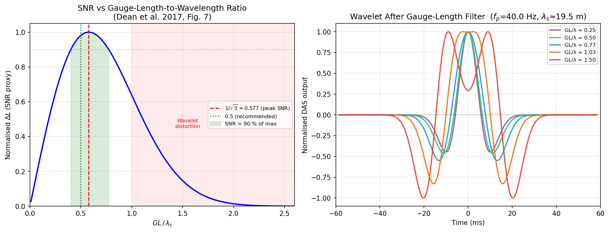
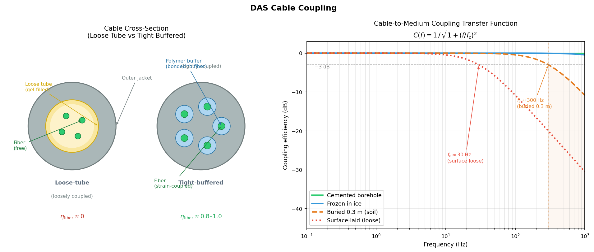

# DAS 分布式声学传感

## 引言

**分布式声学传感**（Distributed Acoustic Sensing，DAS）是一种基于光纤的地震传感技术，可将普通通信光缆改造为连续的密集地震台阵。一根长达数十千米的光缆，可同时提供数万个虚拟传感器，道间距低至 1 m，采样率可达数千 Hz。

与传统检波器相比，DAS 具有三大核心优势：

| 特性 | 传统检波器 | DAS |
|------|-----------|-----|
| 部署成本 | 每个传感器单独安装 | 光缆一次性铺设 |
| 空间密度 | 有限台站（tens–hundreds） | 数千至数万虚拟道 |
| 频段下限 | 受自然频率限制（如 4.5 Hz） | 直流至高频均响应（平坦响应） |
| 环境适应 | 需电源、防水处理 | 全光无源，可用海底光缆 |

DAS 测量的物理量是沿光纤轴向的**动态应变**（dynamic strain）或**应变率**（strain rate），而非粒子速度，这一根本差异决定了其独特的方向性响应特征与标距效应。

---

## 基本原理

### 瑞利散射与相敏 OTDR

DAS 的工作原理基于光纤中的**瑞利散射**（Rayleigh backscattering）和**相位光时域反射法**（phase-sensitive Optical Time Domain Reflectometry，φ-OTDR）：

1. **脉冲注入**：仪器向光纤发射一段相干激光脉冲（脉宽决定空间分辨率）
2. **瑞利后向散射**：光在光纤内沿途与随机折射率不均匀点发生散射，部分散射光沿原路返回
3. **相位检测**：仪器对返回光进行相干解调，测量不同深度处散射光的**相位差**
4. **相位→应变**：相位变化与光纤局部**光程长度变化**成正比，即与轴向应变成正比

$$
\Delta\phi = \frac{4\pi n}{\lambda} \cdot \Delta L
$$

其中 $n$ 为光纤折射率，$\lambda$ 为激光波长，$\Delta L$ 为物理路径长度变化（应变引起）。

!!! note "DAS 测量的是什么"
    DAS 测量的是沿光纤**轴线方向**的**动态应变** $\varepsilon_{xx}$（或应变率 $\dot{\varepsilon}_{xx}$），即光纤轴向的相对拉伸/压缩。对于垂直或水平入射的地震波，其响应强烈依赖于波的传播方向与光纤轴线的夹角。

### 关键系统参数

| 参数 | 典型值 | 说明 |
|------|--------|------|
| 道间距（channel spacing） | 1–10 m | 相邻虚拟传感器之间的距离 |
| 标距（gauge length，GL） | 5–50 m | 单道应变积分长度，决定空间分辨率与信噪比 |
| 采样率 | 1–10 kHz | 时间分辨率 |
| 最大电缆长度 | 10–100 km | 受激光功率与损耗限制 |
| 动态范围 | ~80–100 dB | 与激光相干性相关 |

---

## DAS 的典型应用

### 垂直地震剖面（VSP）

在油气勘探中，DAS 最早的大规模应用是**垂直地震剖面**（VSP）。将光缆布设于油井套管外，可同时记录数百米深度范围内的地震波场。

- **优势**：无需反复起下钻，节省作业时间；覆盖整口井，分辨率高
- **典型标距**：5–10 m
- **信号类型**：直达 P/S 波、反射波、转换波

### 城市浅层地下结构成像

将光缆铺设于城市道路下的通信管道（已有光缆），利用车辆振动等**环境噪声**作为被动震源，反演浅地表 S 波速度结构。

- 代表工作：Lindsey et al. (2017) 利用斯坦福大学园区光缆成像地下结构
- 无需主动震源，成本极低

### 海底地震观测

利用已有**海底通信光缆**进行地震监测，弥补海洋地震台网的稀疏不足。

- 检测微震、海底滑坡、海啸前兆
- 代表工作：Marra et al. (2018, *Science*) 用大西洋海底光缆探测地震

### 微地震与诱发地震监测

在地热能、页岩气水力压裂、CO₂封存等工程中，DAS 用于实时监测**微地震活动**，追踪裂缝发育。

---

## 对入射角的方向性响应

### 几何关系

设光纤沿 $x$ 轴方向铺设，地震平面波在 $x$-$z$ 平面内传播，传播方向与光纤轴线（$x$ 轴）的夹角为 $\theta$（以下称**入射角**）。

波矢量：

$$
\mathbf{k} = k(\cos\theta\,\hat{x} + \sin\theta\,\hat{z}), \quad k = \frac{2\pi f}{c}
$$

沿光纤方向的分量：$k_x = k\cos\theta$

DAS 测量的是轴向应变 $\varepsilon_{xx} = \partial u_x / \partial x$。

### P 波的方向性响应

P 波粒子位移沿传播方向，即：

$$
\mathbf{u} = A\hat{k}\,e^{i(\mathbf{k}\cdot\mathbf{x} - \omega t)}
= A(\cos\theta\,\hat{x} + \sin\theta\,\hat{z})\,e^{i(k_x x + k_z z - \omega t)}
$$

$x$ 分量：$u_x = A\cos\theta \cdot e^{i(k_x x + k_z z - \omega t)}$

轴向应变：

$$
\varepsilon_{xx}^{P} = \frac{\partial u_x}{\partial x} = ik_x \cdot A\cos\theta \cdot e^{i(\cdots)} = ik\cos\theta \cdot A\cos\theta \cdot e^{i(\cdots)}
$$

因此：

$$
\boxed{|\varepsilon_{xx}^{P}| \propto \cos^2\theta}
$$

- $\theta = 0$（波平行于光纤传播）：**响应最强**
- $\theta = 90°$（波垂直于光纤传播）：$\varepsilon_{xx} = 0$，**完全无响应**

### SV 波的方向性响应

SV 波粒子位移垂直于传播方向，在 $x$-$z$ 平面内：

$$
\mathbf{u} = A(-\sin\theta\,\hat{x} + \cos\theta\,\hat{z})\,e^{i(k_x x + k_z z - \omega t)}
$$

$x$ 分量：$u_x = -A\sin\theta \cdot e^{i(\cdots)}$

轴向应变：

$$
\varepsilon_{xx}^{SV} = \frac{\partial u_x}{\partial x} = ik_x(-A\sin\theta) = -ik\cos\theta \cdot A\sin\theta \cdot e^{i(\cdots)}
$$

因此：

$$
\boxed{|\varepsilon_{xx}^{SV}| \propto |\sin\theta\cos\theta| = \frac{1}{2}|\sin 2\theta|}
$$

- $\theta = 0$ 或 $\theta = 90°$：响应为零
- $\theta = 45°$：**响应最强**

!!! note "SH 波盲区"
    SH 波的粒子位移垂直于 $x$-$z$ 平面（沿 $y$ 轴），因此对 $x$ 方向没有位移分量，DAS 对 SH 波**完全不响应**（如果光纤在 $x$-$z$ 平面内）。这是 DAS 的固有盲区。

### 方向性响应的极坐标图

以 $\theta$ 为极角，$|\varepsilon_{xx}|$ 为极径，P 波响应（$\cos^2\theta$）和 SV 波响应（$|\sin 2\theta|/2$）的极坐标图见图 1。


*图 1：DAS 对 P 波（蓝）和 SV 波（橙）的方向性响应极坐标图。阴影区域面积代表相对响应强度。光纤方向为水平轴。*

---

## 平坦频率响应（Flat Response）

### 应变与粒子速度的关系

DAS 测量轴向应变，而地震学中常用的量是**粒子速度**。两者的转换关系对于理解 DAS 的频率特性至关重要。

对于沿 $x$ 方向传播的平面 P 波，粒子位移 $u_x = A e^{i(kx - \omega t)}$，则：

$$
v_x = \frac{\partial u_x}{\partial t} = -i\omega A e^{i(\cdots)}
$$

$$
\varepsilon_{xx} = \frac{\partial u_x}{\partial x} = ik A e^{i(\cdots)} = \frac{ik}{-i\omega} \cdot v_x = -\frac{k}{\omega} v_x = -\frac{v_x}{c_P}
$$

对于一般入射角 $\theta$（与光纤轴的夹角），综合 P 波方向性：

$$
\varepsilon_{xx} = -\frac{\cos^2\theta}{c_P} \cdot v_P
$$

其中 $v_P$ 是沿传播方向的粒子速度幅度，$v_x = v_P\cos\theta$。

整理得：

$$
\boxed{v_P = -\frac{c_P}{\cos^2\theta} \cdot \varepsilon_{xx}}
$$

**关键特性：转换系数 $c_P / \cos^2\theta$ 与频率无关。**

### 为何称为"平坦响应"

这一频率无关性使 DAS 具有区别于传统检波器的**平坦频率响应**（flat response）：

| 仪器类型 | 测量量 | 频率响应 | 低频特性 |
|----------|--------|----------|----------|
| 短周期检波器 | 粒子速度 | 平坦（$f > f_0$），低频衰减 | 在自然频率 $f_0$ 以下滚降 |
| 加速度计 | 粒子加速度 | 平坦（$f < f_\mathrm{res}$） | 低频端需积分才得速度 |
| **DAS（应变）** | **轴向应变** | **从直流到 $f_\mathrm{notch}$ 均平坦** | **无低频截止** |

!!! tip "平坦响应的实际意义"
    DAS 记录的应变信号，可以在**全频段**（0 Hz 至标距陷波频率 $f_\mathrm{notch}$）用一个与频率无关的常数转换为粒子速度，无需任何频率补偿。这使 DAS 天然适合记录低频地震波（面波、慢地震、潮汐等），而不受传统短周期检波器自然频率的限制。

!!! warning "注意：应变率 ≠ 应变"
    许多 DAS 系统直接输出**应变率** $\dot{\varepsilon}$（对时间的导数），而非应变。应变率与粒子速度的关系为 $\dot{\varepsilon} = -(\cos^2\theta / c_P) \cdot \dot{v}_P$，即正比于**加速度**，此时不具有平坦速度响应，需先对时间积分（等效于频域除以 $\omega$）还原成应变。

---

## 标距效应（Gauge Length Effect）

### 空间积分滤波

DAS 并不测量真正意义上的"点"应变，而是测量长度为 $L$（标距，gauge length）的光纤段两端之间的相位差，等价于在该段上对应变做**空间积分平均**：

$$
\varepsilon_\mathrm{GL}(x_0, t) = \frac{u_x(x_0 + L/2,\, t) - u_x(x_0 - L/2,\, t)}{L}
$$

### 传递函数推导

对于平面波 $u_x = A e^{i(k_x x - \omega t)}$，代入上式：

$$
\varepsilon_\mathrm{GL} = \frac{A e^{ik_x(x_0 + L/2)} - A e^{ik_x(x_0 - L/2)}}{L} \cdot e^{-i\omega t}
= \frac{2i\sin(k_x L/2)}{L} \cdot A e^{ik_x x_0} e^{-i\omega t}
$$

点应变为 $\varepsilon_\mathrm{point} = ik_x A e^{ik_x x_0} e^{-i\omega t}$，因此标距传递函数为：

$$
H(k_x) = \frac{\varepsilon_\mathrm{GL}}{\varepsilon_\mathrm{point}} = \frac{\sin(k_x L/2)}{k_x L/2} = \mathrm{sinc}\!\left(\frac{k_x L}{2\pi}\right)
$$

其中 $\mathrm{sinc}(x) = \sin(\pi x) / (\pi x)$。

用频率表示（代入 $k_x = 2\pi f \cos\theta / c$）：

$$
\boxed{H(f, \theta) = \mathrm{sinc}\!\left(\frac{f L \cos\theta}{c}\right)}
$$

### 陷波频率

sinc 函数在 $k_x L/2 = n\pi$（$n = 1, 2, 3, \ldots$）处为零，对应的**陷波频率**：

$$
f_n = \frac{n \cdot c}{L\cos\theta} = \frac{n \cdot c_\mathrm{app}}{L}
$$

其中 $c_\mathrm{app} = c/\cos\theta$ 是沿光纤方向的**视速度**（apparent velocity）。

!!! note "物理解释"
    当地震波的沿纤视波长 $\lambda_\mathrm{app} = c_\mathrm{app}/f$ 等于标距 $L$ 时（即 $f = c_\mathrm{app}/L$），标距两端的位移**大小相等、方向相反**，相减后精确为零，出现第一陷波。

### 标距与陷波频率的权衡

| 标距 $L$ | 陷波频率 $f_1$（$c$ = 3000 m/s，$\theta$ = 0°） | 信噪比 |
|----------|---------------------------------------------|--------|
| 5 m | 600 Hz | 低（积分路径短） |
| 10 m | 300 Hz | 中 |
| 20 m | 150 Hz | 较高 |
| 50 m | 60 Hz | 高，但高频损失严重 |

!!! warning "标距选取的关键性"
    标距 $L$ 过大：陷波频率降低，损失高频信息；$L$ 过小：每道平均的应变段短，信噪比下降。实际中根据目标信号频段和地面/井下条件选取，通常 $L = 5$–$20$ m。

角度效应：入射角 $\theta$ 越大（波越接近垂直于光纤），$k_x$ 越小，陷波频率越高，高频信息保留越好，但振幅响应（$\cos^2\theta$ 因子）也越弱。


*图 2：不同标距下 DAS 的传递函数（$|H(f)|$）随频率的变化（$\theta = 0°$，$c$ = 3000 m/s）。标距越大，陷波频率越低。*

### 最优标距：信噪比与分辨率的权衡

以上分析表明标距存在两种相互对立的效应：**标距过小 → 信噪比差；标距过大 → 分辨率下降、波形畸变**。Dean, Cuny & Hartog（2016）针对轴向入射 P 波（$\theta = 0°$，VSP 典型场景）给出了定量分析。

#### 信噪比分析

对于沿光纤轴向传播的 P 波，应变波形为**Ricker 子波**（时域）：

$$
\varepsilon(t) = \left(1 - 2\pi^2 f_p^2 t^2\right) e^{-\pi^2 f_p^2 t^2}
$$

其空间域形式（波数 $k = \pi f_p / v$）：

$$
\varepsilon(x) = \left(1 - 2\pi^2 k^2 x^2\right) e^{-\pi^2 k^2 x^2}
$$

DAS 测量的光纤长度变化 $\Delta L$（即信号强度）为应变在标距上的积分：

$$
\Delta L = \int_{-L/2}^{L/2} \varepsilon(x)\,\mathrm{d}x = L\, e^{-\pi^2 k^2 (L/2)^2}
$$

!!! note "公式推导"
    利用 $\frac{\mathrm{d}}{\mathrm{d}x}\!\left[x\,e^{-\pi^2 k^2 x^2}\right] = \varepsilon(x)$，可解析积分得到上式。

$\Delta L$ 关于 $L$ 的极值：令 $\mathrm{d}(\Delta L)/\mathrm{d}L = 0$，解得：

$$
\boxed{L_\mathrm{SNR} = \frac{\lambda_s}{\sqrt{3}} \approx 0.577\,\lambda_s}
$$

其中**空间波长** $\lambda_s = v\lambda_t = v\sqrt{6}/(\pi f_p)$。

DAS 的相位测量误差 $E(\Delta L)$ 与标距无关（由激光相干性决定），因此 **SNR ∝ $\Delta L$**，在 $L = \lambda_s/\sqrt{3}$ 时取得最大值。

#### 分辨率分析（波形畸变）

标距的积分等效于一个**箱型（移动平均）低通滤波器**，其频率响应即为 sinc 函数。随着 $L$ 增大，陷波频率向低频移动，逐步侵入子波的主频带：

| GL/$\lambda_s$ 比值 | 波形状态 | SNR |
|--------------------|----------|-----|
| $< 0.40$ | 正常，高分辨率 | 低（信号弱） |
| $0.40$–$0.54$ | **最优区间**：高 SNR + 良好分辨率 | > 90 % 最大值 |
| $\approx 0.577$ | SNR 峰值；子波轻微展宽 | 最大 |
| $\approx 1.0$ | 陷波进入主频带，子波顶部变平（flat-topped） | 较高但分辨率差 |
| $> 1.0$ | 子波出现**双峰畸变**（double-lobed），严重失真 | 应避免 |

#### 最优标距公式

综合 SNR > 90% 最大值与分辨率误差 < 15% 两个约束，最优比值范围为 $GL/\lambda_s \approx 0.40$–$0.54$，推荐取 0.5，由此得到**最优标距**（Dean et al. 2016，公式 18）：

$$
\boxed{L_\mathrm{opt} = \frac{\mathrm{ratio} \times v}{f_p} \approx \frac{0.5\,v}{f_p} = \frac{\lambda_s}{2}}
$$

!!! tip "实际计算示例"
    VSP 中某深度段视速度 $v = 3000$ m/s，子波主频 $f_p = 50$ Hz：
    $$L_\mathrm{opt} \approx \frac{0.5 \times 3000}{50} = 30\text{ m}, \quad \lambda_s \approx \frac{3000\sqrt{6}}{\pi \times 50} \approx 46.8\text{ m}$$
    若视速度在全井范围内从 2900 m/s 变化到 5900 m/s（变化近 2 倍），**建议对不同深度段分别选取最优标距**，以保证 SNR 和分辨率在全深度范围内均处于最优状态。

!!! warning "标距下限的物理约束"
    当 $L$ 减小到接近激光脉冲宽度时（通常 $L < 8$ m），相位与应变的关系变为非线性，DAS 系统的基本假设失效。因此，尽管理论上更小的 $L$ 给出更好的分辨率，实际中 $L_\mathrm{min} \approx 8$ m 是硬性下限。


*图 3：左图——归一化 $\Delta L$（SNR 代理）随 $GL/\lambda_s$ 的变化，绿色区域为 SNR > 90% 最大值的区间，红色阴影区为波形畸变区；右图——不同 $GL/\lambda_s$ 比值下 DAS 输出的归一化子波形状（$f_p$ = 40 Hz，$v$ = 1000 m/s，$\lambda_s \approx 19.5$ m）。（基于 Dean et al. 2016）*

---

## 综合仪器响应模型

实际地震学应用中，DAS 记录到的位移谱是**震源谱、路径衰减、场地响应、仪器响应**四者的乘积。将前文各效应（方向性 $\cos^2\theta$、标距 sinc 滤波、κ 衰减、t\* 路径衰减）整合后，P 波 DAS 位移谱的完整前向模型为（Bakku 2015；Chang et al. 2026）：

$$
\boxed{
d_m\Omega(f) = (2\pi f)^m \cdot \Omega_0 \cdot e^{-\pi f \kappa}
\cdot \underbrace{v\cos^2\theta}_{\text{平坦响应}}
\cdot \underbrace{\mathrm{sinc}\!\left(\frac{\pi f L}{v\cos\theta}\right)}_{\text{标距效应}}
\cdot e^{-\pi f t^*}
}
$$

| 因子 | 公式 | 物理含义 |
|------|------|----------|
| $(2\pi f)^m$ | $m=0,1,2$ 分别对应位移、速度、加速度（应变率） | DAS 输出的积分阶次 |
| $\Omega_0$ | 低频平台 | 震源谱（地震矩） |
| $e^{-\pi f\kappa}$ | $\kappa = \int_\text{path} dt/Q_s$ | 近地表积分 kappa 衰减 |
| $v\cos^2\theta$ | 角度响应 | P 波对光纤轴的方向性灵敏度 |
| $\mathrm{sinc}(\pi fL / v\cos\theta)$ | 标距传递函数 | 空间积分低通滤波 |
| $e^{-\pi f t^*}$ | $t^* = \int_\text{path} dt/Q$ | 路径非弹性衰减 |

S 波对应：用 $v\cos\theta\sin\theta$ 替换 $v\cos^2\theta$，sinc 参数中 $\cos\theta$ 保持不变。

!!! note "深度微分项"
    在井中 DAS 的逐道分析中，两相邻道之间的时间差（用于谱比法）为：
    $$\mathrm{d}t_m = \frac{\mathrm{d}z}{v\cos\theta}$$
    其中 $\mathrm{d}z$ 是道间深度差。这一项将**深度差转化为传播时间差**，也是入射角的函数。

### 入射角对仪器响应校正的影响

使用 DAS 进行震源参数反演或 Q 值反演时，需要先**从观测谱中去除仪器响应**，即除以 $v\cos^2\theta \cdot \mathrm{sinc}(\cdots)$。这一校正在入射角较大时会引入严重误差：

| 影响因素 | 小角度 $\theta \ll 45°$ | 大角度 $\theta \to 90°$ |
|----------|------------------------|------------------------|
| 平坦响应校正系数 $1/\cos^2\theta$ | 接近 1，稳定 | 趋于 $\infty$，放大噪声 |
| sinc 陷波频率 $v\cos\theta/L$ | 接近 $v/L$，高频段保留好 | 向低频移动，有效带宽收窄 |
| 灵敏度 $v\cos^2\theta$ | 接近 $v$，信噪比高 | 趋于 0，信噪比极低 |

**实践中的入射角阈值**：Chang et al.（2026）在使用垂直井 DAS 反演浅层 Q 和微地震源参数时，将入射角限制为：

$$
\boxed{\theta < 45°}
$$

超过此阈值的台道（channel）在谱拟合时被排除，以防止响应校正误差主导结果。

!!! tip "垂直井的几何约束"
    对于深度为 $z_\text{ch}$ 的台道和位于震源 $(r_H,\, z_\text{src})$ 的事件（$r_H$ 为水平距离，$z_\text{src} > z_\text{ch}$ 即事件在台道下方），入射角为：
    $$\theta = \arctan\!\left(\frac{r_H}{z_\text{src} - z_\text{ch}}\right)$$
    $\theta < 45°$ 要求 $r_H < z_\text{src} - z_\text{ch}$，即**事件的水平距离小于事件与台道的垂直距离差**。因此谱比法 Q 反演优先使用**井底正下方的事件**。

---

## 光缆耦合

DAS 记录到的轴向应变信号，必须经历两个串联的机械传递环节才能真正反映地层运动：

$$
\underbrace{\varepsilon_\text{地层}}_{\text{自由场应变}}
\xrightarrow{C_\text{med}(f)}
\underbrace{\varepsilon_\text{外套}}_{\text{缆套应变}}
\xrightarrow{\eta_\text{fiber}}
\underbrace{\varepsilon_\text{光纤}}_{\text{DAS 测量}}
$$

两个系数均小于 1，且各自有独立的频率响应和工程控制手段。

---

### 光缆外套到光纤的耦合

#### 光缆机械结构与应变传递效率

光纤外封装结构决定了外套应变能否传递到光纤，是 DAS 最基本的硬件约束。

**松套管结构（Loose-tube cable）**

光纤悬浮在充满**油膏**（filling compound）的松套管内，管内光纤比管稍长（余量系数 0.1–0.5%）。

- 径向和轴向均无机械约束 → **动态应变传递效率 $\eta_\text{fiber} \approx 0$**
- 专为通信设计：防止温度变化产生的热应力传递到光纤，保护传输性能
- **不适合 DAS 地震传感**——使用松套管电缆进行 DAS 测量时，记录到的是近乎纯噪声

**紧套管结构（Tight-buffered cable）**

聚合物缓冲层（典型厚度 0.9 mm）直接热挤压到光纤包层（cladding）上，形成刚性键合。

$$\varepsilon_\text{fiber} = \eta_\text{fiber} \cdot \varepsilon_\text{jacket}, \qquad \eta_\text{fiber} \approx 0.7\text{–}0.9$$

准静态下 $\eta \to 1$；在高频段，由于缓冲层的黏弹性滞后（viscoelastic lag），$\eta$ 略有下降。

**应变传感专用光缆（Strain-sensing cable）**

为 DAS/分布式应变传感（DSS）优化设计，通常采用以下一种或几种结构：
- **增强紧套管**：更高刚度的缓冲聚合物，$\eta \approx 0.9$–$1.0$
- **绞合型加强件**（helically wound steel wires）：将应变均匀分配到光纤，兼顾保护与传感
- **直接粘接**（direct bonding）：光纤用环氧树脂直接固定于金属护套内壁，应变传递最优

| 光缆类型 | 典型 $\eta_\text{fiber}$ | 地震 DAS 适用性 | 典型用途 |
|---------|------------------------|---------------|---------|
| 松套管（Loose-tube）| ≈ 0 | ❌ 不适用 | 长距离通信、海底光缆 |
| 紧套管（Tight-buffered）| 0.7–0.9 | ✓ 适用 | 室内布线、短距离传感 |
| 应变传感专用缆 | 0.9–1.0 | ✓ 最优 | DAS、DSS 传感专用 |
| 铠装光缆（Armored）| 0.5–0.8† | △ 视结构而定 | 井下/恶劣环境 |

†铠装钢丝若与内部松套管组合，则外层铠甲感知应变而内部光纤不感知，η 取决于松/紧套内芯。

!!! warning "通信光缆复用的陷阱"
    城市 DAS 研究中常将现有通信光缆直接用于地震传感。多数城市通信光缆为**松套管结构**，尽管 DAS 询问器可正常工作，但所有通道的应变信号极弱，信噪比极低。仅当光缆包含**紧套管芯**（tight-buffered core）时，相应通道方可用于地震传感。在选缆前须向运营商索取光缆截面结构说明书（cable datasheet）。

#### 频率域的套-芯耦合模型

对于紧套管结构，缓冲层的**黏弹性剪切刚度**决定了频率相关的应变传递率。考虑一段长度为 $l$、内外径分别为 $r_f$（光纤）和 $r_b$（缓冲外径）的缓冲层，其轴向剪切传递导纳（Kuvshinov 2016）：

$$
\eta_\text{fiber}(f) = \frac{k_b}{k_b + k_f \cdot (i 2\pi f \tau_b)}
$$

其中 $k_b = G_b / \ln(r_b/r_f)$ 为缓冲层剪切刚度，$\tau_b$ 为缓冲材料的黏弹性松弛时间（通常 $\tau_b \sim 10^{-4}$–$10^{-3}$ s），$k_f = E_f \pi r_f^2$ 为光纤轴向刚度。

在地震频段（1–1000 Hz），对于典型紧套缓冲材料（聚酰亚胺/ETFE，$G_b \sim 0.5$–$2$ GPa），**高频截止频率** $f_\text{cut} = k_b/(2\pi m_f)$ 通常在数 kHz 以上，远高于地震信号频带，因此实践中可将 $\eta_\text{fiber}$ 近似为常数。

---

### 光缆与介质的耦合

#### 物理机制

光缆铺设于地层后，地震波传播产生的**自由场应变** $\varepsilon_g(f)$ 必须通过光缆与周围介质之间的界面传入光缆外套。这一传递由界面剪切刚度 $k_s$（单位长度，N/m²）决定：

- $k_s \to \infty$（完全固结）：$C_\text{med}(f) = 1$，完美耦合
- $k_s = 0$（自由滑动）：$C_\text{med}(f) = 0$，零耦合

对于有限 $k_s$，耦合系统等效为分布式弹簧-质量模型（distributed spring-mass），其传递函数近似为一阶低通（Martin et al. 2021）：

$$
\boxed{C_\text{med}(f) = \frac{1}{\sqrt{1 + \left(\dfrac{f}{f_c}\right)^2}}}
$$

截止频率：

$$
\boxed{f_c = \frac{1}{2\pi}\sqrt{\frac{k_s}{m_c}}}
$$

其中 $m_c$ 为光缆单位长度质量（kg/m）。**当 $f \gg f_c$ 时，光缆惯性阻止其跟随地层运动，耦合效率以 $-20$ dB/decade 下降。**

#### 四类部署场景

**（1）灌浆固化井孔（cemented borehole）**

光缆置于套管外或裸眼孔中，用水泥浆（或快干环氧树脂）灌注固化。

剪切刚度近似为（Kuvshinov 2016）：

$$
k_s \approx \frac{2\pi G_g}{\ln\!\left(r_\text{bh}/r_c\right)}
$$

其中 $G_g \sim 5$–$20$ GPa 为水泥浆剪切模量，$r_\text{bh}$ 为孔径，$r_c$ 为光缆半径。典型结果 $f_c \gg 1000$ Hz，**在所有地震频段内视为完美耦合**。

**（2）冻结于冰中（frozen-in ice / permafrost）**

热钻孔后插入光缆，待孔隙水重新冻结（数小时至数天）。冰的剪切模量 $G_\text{ice} \approx 3.5$ GPa。耦合效率与灌浆固化接近，估计 $f_c \sim 1000\text{–}3000$ Hz，**实际地震频段完全耦合**。冻融循环会破坏固化，需重新评估。

**（3）浅埋于土壤（buried in soil）**

在疏松土壤中，有效剪切刚度：

$$
k_s \approx \frac{2\pi G_s}{\ln\!\left(D_\infty / r_c\right)}
$$

$G_s$ 为土体剪切模量（软土 5–50 MPa，硬土 50–500 MPa），$D_\infty \approx 10 r_c$ 为影响半径。截止频率随埋深和土体刚度变化：

| 土体类型 | $G_s$ | 埋深 0.1 m | 埋深 0.3 m | 埋深 1.0 m |
|---------|-------|-----------|-----------|-----------|
| 软黏土 | 5 MPa | ~30 Hz | ~80 Hz | ~200 Hz |
| 砂土 | 50 MPa | ~120 Hz | ~300 Hz | ~800 Hz |
| 硬土/风化岩 | 200 MPa | ~400 Hz | ~1000 Hz | > 2000 Hz |

**实践建议**：埋深 ≥ 0.3 m 可保证 100 Hz 以下地震信号的有效耦合（$C > -1$ dB）。

**（4）裸铺于地面（surface-laid cable）**

光缆仅靠**自重摩擦**与地面接触，有效 $k_s$ 取决于光缆重量和地面粗糙度，通常极低（等效摩擦刚度 $k_s \sim 10^3$–$10^4$ N/m²）。$f_c$ 低至 20–100 Hz，高频信号严重衰减。

!!! warning "裸铺光缆用于 DAS 的局限"
    海底通信光缆通常**裸铺**于海床（铺设船直接放缆），其耦合效率受到双重限制：内部松套管结构（$\eta_\text{fiber} \approx 0$）与表面摩擦耦合（$f_c \sim 50$ Hz）叠加，实际可用频带通常 < 20 Hz，且信号振幅远低于标准地震仪。尽管如此，借助超长光缆（数千公里）与超低频信号（地震面波），海缆 DAS 依然在全球地震监测中取得了重要成果（Marra et al. 2018）。


*图 4：（左）松套管与紧套管光缆截面对比——松套管中光纤自由漂浮于油膏中（$\eta_\text{fiber} \approx 0$），紧套管中聚合物缓冲层直接键合于光纤（$\eta_\text{fiber} \approx 0.8$–$1.0$）。（右）四种部署场景的介质–光缆耦合传递函数 $C_\text{med}(f) = [1+(f/f_c)^2]^{-1/2}$：灌浆固化井孔（$f_c \to \infty$，绿色实线）和冻结耦合（$f_c \approx 3000$ Hz）在地震频段完全透明；埋深 0.3 m（$f_c \approx 300$ Hz，橙色虚线）在 1 kHz 以下可靠；裸铺地面（$f_c \approx 30$ Hz，红色点线）在 100 Hz 以上已严重衰减。*

---

### 修正后的综合仪器响应

引入两个耦合系数后，DAS P 波记录谱的完整前向模型扩展为：

$$
\boxed{
d_m\Omega(f) = (2\pi f)^m \cdot \Omega_0 \cdot e^{-\pi f \kappa}
\cdot \underbrace{C_\text{med}(f)}_{\substack{\text{介质}\\\text{耦合}}}
\cdot \underbrace{\eta_\text{fiber}}_{\substack{\text{套-芯}\\\text{耦合}}}
\cdot \underbrace{v\cos^2\theta}_{\text{方向性}}
\cdot \underbrace{\mathrm{sinc}\!\left(\frac{\pi fL}{v\cos\theta}\right)}_{\text{标距效应}}
\cdot e^{-\pi ft^*}
}
$$

各耦合因子对应不同的物理环节，可独立评估与校正：

| 因子 | 控制手段 | 残余不确定性 |
|------|---------|------------|
| $C_\text{med}(f)$ | 灌浆固化 / 埋深 | 孔隙率、泥浆固化质量 |
| $\eta_\text{fiber}$ | 选用紧套管 / 传感专用缆 | 缓冲层老化、温度 |
| $v\cos^2\theta$ | 入射角约束（$\theta < 45°$） | 速度模型误差 |
| $\mathrm{sinc}(\cdots)$ | 标距选择 | 见标距效应章节 |

!!! tip "反演前的耦合校正顺序"
    1. **先确认光缆类型**（紧/松套），筛除 $\eta_\text{fiber} \approx 0$ 的通道
    2. **评估部署状态**，估计 $f_c$，确定可用频带上限
    3. 若需要宽频带反演，将 $C_\text{med}(f)$ 的倒数补偿到数据谱上（注意避免在截止频率以上过度放大噪声）
    4. 再进行标距、方向性、$t^*$ 等的联合反演

---

### 耦合质量的现场评估

直接评估耦合效率的方法：将 DAS 与同位置**点式地震仪**（宽频或检波器）的记录进行比较，计算经验传递函数：

$$
T(f) = \frac{U_\text{DAS}(f)}{U_\text{ref}(f)}
$$

期望值为 $T(f) \propto (i2\pi f)^m \cdot C_\text{med}(f) \cdot \eta_\text{fiber} \cdot v\cos^2\theta$（在校正方向性和标距后）。若 $|T(f)|$ 在某频段以 $-20$ dB/decade 衰减，可直接读取 $f_c$，进而估算耦合刚度 $k_s$。

---

## 环形光缆：曲率与标距的选取

前文的方向性响应和标距效应均假设光纤为**直线**。实际部署中光缆常常弯曲——环形阵列（ring array）、螺旋缠绕（helical winding）、道路拐角、绕障碍布线——此时**单个标距 $L$ 跨越一段圆弧**，弧内各点的光纤切向方向不同，方向响应和标距滤波都会发生改变。

### 标距弧角：核心无量纲参数

设光缆局部曲率半径为 $R$（环形光缆即为环的半径），标距 $L$ 在弧上对应的**圆心角**（标距弧角）为：

$$
\boxed{\Delta\varphi = \frac{L}{R}}
$$

这是弯曲光缆 DAS 的核心无量纲参数：

- $\Delta\varphi \to 0$：标距内光纤近似直线，退化为直缆情形
- $\Delta\varphi$ 增大：标距内切向方向显著旋转，方向图被"抹平"
- $\Delta\varphi = 2\pi$：标距绕环一整圈，响应完全各向同性

### 弧上平均的方向响应推导

对入射方位角为 $\theta$（相对弧段中点切向）的 P 波，弧上弧长坐标 $s$ 处的局部切向相对中点旋转了 $\varphi(s) = s/R$（$s \in [-L/2, L/2]$）。DAS 通道输出是轴向应变沿标距的平均：

$$
\bar{R}(\theta) = \frac{1}{L}\int_{-L/2}^{L/2} \cos^2\!\big(\theta - \varphi(s)\big)\, \mathrm{d}s
$$

代入 $\cos^2 x = \tfrac{1}{2}(1 + \cos 2x)$，变量替换 $\varphi = s/R$：

$$
\bar{R}(\theta) = \frac{1}{2} + \frac{1}{2\Delta\varphi}\int_{-\Delta\varphi/2}^{\Delta\varphi/2} \cos\!\big(2\theta - 2\varphi\big)\, \mathrm{d}\varphi
$$

积分后得到闭式解：

$$
\boxed{\bar{R}(\theta) = \frac{1}{2}\Big[1 + \mathrm{sinc}(\Delta\varphi)\cos 2\theta\Big]},
\qquad \mathrm{sinc}(x) = \frac{\sin x}{x}
$$

其中 $m = \mathrm{sinc}(\Delta\varphi)$ 称为**方向调制深度**（directional modulation depth）：

| $\Delta\varphi$ | $m = \mathrm{sinc}(\Delta\varphi)$ | 方向图形态 |
|------------------|-----------------------------------|-----------|
| 0°（直缆） | 1.000 | 标准 $\cos^2\theta$ 双瓣 |
| 45° | 0.900 | 接近直缆，瓣形略钝 |
| 90° | 0.637 | 瓣形明显展宽 |
| 180°（半圆） | 0.000* | 接近各向同性 |
| 360°（整圆） | 0.000 | 完全各向同性，$\bar{R} \equiv 1/2$ |

*$\mathrm{sinc}(\pi) = 0$ 精确为零。

!!! note "两面性：方向性是优点还是缺点"
    - **需要方向信息时**（波束形成、方位角估计）：曲率是**有害**的——方向图模糊使慢度谱主瓣展宽，定位精度下降
    - **需要全向覆盖时**（事件检测、振幅监测）：曲率是**有益**的——半圆以上弧角的通道响应近似各向同性，消除了直缆 DAS 对垂直入射波的盲区（$\cos^2 90° = 0$）

### 曲率约束下的标距选取准则

**准则一：保持方向性（适用于波束形成、F-K 分析、矩张量反演）**

要求方向调制深度 $m > 0.9$，即：

$$
\boxed{\Delta\varphi < 45° \iff L < 0.79\, R}
$$

**准则二：兼顾直缆最优标距（Dean et al. 2016）**

直缆分析给出 SNR 最优标距 $L_\text{opt} \approx 0.577\,\lambda_s$（$\lambda_s$ 为目标信号最短波长）。曲率约束与之取交集：

$$
\boxed{L = \min\big(0.577\,\lambda_s,\ 0.79\,R\big)}
$$

- 当 $R > 0.73\,\lambda_s$ 时曲率不构成约束，按直缆准则选取
- 当 $R$ 较小（紧凑环形阵列）时，曲率约束主导，被迫使用短标距 → SNR 损失，需通过叠加多通道弥补

**准则三：刻意各向同性（适用于全向检测）**

令 $\Delta\varphi \geq 180°$（即 $L \geq \pi R$），单通道方向图接近全向。极端情形是**标距绕环整圈**（$L = 2\pi R$），该通道测量的是环的周长变化率，对环内的体应变（面应变）敏感——这正是**环形应变计**（ring strain gauge）的工作原理。


*图 5：（左）不同标距弧角 $\Delta\varphi$ 下的 P 波方向响应极坐标图——直缆（蓝）为标准 cos²θ 双瓣；弧角增大时瓣形逐渐展宽；半圆（红色点划线）已接近各向同性。（右）方向调制深度 $m = \mathrm{sinc}(\Delta\varphi)$ 随弧角的变化：绿色区域（$\Delta\varphi < 45°$，即 $L < 0.79R$）保持 $m > 0.9$ 的强方向性；半圆处 $m$ 精确为零（接近各向同性）；整圆处完全各向同性。*

### 弯曲对标距滤波（陷波）的影响

直缆标距滤波的陷波频率为 $f_1 = v_\text{app}/L$（沿缆视速度 $v_\text{app} = c/\cos\theta$）。弯曲光缆上，波前沿弧扫过的等效"沿缆视慢度"随位置变化，导致：

1. **陷波变浅**：不同弧段的陷波频率互不相同，平均后陷波不再是完全零点，而是有限深度的凹陷
2. **有效标距缩短**：波传播方向上的投影长度是**弦长**而非弧长：

$$
L_\text{chord} = 2R\sin\!\left(\frac{\Delta\varphi}{2}\right) < L
$$

例如 $\Delta\varphi = 90°$ 时 $L_\text{chord} \approx 0.90\,L$；$\Delta\varphi = 180°$ 时 $L_\text{chord} = 2R \approx 0.64\,L$。陷波频率相应上移，等效空间分辨率略优于按弧长计算的预期。

!!! tip "环形阵列的实践要点"
    1. **环径选取**：城市井场常用环径 $2R \sim 50$–$200$ m 的环形布缆。若用 10 m 标距，$R = 25$ m 时 $\Delta\varphi = L/R = 0.4$ rad ≈ 23°，$m \approx 0.97$，方向性几乎不受影响
    2. **拐角通道剔除**：道路直角拐弯处曲率半径可低至 1–2 m，10 m 标距的 $\Delta\varphi$ 超过 360°，这些通道的响应不可解析，常规处理中直接**剔除拐角附近 ±L 范围内的通道**
    3. **光纤弯曲损耗**：除响应畸变外，过小的曲率半径还引起宏弯损耗（macrobend loss）。单模光纤要求 $R \gtrsim 15$ mm，带护套光缆要求 $R \gtrsim 10\text{–}20$ 倍缆径——环形阵列（米级以上）远未触及该极限，但**接续盒和余缆盘绕**处需注意
    4. **方位多样性**：环形阵列的固有优势——环上各通道切向覆盖全部 360° 方位，等效于一套全方位的单分量应变计组合，对各向异性反演和震源机制约束特别有价值

---

## Python 示例

下面的代码生成上文中的两幅图：方向性响应极坐标图与标距效应传递函数图。

```python
import numpy as np
import matplotlib.pyplot as plt

# ── 图 1：方向性响应极坐标图 ───────────────────────────────
theta = np.linspace(0, 2 * np.pi, 720)

# P 波：cos²θ（双极瓣）
resp_P  = np.cos(theta) ** 2

# SV 波：|sin(2θ)|/2（四极瓣）
resp_SV = np.abs(np.sin(2 * theta)) / 2

fig, axes = plt.subplots(1, 2, figsize=(11, 5),
                          subplot_kw=dict(projection='polar'))

for ax, resp, color, label, desc in [
    (axes[0], resp_P,  '#3498db', r'P-wave  $|\cos^2\theta|$',
     'P-wave sensitivity\n' + r'$|\varepsilon_{xx}| \propto \cos^2\theta$'),
    (axes[1], resp_SV, '#e67e22', r'SV-wave  $|\sin 2\theta|/2$',
     'SV-wave sensitivity\n' + r'$|\varepsilon_{xx}| \propto |\sin 2\theta|/2$'),
]:
    ax.plot(theta, resp, color=color, lw=2)
    ax.fill(theta, resp, alpha=0.25, color=color)
    ax.set_theta_zero_location('E')
    ax.set_theta_direction(1)
    ax.set_xticks(np.deg2rad([0, 45, 90, 135, 180, 225, 270, 315]))
    ax.set_xticklabels(['0° (fiber)', '45°', '90°', '135°',
                         '180°', '225°', '270°', '315°'], fontsize=8)
    ax.set_yticks([0.5, 1.0])
    ax.set_yticklabels(['0.5', '1.0'], fontsize=8)
    ax.set_title(desc, pad=14, fontsize=10)

plt.suptitle('DAS Directional Sensitivity (Fiber along 0°–180°)', y=1.02, fontsize=12)
plt.tight_layout()
plt.savefig('docs/assets/images/das_angle_response.png',
            dpi=150, bbox_inches='tight')
print('Saved das_angle_response.png')

# ── 图 2：标距效应传递函数 ─────────────────────────────────
c   = 3000.0   # apparent velocity (m/s), θ = 0 → c_app = c
GLs = [5, 10, 20, 50]
colors = ['#2ecc71', '#3498db', '#e67e22', '#e74c3c']

f = np.linspace(0.1, 600, 2000)

fig, ax = plt.subplots(figsize=(9, 5))
for L, color in zip(GLs, colors):
    kxL_half = np.pi * f * L / c     # k_x * L/2  (θ=0 → k_x = 2πf/c)
    H = np.abs(np.sinc(kxL_half / np.pi))  # sinc(k_x L / 2π) = sin(k_x L/2)/(k_x L/2)
    ax.plot(f, 20 * np.log10(np.clip(H, 1e-6, None)),
            color=color, lw=2, label=f'GL = {L} m  (notch: {c/L:.0f} Hz)')

ax.axhline(-3, color='k', lw=0.8, ls=':', alpha=0.6, label='−3 dB')
ax.set(xlabel='Frequency (Hz)',
       ylabel='DAS / Point-sensor response (dB)',
       title='Gauge Length Effect: Transfer Function $|H(f)|$\n'
             r'($\theta = 0°$, $c_{\rm app}$ = 3000 m/s)',
       xlim=[0, 600], ylim=[-60, 3])
ax.legend(fontsize=9)
ax.grid(True, alpha=0.3)

plt.tight_layout()
plt.savefig('docs/assets/images/das_gauge_length.png',
            dpi=150, bbox_inches='tight')
print('Saved das_gauge_length.png')

# ── 图 3：最优标距——SNR 曲线与子波畸变（Dean et al. 2016）────
fp, v = 40.0, 1000.0
k_r      = np.pi * fp / v
lambda_s = np.sqrt(6) / k_r        # 空间波长 ≈ 19.5 m
T_half   = 3 * lambda_s / v
dt       = lambda_s / v / 200
t        = np.arange(-T_half, T_half + dt, dt)
eps      = (1 - 2*(np.pi*fp*t)**2) * np.exp(-(np.pi*fp*t)**2)

GL_ratios = np.linspace(0.01, 2.6, 1000)
DL        = GL_ratios * lambda_s * np.exp(-(k_r * GL_ratios*lambda_s/2)**2)  # 无额外 π
DL_norm   = DL / DL.max()

fig, axes = plt.subplots(1, 2, figsize=(13, 5))

ax = axes[0]
ax.plot(GL_ratios, DL_norm, 'b-', lw=2)
ax.axvline(1/np.sqrt(3), color='r', lw=1.5, ls='--',
           label=r'$1/\sqrt{3}\approx0.577$ (peak SNR)')
ax.axvline(0.5, color='g', lw=1.5, ls=':',
           label='0.5 (recommended)')
ax.axhline(0.90, color='gray', lw=1, ls=':', alpha=0.6)
ax.fill_between(GL_ratios, DL_norm, where=(DL_norm >= 0.90),
                alpha=0.15, color='green', label='SNR > 90 % of max')
ax.axvspan(1.0, 2.6, alpha=0.08, color='red')
ax.text(1.55, 0.45, 'Wavelet\ndistortion', color='red', fontsize=8, ha='center')
ax.set(xlabel=r'$GL\,/\,\lambda_s$', ylabel=r'Norm. $\Delta L$ (SNR proxy)',
       title='SNR vs GL/Wavelength Ratio  (Dean et al. 2016)',
       xlim=[0, 2.6], ylim=[0, 1.05])
ax.legend(fontsize=8)
ax.grid(True, alpha=0.3)

ax = axes[1]
palette2 = ['#9b59b6','#2ecc71','#3498db','#e67e22','#e74c3c']
for r, color in zip([0.25, 0.50, 0.77, 1.03, 1.50], palette2):
    n_box = max(1, int(round(r * lambda_s / v / dt)))
    box   = np.ones(n_box) / n_box
    out   = np.convolve(eps, box, mode='same')
    out  /= (np.abs(out).max() + 1e-30)
    ax.plot(t*1e3, out, color=color, lw=1.8, label=f'GL/λ = {r:.2f}')
ax.axhline(0, color='k', lw=0.6, ls='--', alpha=0.4)
ax.set(xlabel='Time (ms)', ylabel='Normalised DAS output',
       title=fr'Wavelet After Gauge-Length Filter  ($f_p$={fp} Hz, $\lambda_s$≈{lambda_s:.1f} m)',
       xlim=[-60, 60])
ax.legend(fontsize=8)
ax.grid(True, alpha=0.3)

plt.tight_layout()
plt.savefig('docs/assets/images/das_gauge_opt.png', dpi=150, bbox_inches='tight')
print('Saved das_gauge_opt.png')

plt.show()
```

---

## 参考文献

- Lindsey, N. J., Martin, E. R., Dreger, D. S., Freifeld, B., White, S., Monga, S. K., … & Ajo-Franklin, J. B. (2017). Fiber-optic network observations of earthquake wavefields. *Geophysical Research Letters*, 44(23), 11–792.
- Mateeva, A., Lopez, J., Potters, H., Mestayer, J., Cox, B., Kiyashchenko, D., … & Berlang, W. (2014). Distributed acoustic sensing for reservoir monitoring with vertical seismic profiling. *Geophysical Prospecting*, 62(4), 679–692.
- Marra, G., Clivati, C., Luckett, R., Tampellini, A., Kronjäger, J., Wright, L., … & Margolis, H. S. (2018). Ultrastable laser interferometry for earthquake detection with terrestrial and submarine cables. *Science*, 361(6401), 486–490.
- Wang, H. F., Zeng, X., Miller, D. E., Fratta, D., Feigl, K. L., Thurber, C. H., & Mellors, R. J. (2018). Ground motion response to an ML 4.3 earthquake using co-located distributed acoustic sensing and seismometers. *Geophysical Journal International*, 213(3), 2020–2036.
- Daley, T. M., Miller, D. E., Dodds, K., Cook, P., & Freifeld, B. M. (2016). Field testing of modular borehole monitoring with simultaneous distributed acoustic sensing and geophone vertical seismic profiles at Citronelle, Alabama. *Geophysical Prospecting*, 64(5), 1318–1334.
- Zhan, Z. (2020). Distributed acoustic sensing turns fiber-optic cables into seismic stations. *Bulletin of the Seismological Society of America*, 110(3), 975–985.
- Dean, T., Cuny, T., & Hartog, A. H. (2017). The effect of gauge length on axially incident P-waves measured using fibre optic distributed vibration sensing. *Geophysical Prospecting*, 65(1), 184–193. https://doi.org/10.1111/1365-2478.12419
- Bakku, S. K. (2015). *Fracture characterization from seismic measurements in a borehole* (Doctoral dissertation, Massachusetts Institute of Technology).
- Chang, H., Nakata, N., Abercrombie, R. E., Dadi, S., & Titov, A. (2026, in review). Using borehole Distributed Acoustic Sensing to investigate microearthquake source parameter variability in an enhanced geothermal system. *ESSOAr preprint*. https://doi.org/10.22541/essoar.15002292/v1
