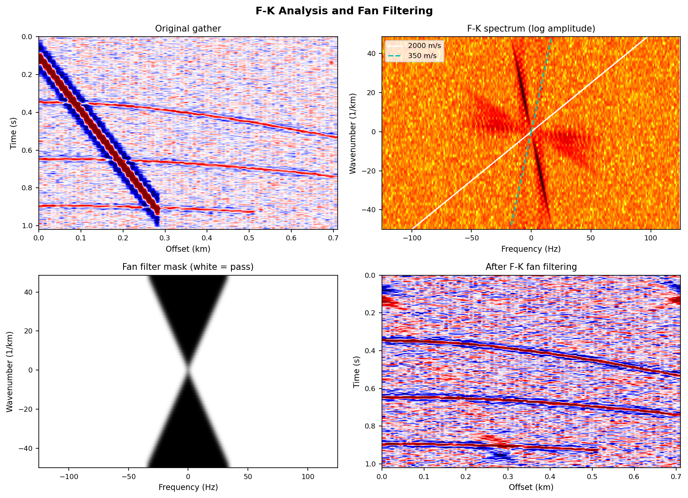
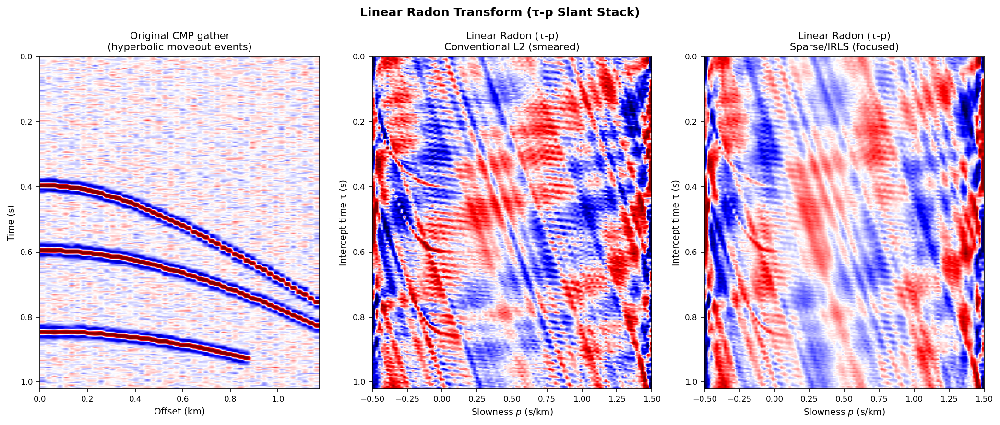

# F-K Analysis and Radon Transform

## Introduction

**Transform-domain methods** in seismic data processing map data from the time-space ($t$-$x$) domain into a new domain where different wavefields, or signal and noise, become separable. An overview of the most commonly used transforms:

| Transform | Input → Output | Separates | Typical use |
|-----------|---------------|-----------|-------------|
| F-K (2D FFT) | $d(x,t)$ → $D(k,f)$ | Frequency + wavenumber (apparent velocity) | Dip noise removal, wavefield separation |
| Linear Radon (τ-p, slant stack) | $d(x,t)$ → $m(\tau,p)$ | Intercept time + slowness | Multiple attenuation, surface-wave extraction |
| Parabolic Radon | $d(x,t)$ → $m(\tau,q)$ | Intercept time + curvature | Accurate multiple attenuation |
| Beamforming | $d(x,t)$ → $P(f,k)$ | Azimuth + slowness | Array steering, source location |

**Apparent velocity** is the unifying concept across all these transforms:

$$
v_\text{app} = \left.\frac{\partial t}{\partial x}\right|^{-1} = \frac{f}{k} = \frac{1}{p}
$$

where $p = k/f$ is the **slowness** (units: s/m or s/km).

---

## F-K Analysis

### The 2D Fourier Transform

The 2D discrete Fourier transform of a multi-channel record $d(x_i, t)$ yields the **frequency-wavenumber spectrum**:

$$
D(k, f) = \sum_{i=1}^{N_x}\sum_{j=1}^{N_t} d(x_i, t_j)\, e^{-i 2\pi (k x_i + f t_j)}
$$

- $f$ (Hz): temporal frequency — how fast the signal oscillates in time
- $k$ (1/m): spatial wavenumber — how fast the signal oscillates across the array
- Apparent velocity: $v_\text{app} = f/k$; apparent slowness: $p = k/f$

**Key property**: A plane wave propagating with apparent velocity $v$ along $x$, i.e. $d(x,t) = w(t - x/v)$, concentrates all its energy on the line $k = f/v$ in the F-K domain. Different wavefields — P-waves, S-waves, surface waves, noise — occupy distinct **wedge-shaped bands** in F-K space, enabling separation by a fan-shaped filter.

### Fan Filter

A fan (velocity) filter passes energy within an apparent velocity range $[v_\min, v_\max]$:

$$
H(f, k) = \begin{cases}
1, & |f/k| \geq v_\min \text{ and } |f/k| \leq v_\max \\
0, & \text{otherwise (slow/fast noise zone)}
\end{cases}
$$

In practice, the passband boundaries must be **tapered** (cosine or Hanning taper) to suppress Gibbs-effect ringing in the $t$-$x$ domain.

!!! note "F-K Filtering in VSP Wavefield Separation"
    In VSP processing, downgoing waves ($\partial t/\partial z > 0$) and upgoing waves ($\partial t/\partial z < 0$) have opposite-sign apparent velocities. An F-K filter retaining only $k > 0$ or $k < 0$ separates them directly. See [VSP Principles](vsp-en.md).

### Spatial Aliasing

When the channel spacing $\Delta x$ is too large, steeply dipping events alias in the wavenumber domain:

$$
k_\text{Nyquist} = \frac{1}{2\Delta x}, \qquad
f_\text{alias} = \frac{v_\text{app}}{2\Delta x}
$$

For surface waves ($v_\text{app} = 500$ m/s) and $\Delta x = 25$ m: $f_\text{alias} = 10$ Hz — surface waves alias above 10 Hz, contaminating the filter design. The spatial Nyquist condition is:

$$
\boxed{\Delta x \leq \frac{v_\text{app,min}}{2 f_\text{max}}}
$$

DAS channel spacings (1–5 m) largely eliminate this problem, whereas conventional geophone arrays (25–50 m spacing) often violate it for slow coherent noise.

### High-Resolution F-K: Capon Adaptive Beamforming

Conventional F-K (delay-and-sum beamforming) applies equal weights $1/N$ to all channels, equivalent to a rectangular spatial window — leading to high **sidelobes** that contaminate the spectrum.

Capon (1969) proposed the **Minimum Variance Distortionless Response (MVDR)**: maintain unit gain toward the look direction while minimising total output power, thereby maximally suppressing energy from all other directions.

Using the **spatial covariance matrix** $\hat{\mathbf{R}}(f)$ estimated from multiple data segments, the Capon spectrum is:

$$
\boxed{P_\text{Capon}(f, k) = \frac{1}{\mathbf{a}^H(k)\,\hat{\mathbf{R}}^{-1}(f)\,\mathbf{a}(k)}}
$$

where $\mathbf{a}(k) = [1,\, e^{ik\Delta x},\, e^{i2k\Delta x},\, \ldots]^T$ is the **steering vector** and $\hat{\mathbf{R}}(f) = \frac{1}{N_\text{seg}}\sum_n \hat{\mathbf{d}}_n\hat{\mathbf{d}}_n^H$ is estimated from $N_\text{seg}$ independent snapshots. The sidelobe level is typically 10–20 dB lower than conventional beamforming.

!!! warning "Practical Requirements for Capon MVDR"
    $\hat{\mathbf{R}}$ must be well-conditioned: requires $N_\text{seg} \gg N_x$ independent snapshots. When this condition is not met, use **diagonal loading**: $\hat{\mathbf{R}}_\epsilon = \hat{\mathbf{R}} + \epsilon\mathbf{I}$ with $\epsilon \approx 1$–$5\%$ of the largest eigenvalue.

### MUSIC Algorithm

**Multiple Signal Classification (MUSIC)** decomposes the covariance matrix into signal and noise subspaces:

$$
\hat{\mathbf{R}} = \mathbf{E}_s \boldsymbol{\Lambda}_s \mathbf{E}_s^H + \sigma_n^2 \mathbf{E}_n \mathbf{E}_n^H
$$

The MUSIC spectrum:

$$
P_\text{MUSIC}(k) = \frac{1}{\|\mathbf{E}_n^H\,\mathbf{a}(k)\|^2}
$$

diverges when the steering vector is orthogonal to the noise subspace, giving theoretically unlimited resolution (SNR-limited in practice). The cost is the need to know the source count $d$ (number of eigenvectors to assign to the signal subspace).

*Figure 1: (top-left) Original CMP gather with surface-wave noise; (top-right) F-K spectrum (log amplitude) — white line at 2000 m/s marks P-waves, cyan at 350 m/s marks surface waves; (bottom-left) fan filter mask (white = pass, $v_\text{app} > 700$ m/s); (bottom-right) filtered gather with surface-wave energy removed.*

---

## Radon Transform (Slant Stack)

### Linear Radon (τ-p Transform)

The linear Radon transform (also called the **slant stack** or **τ-p transform**) maps $x$-$t$ data to intercept-time–slowness (τ-p) space:

$$
m(\tau, p) = \int d(x,\, \tau + p\,x)\, \mathrm{d}x
$$

**Physical meaning**: integrate $d(x,t)$ along a straight line with slope $p$ (= apparent slowness). A linear moveout event with apparent velocity $v = 1/p$ collapses to a single point at $(τ, p)$ in the Radon domain.

**Inverse transform**:

$$
d(x, t) = \int m(\tau,\, p)\big|_{\tau = t - px}\, \mathrm{d}p
$$

### Discrete Implementation: Phase-Shift Summation

Efficient frequency-domain implementation: for each frequency $f$,

$$
M(p, f) = \sum_{i=1}^{N_x} D(x_i, f)\, e^{-i 2\pi f\, p\, x_i}
$$

This is a phase rotation for each slowness $p$, with total cost $O(N_p \cdot N_x \cdot N_f)$ — much faster than time-domain interpolation.

### Parabolic Radon

Real reflection moveout is hyperbolic; the **parabolic approximation** is more accurate after NMO:

$$
m(\tau, q) = \int d(x,\, \tau + q\,x^2)\, \mathrm{d}x
$$

where $q$ (s/m²) is the curvature parameter. After NMO correction, primary reflections map near $q = 0$, while multiples with residual moveout map to finite $q$ — enabling **multiple attenuation by muting** in the Radon domain.

| Radon type | Integration path | Focuses | Primary application |
|-----------|----------------|---------|-------------------|
| Linear (τ-p) | $t = \tau + px$ | Linear events | Surface-wave extraction, plane-wave decomposition |
| Parabolic | $t = \tau + qx^2$ | Post-NMO hyperbolic events | Multiple attenuation (OBC, towed streamer) |
| Hyperbolic | $t = \sqrt{\tau^2 + x^2/v^2}$ | Raw hyperbolic events | Precise velocity analysis |

### The L2 Smearing Problem

In discrete form: $\mathbf{d} = \mathbf{L}\mathbf{m}$. The **minimum-norm L2 solution**:

$$
\hat{\mathbf{m}}_{L2} = (\mathbf{L}^H\mathbf{L} + \varepsilon^2\mathbf{I})^{-1}\mathbf{L}^H\mathbf{d}
$$

Because $\mathbf{L}^H\mathbf{L}$ is not the identity (the operator is non-orthogonal for finite arrays), the L2 solution **smears** energy across neighbouring slownesses, degrading the contrast between primaries and multiples and reducing the effectiveness of subsequent muting.

---

## Sparse / High-Resolution Radon (Current Research)

### L1 Regularisation (Sparse Radon)

Replacing the L2 penalty with an L1 term forces most Radon coefficients to zero, consistent with the sparse nature of seismic reflectivity:

$$
\boxed{\hat{\mathbf{m}} = \arg\min_{\mathbf{m}} \left\{\|\mathbf{d} - \mathbf{L}\mathbf{m}\|_2^2 + \lambda\|\mathbf{m}\|_1\right\}}
$$

Common solvers: ADMM (Alternating Direction Method of Multipliers), ISTA/FISTA (iterative soft thresholding).

### Iteratively Reweighted Least Squares (IRLS)

IRLS solves a series of weighted L2 problems, updating the weight matrix from the previous solution's amplitude:

$$
\hat{\mathbf{m}}^{(k+1)} = \left(\mathbf{L}^H\mathbf{L} + \varepsilon\,[\mathbf{Q}^{(k)}]^{-1}\right)^{-1} \mathbf{L}^H\mathbf{d}
$$

$$
Q^{(k)}_{ii} = \left|m_i^{(k)}\right| + \delta, \quad \delta \ll 1
$$

Even 1–3 iterations produce dramatically sharper Radon panels compared with the L2 solution, at only a modest computational overhead.

### Sacchi-Ulrych High-Resolution Radon

Sacchi & Ulrych (1995) perform frequency-by-frequency estimation in the frequency domain using **adaptive weighting** derived from the estimated model power spectrum:

$$
\hat{\mathbf{M}}(\omega) = \left(\mathbf{L}^H\mathbf{L} + \mu\,\mathbf{Q}^{-1}(\omega)\right)^{-1} \mathbf{L}^H\mathbf{D}(\omega), \quad \mathbf{Q}(\omega) = \mathrm{diag}(|\hat{M}_j(\omega)|^2)
$$

This **frequency-adaptive regularisation** applies strong constraint only where the model power is low (noise-dominated frequencies), achieving consistent focusing across the full bandwidth.

### Compressive Sensing Radon

When receiver spacing is non-uniform or traces are missing, the conventional regular-grid Radon assumption breaks down. The compressive sensing formulation directly recovers a sparse Radon panel from irregular observations:

$$
\hat{\mathbf{m}} = \arg\min_{\mathbf{m}} \|\mathbf{m}\|_1 \quad \text{s.t.} \quad \|\mathbf{d} - \mathbf{L}_\text{irr}\mathbf{m}\|_2 \leq \sigma
$$

where $\mathbf{L}_\text{irr}$ is the irregular-sampling Radon operator. No interpolation pre-processing is required.

*Figure 2: (left) CMP gather with hyperbolic moveout events; (centre) conventional L2 Radon — events smear widely in slowness; (right) sparse/IRLS Radon — events focus into sharp stripes in the τ-p domain.*

---

## Practical Requirements and Guidelines

### F-K Filtering

| Issue | Explanation | Mitigation |
|-------|------------|-----------|
| Uniform channel spacing | Non-uniform spacing distorts the F-K spectrum | Interpolate to a regular grid, or use NUFFT |
| Edge effects | Finite aperture produces sidelobes | Apply spatial/temporal tapers (Hanning, Tukey) |
| Filter boundary | Rectangular cut creates ringing | Cosine-taper the boundary (≥ 5% of band width) |
| Signal leakage | Overly narrow passband clips useful signal | Widen passband to acceptable residual noise level |
| 3D data | 2D F-K misses cross-line dips | Extend to 3D F-K ($k_x$, $k_y$, $f$) |

### Linear Radon

| Issue | Explanation | Mitigation |
|-------|------------|-----------|
| Slowness range | Too narrow → energy overflow | Cover all target apparent velocities including surface waves |
| Slowness sampling | Large $\Delta p$ → poor slowness resolution | $\Delta p \leq 1/(N_x \cdot x_\max \cdot f_\max)$ |
| NMO residual | Linear Radon cannot focus hyperbolic events exactly | Use parabolic Radon, or apply NMO before linear Radon |
| Regularisation $\varepsilon$ | Too large → smearing; too small → instability | L-curve or cross-validation for automatic selection |
| Computational cost | Time-domain: $O(N_p N_x N_t)$ | Frequency-domain: $O(N_p N_x N_f)$ per iteration |

### High-Resolution Methods

| Method | Key parameter | Recommended range |
|--------|--------------|------------------|
| Capon MVDR | Diagonal loading $\epsilon$ | $1$–$5\%$ of largest eigenvalue |
| Capon MVDR | Number of snapshots $N_\text{seg}$ | $N_\text{seg} > 2 N_x$ (otherwise singular) |
| IRLS Radon | Number of iterations | 3–10; more iterations risk over-sparsity and amplitude distortion |
| IRLS Radon | Stabilisation factor $\delta$ | $1$–$5\%$ of maximum amplitude |
| Sparse Radon (ADMM) | Regularisation $\lambda$ | $\lambda = \sigma_n\sqrt{2\ln N}$ (BIC estimate) |

---

## Summary Comparison

| Method | Separation criterion | Resolution | Cost | Current research |
|--------|---------------------|-----------|------|-----------------|
| F-K fan filter | Apparent velocity (linear) | Aperture-limited | Low (FFT) | Adaptive weights, DAS non-uniform sampling |
| Capon MVDR | Apparent velocity (adaptive) | High (SNR-limited) | Medium (matrix inversion) | Diagonal loading optimisation, recursive update |
| MUSIC | Apparent velocity (subspace) | Super-resolution | High (eigendecomposition) | Source-count estimation, non-stationary covariance |
| Linear Radon (L2) | Apparent velocity (linear) | Low (smeared) | Medium | Baseline reference; largely superseded |
| High-res Radon (IRLS) | Apparent velocity (linear) | High | Medium-high | Compressive sensing, irregular sampling |
| Parabolic Radon (L1) | Curvature + velocity | High | High | Deep-water multiple suppression |

---

## References

- Capon, J. (1969). High-resolution frequency-wavenumber spectrum analysis. *Proceedings of the IEEE*, 57(8), 1408–1418.
- Schmidt, R. O. (1986). Multiple emitter location and signal parameter estimation. *IEEE Transactions on Antennas and Propagation*, 34(3), 276–280.
- Hampson, D. (1986). Inverse velocity stacking for multiple elimination. *SEG Technical Program Expanded Abstracts*, 422–424.
- Sacchi, M. D., & Ulrych, T. J. (1995). High-resolution velocity gathers and offset space reconstruction. *Geophysics*, 60(4), 1169–1177.
- Trad, D., Ulrych, T., & Sacchi, M. (2003). Latest views of the sparse Radon transform. *Geophysics*, 68(1), 386–399.
- Herrmann, F. J., & Hennenfent, G. (2008). Non-parametric seismic data recovery with curvelet frames. *Geophysical Journal International*, 173(1), 233–248.
- Naghizadeh, M., & Sacchi, M. D. (2010). Beyond alias hierarchical scale curvelet interpolation of regularly and irregularly sampled seismic data. *Geophysics*, 75(6), WB189–WB202.
