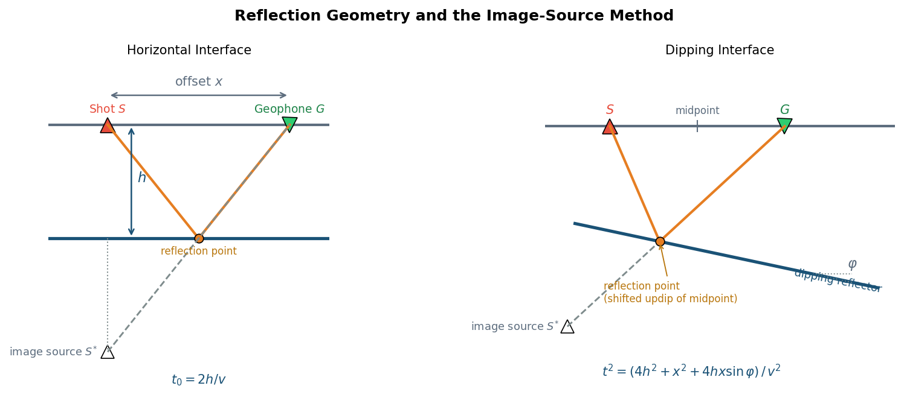
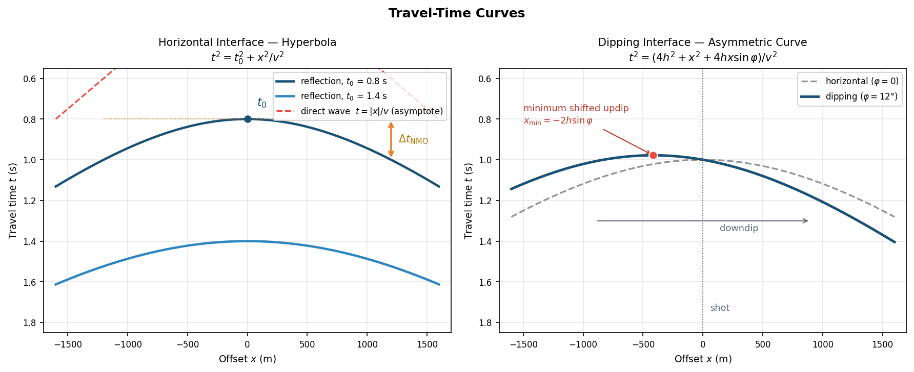
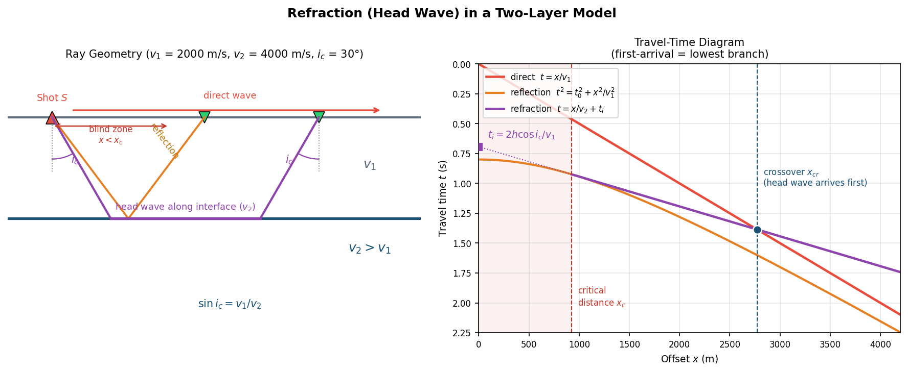
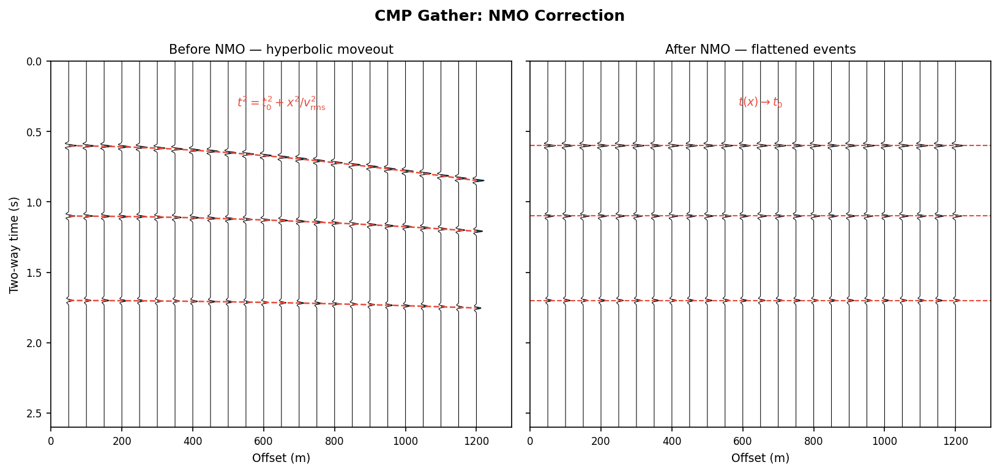
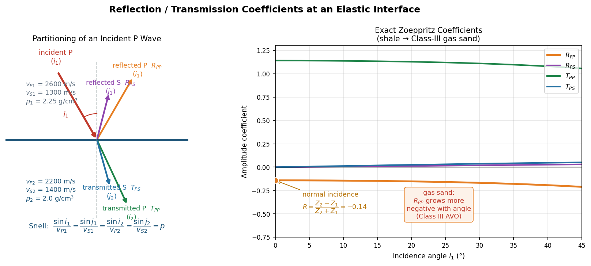
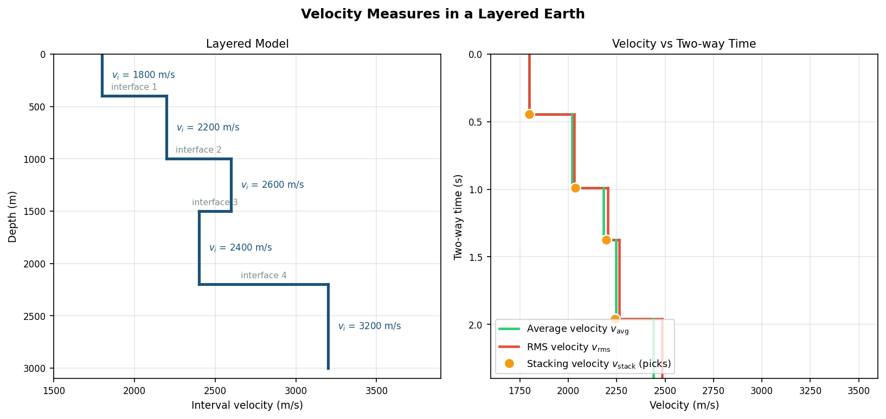
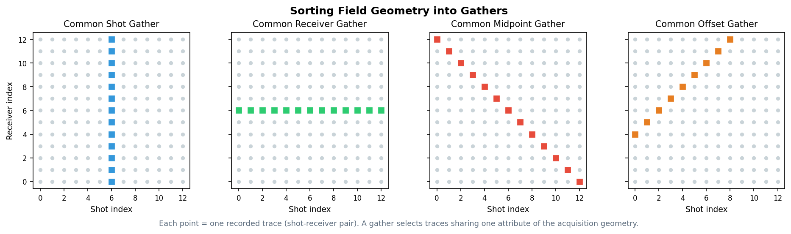

# Geometrical Seismology: Travel-Time Curves, Velocities and Gathers

## Introduction

**Geometrical seismology** studies the **kinematics** of seismic wave propagation — travel times, ray paths and acquisition geometry — without reference to amplitude, phase or other dynamical information. It is the foundation of reflection seismology: every step from raw field records to a structural image (NMO, velocity analysis, stacking, migration) rests on geometrical travel-time relations.

Two core questions run throughout:

1. **How long did the wave travel?** — the travel-time curve describes how travel time varies with offset;
2. **How should the data be arranged?** — the gather defines how multi-channel records are organized, and determines what information subsequent processing can extract.

---

## Reflection Travel-Time Curves

### Horizontal interface: the hyperbolic moveout equation

For a horizontal reflector at depth $h$ in a homogeneous medium of velocity $v$, with source-receiver **offset** $x$, the reflection travel time satisfies:

$$
t^2(x) = t_0^2 + \frac{x^2}{v^2}
$$

where $t_0 = 2h/v$ is the zero-offset two-way time. The travel-time curve is a **hyperbola** symmetric about the $t$ axis.


*Figure 1: Reflection geometry and the image-source method. Left — horizontal interface: shot $S$, geophone $G$, the reflection point directly beneath the midpoint, and the image source $S^{*}$ mirrored across the interface (the reflected ray is equivalent to a straight line from $S^{*}$ to $G$); right — dipping interface: the reflection point shifts updip of the midpoint, and the image source is the mirror of the shot across the dipping interface.*

**Normal Moveout (NMO)** is the difference between the travel time at offset $x$ and at zero offset:

$$
\Delta t_\text{NMO} = t(x) - t_0 = \sqrt{t_0^2 + \frac{x^2}{v^2}} - t_0 \approx \frac{x^2}{2 v^2 t_0}
\qquad (x \ll h)
$$

Moveout grows **quadratically with offset** and decays with depth ($t_0$) — deeper reflections have flatter hyperbolas.

### Dipping interface: an asymmetric curve

When the interface dips at angle $\varphi$:

$$
t^2(x) = \frac{4h^2 + x^2 + 4 h x \sin\varphi}{v^2}
$$

The hyperbola's **minimum shifts away from the shot**, and the shift's direction and magnitude carry dip information (travel times are smaller in the downdip direction). This is why a single-sided spread cannot distinguish "dipping interface" from "velocity variation".


*Figure 2: Travel-time curves. Left — hyperbolas over a horizontal interface for two values of $t_0$; the red dashed line is the direct wave $t=|x|/v$, the asymptote of the hyperbola, and the orange arrow marks the normal moveout $\Delta t_\text{NMO}$; right — asymmetric curve for a dipping interface ($\varphi = 12°$, solid) versus the symmetric horizontal case (dashed), with the minimum shifted updip to $x_\text{min}=-2h\sin\varphi$.*

### Refraction (head-wave) travel-time curve

When the underlying layer is faster than the overburden ($v_2 > v_1$), a **critical angle** exists:

$$
\sin i_c = \frac{v_1}{v_2}
$$

A ray incident at the critical angle enters the lower layer, **travels along the interface at $v_2$**, and returns to the surface along the same angle, forming the **refraction** (head wave). Its travel-time curve is a **straight line**:

$$
t(x) = \frac{x}{v_2} + t_i, \qquad
t_i = \frac{2h\cos i_c}{v_1}
$$

where $t_i$ is the **intercept time** (where the refraction line extrapolates to the $t$ axis). Two key distances:

- **Critical distance** $x_c = 2h\tan i_c$: for $x < x_c$ there is a **blind zone** — the head wave has not yet returned to the surface;
- **Crossover distance** $x_{cr} = 2h\sqrt{\dfrac{v_2+v_1}{v_2-v_1}}$: beyond $x_{cr}$ the head wave, despite its longer path, **arrives first** and becomes the first break.


*Figure 3: Refraction in a two-layer model ($v_1$ = 2000 m/s, $v_2$ = 4000 m/s). Left — ray geometry: direct wave (red), reflection (orange), and the head wave (purple) entering at the critical angle $i_c$ and travelling along the interface; $x < x_c$ is the blind zone; right — travel-time diagram with the direct line, reflection hyperbola and refraction line: beyond the crossover distance $x_{cr}$ the refraction branch is the first arrival, and the intercept time $t_i$ yields the interface depth.*

The refraction travel-time curve directly yields the near-surface structure: the slopes give $v_1$ and $v_2$, and the intercept time gives the interface depth:

$$
h = \frac{t_i \, v_1}{2\cos i_c}
$$

!!! note "Prerequisites and uses of refraction"
    A head wave exists only when **velocity increases with depth** ($v_2 > v_1$); a low-velocity layer (e.g., a gas-charged zone) is "invisible" to refraction. Refraction analysis underlies **first-break picking, near-surface velocity modelling and static corrections** — land weathering-layer correction relies precisely on first-break refraction information.

### NMO correction

NMO correction shifts each offset's reflection time $t(x)$ back to its zero-offset time $t_0$, **flattening** the event so that traces can be stacked in phase:


*Figure 5: NMO correction of a synthetic CMP gather. Left — before correction, three reflection events follow hyperbolas (red dashes: theoretical curves); right — after correction with the correct $v_\text{rms}$, events are flattened to their $t_0$ and ready to stack.*

!!! warning "NMO stretch"
    NMO is a nonlinear compression/stretching of the time axis: shallow, far-offset wavelets are stretched noticeably (lowered in frequency). Such data are usually **muted** above a stretch threshold, otherwise they contaminate the high-frequency shallow part of the stack.

---

## Reflection and Transmission Coefficients (RT)

Travel-time curves tell us **when** a wave arrives; reflection/transmission coefficients answer **how much energy** it brings back — the physical basis of amplitude interpretation and reservoir prediction.

### Normal incidence: the impedance-contrast formula

For a plane wave normally incident on an interface, the two boundary conditions — continuity of **displacement** and of **stress** — directly give the reflection and transmission coefficients:

$$
R = \frac{Z_2 - Z_1}{Z_2 + Z_1}, \qquad
T = \frac{2 Z_1}{Z_1 + Z_2}
$$

where $Z = \rho v$ is the **acoustic impedance**. Note:

- **Sign convention**: when $Z_2 < Z_1$ (e.g., shale over gas sand), $R < 0$ and the reflected waveform is **polarity-reversed**; $R > 0$ preserves polarity;
- $T$ can exceed 1 (in amplitude) without violating energy conservation — the true constraint is on the **energy coefficients**:

$$
E_R = R^2, \qquad E_T = \frac{Z_2}{Z_1} T^2, \qquad E_R + E_T = 1
$$

- Typical sedimentary interfaces have $|R|$ of only $0.05$–$0.15$; the top of a gas sand can reach $0.2$–$0.3$ — the physical origin of "bright spots".

### Oblique incidence: mode conversion and the Zoeppritz equations

A P wave incident at angle $i_1$ on an elastic interface generates **four waves**: reflected P, converted reflected S ($R_{PS}$), transmitted P, and converted transmitted S ($T_{PS}$). Their angles are linked by **Snell's law** (conservation of the ray parameter $p$):

$$
\frac{\sin i_1}{v_{P1}} = \frac{\sin j_1}{v_{S1}} = \frac{\sin i_2}{v_{P2}} = \frac{\sin j_2}{v_{S2}} = p
$$

Since $v_S < v_P$, converted waves always travel **closer to the normal** ($j_1 < i_1$).

The amplitudes follow from four boundary conditions — continuity of normal/tangential **displacement** and normal/tangential **stress** — forming a 4×4 linear system for $[R_{PP}, R_{PS}, T_{PP}, T_{PS}]$: the **Zoeppritz equations** (Zoeppritz, 1919). Writing each wave's displacement and stress through potentials and substituting the boundary conditions gives a system of the form:

$$
\underbrace{\begin{bmatrix}
p & \eta_{S1} & -p & \eta_{S2}\\
-\eta_{P1} & p & -\eta_{P2} & -p\\
2\mu_1 p\,\eta_{P1} & \mu_1(\eta_{S1}^2-p^2) & 2\mu_2 p\,\eta_{P2} & -\mu_2(\eta_{S2}^2-p^2)\\
-\rho_1(1-2v_{S1}^2p^2) & 2\mu_1 p\,\eta_{S1} & \rho_2(1-2v_{S2}^2p^2) & 2\mu_2 p\,\eta_{S2}
\end{bmatrix}}_{\text{Zoeppritz matrix}}
\begin{bmatrix} R_{PP} \\ R_{PS} \\ T_{PP} \\ T_{PS} \end{bmatrix}
=
\begin{bmatrix} -p \\ -\eta_{P1} \\ 2\mu_1 p\,\eta_{P1} \\ \rho_1(1-2v_{S1}^2p^2) \end{bmatrix}
$$

where $\eta_{P} = \cos i / v_P$ and $\eta_S = \cos j / v_S$ are vertical slownesses and $\mu = \rho v_S^2$ is the shear modulus. At normal incidence ($p = 0$) the system diagonalizes, $R_{PS} = T_{PS} = 0$, and the impedance formula above falls out immediately — one benchmark for any numerical Zoeppritz implementation (the other is energy conservation $E_R + E_T = 1$).


*Figure 4: Energy partitioning at an elastic interface. Left — an incident P wave splits into reflected P/S and transmitted P/S waves, with converted waves travelling closer to the normal; right — exact Zoeppritz coefficients versus incidence angle for a shale over Class-III gas sand: $R_{PP}$ starts at $-0.14$ (polarity reversal) and grows more negative with angle (the Class-III AVO signature); converted-wave energy is zero at normal incidence and grows slowly with angle.*

### Weak-contrast approximations and AVO

The Zoeppritz equations have no simple closed-form solution. For **weak contrasts** (small $\Delta v/\bar{v}$, $\Delta\rho/\bar{\rho}$, …), Aki & Richards (1980) derived a linearized approximation, whose most-used form is the **Shuey three-term equation**:

$$
R_{PP}(\theta) \approx \underbrace{A}_{\text{intercept}} + \underbrace{B}_{\text{gradient}} \sin^2\theta + \underbrace{C}_{\text{curvature}} \sin^2\theta\tan^2\theta
$$

- $A = R_0$: the normal-incidence coefficient, set by the **impedance contrast**;
- $B$: governed mainly by the **Poisson-ratio contrast** $\Delta\sigma$ — gas sands have markedly lower Poisson's ratio than surrounding shales, so $|R|$ grows with offset (the AVO bright-spot signature);
- $C$: tied to the velocity contrast; a large-angle term often dropped at the low S/N of real data.

Fitting $A$ and $B$ trace-by-trace on a CMP gather is **intercept-gradient analysis**, the industry-standard AVO workflow. This is also why common-offset gathers and amplitude-preserving processing matter so much in reservoir studies — the angle information must survive the acquisition geometry.

!!! note "Echo of the refraction section"
    When $v_{P2} > v_{P1}$ and the incidence angle reaches the critical angle $i_c$ ($\sin i_c = v_{P1}/v_{P2}$), the transmitted P wave turns into an interface-sliding head wave and $R_{PP}$ becomes complex (amplitude approaching 1 with an added phase shift) — the behaviour of Zoeppritz coefficients near the critical angle ties the reflection and refraction worlds together.

---

## The Many Velocities of Reflection Seismology

"Velocity" is not a single concept in seismic processing. Understanding each velocity's **definition, origin and purpose** is a prerequisite for using them correctly.

### Average velocity

$$
v_\text{avg} = \frac{z}{\displaystyle\sum_i \frac{h_i}{v_i}} = \frac{z}{t_\text{one-way}}
$$

Total depth divided by one-way vertical travel time. It answers "**how fast, on average, does the wave travel vertically**" and is the standard tool for **time-depth conversion** (calibrated by VSP and sonic logs).

### RMS velocity

$$
v_\text{rms}^2 = \frac{\displaystyle\sum_i v_i^2 \, \Delta t_i}{\displaystyle\sum_i \Delta t_i}
$$

with $\Delta t_i$ the one-way vertical time in layer $i$. RMS velocity is a **time-weighted** root mean square in which fast layers weigh more, so:

$$
v_\text{rms} \geq v_\text{avg}
$$

with equality only in a homogeneous medium. **Physical meaning**: in the small-offset approximation, the reflection hyperbola of a horizontally layered medium keeps its form if the homogeneous velocity is replaced by $v_\text{rms}$ — the classic result of Dix (1955).

### Stacking velocity

**$v_\text{stack}$ is fitted from the data**: a CMP gather is NMO-corrected and stacked (or measured by semblance) over a suite of trial velocities; the velocity maximizing stack power is the stacking velocity. Defined by hyperbola fitting:

$$
t^2(x) = t_0^2 + \frac{x^2}{v_\text{stack}^2}
$$

Relation between the three:

$$
v_\text{stack} \;\approx\; v_\text{rms} \;\geq\; v_\text{avg}
$$

- Horizontal layering, small offsets: $v_\text{stack} \approx v_\text{rms}$ — the bridge between "processing" and "geology";
- With dip or lateral velocity variation, $v_\text{stack}$ deviates systematically from $v_\text{rms}$ (for a dipping interface $v_\text{stack} = v/\cos\varphi$), and a direct Dix inversion will be in error.

### Interval velocity and the Dix formula

The **interval velocity** of layer $n$ is recovered from the RMS velocities of the interfaces above and below it:

$$
\boxed{\,v_n^2 = \frac{v_{\text{rms},n}^2 \, t_n - v_{\text{rms},n-1}^2 \, t_{n-1}}{t_n - t_{n-1}}\,}
$$

where $t_n$ is the zero-offset two-way time of the $n$-th interface. The Dix formula is the key step from **velocity spectra → interval velocities → lithology interpretation** (e.g., identifying fast salt or slow gas-charged zones).

!!! note "The fragility of Dix inversion"
    The Dix formula is highly error-sensitive: $v_n$ depends on the difference of two large numbers ($v_{\text{rms},n}^2 t_n$ and $v_{\text{rms},n-1}^2 t_{n-1}$), and the small denominator $t_n - t_{n-1}$ amplifies errors for thin layers. The thinner the layer and the noisier the picks, the less reliable the estimate.


*Figure 6: Left — interval velocities of a five-layer horizontal model; right — the corresponding average (green) and RMS (red) velocities versus two-way time, with stacking-velocity picks from semblance analysis (orange dots). Note $v_\text{stack} \approx v_\text{rms} \geq v_\text{avg}$, and how the low-velocity layer (layer 4, 2400 m/s) pulls the average velocity down.*

### Velocity cheat sheet

| Velocity | Defined by | Question answered | Typical use |
|----------|-----------|-------------------|-------------|
| Interval $v_i$ | the medium itself | How fast in this layer? | Lithology, reservoir prediction |
| Average $v_\text{avg}$ | depth ÷ vertical time | Mean vertical speed? | Time-depth conversion |
| RMS $v_\text{rms}$ | time-weighted RMS of $v_i$ | Equivalent hyperbola velocity? | Theory, input to Dix inversion |
| Stacking $v_\text{stack}$ | hyperbola fit to data | What velocity flattens best? | NMO and stacking |

---

## Acquisition Geometry and Gathers

### Multi-fold coverage and gather sorting

A seismic survey records a dense grid of traces indexed by (shot, receiver). A **gather** groups traces sharing one attribute of that geometry. The same field data can be resorted into different gathers, each serving its own purpose:


*Figure 7: Gather selection on the shot-receiver grid. Each point is one recorded trace; highlighted traces form common-shot (vertical line), common-receiver (horizontal line), common-midpoint (anti-diagonal, constant $s+g$) and common-offset (diagonal, constant $g-s$) gathers.*

| Gather | Shared attribute | Event shape (flat layers) | Main use |
|--------|-----------------|---------------------------|----------|
| Common shot (CSG) | same shot | hyperbola | Field QC, first-break picking, refraction analysis |
| Common receiver (CRG) | same receiver | hyperbola | Receiver consistency, statics, receiver functions |
| Common midpoint (CMP/CDP) | same midpoint | hyperbola | **The arena of velocity analysis, NMO and stacking** |
| Common offset (COG) | same offset | nearly flat | Pre-migration processing, AVO, regularization |

### The CMP gather: heart of the method

A CMP gather collects traces with the **same midpoint**. For horizontal interfaces, equal midpoint means **equal reflection point** (CMP = CRP), so every trace samples the same subsurface point repeatedly — the essence of multi-fold coverage:

1. **NMO** removes offset-dependent moveout and flattens the events;
2. **Stacking** sums $N$ traces in phase: random noise decays as $\sqrt{N}$, signal grows as $N$, and the signal-to-noise ratio improves by $\sqrt{N}$;
3. **Velocity analysis** scans velocities along time (semblance spectra), picking $v_\text{stack}$ at each $t_0$.

**Fold**: the number of traces per CMP. For a single-ended spread:

$$
F = \frac{N \, \Delta g}{2 \, \Delta s}
$$

with $N$ channels, receiver spacing $\Delta g$ and shot spacing $\Delta s$. Typical land surveys use 30–120 fold; higher fold suppresses noise and multiples better, at higher cost.

!!! note "A fortunate coincidence of flat geology"
    CMP processing works because "same midpoint ≈ same reflection point". On dipping interfaces reflection points disperse downdip, and in complex structure a CMP gather mixes information from different reflection points — the fundamental reason **prestack migration** is needed instead of simple stacking.

### From gathers to stacked section: the processing skeleton

```text
field records (shot gathers)
      │  sorting
      ▼
CMP gathers ──► velocity analysis (semblance scan, pick v_stack)
      │                │
      ▼                ▼
   NMO correction ◄── stacking-velocity field
      │
      ▼
   stack ──► stacked section (zero-offset approximation)
      │
      ▼
  migration ──► structural image
```

---

## Summary

- The reflection travel-time curve over a horizontal interface is a hyperbola $t^2 = t_0^2 + x^2/v^2$; moveout grows quadratically with offset;
- A head wave requires $v_2 > v_1$; its travel-time curve is the line $t = x/v_2 + t_i$, becoming the first arrival beyond the crossover distance, with slope and intercept yielding near-surface velocities and interface depth;
- Interface reflection/transmission coefficients follow from the Zoeppritz equations (a 4×4 system from displacement and stress continuity); at normal incidence they reduce to $R = (Z_2 - Z_1)/(Z_2 + Z_1)$, and the Shuey three-term approximation reduces the angle dependence to intercept and gradient — the basis of AVO analysis;
- $v_\text{avg}$ serves time-depth conversion, $v_\text{rms}$ is the small-offset hyperbola-equivalent velocity, $v_\text{stack}$ is fitted from data; $v_\text{stack} \approx v_\text{rms} \geq v_\text{avg}$;
- The Dix formula converts RMS to interval velocity but is sensitive to thin layers and picking errors;
- Gathers re-sort traces by acquisition attribute: common-shot for QC, the **CMP gather** as the core of velocity analysis and stacking;
- Multi-fold coverage + NMO + stacking boosts SNR as $\sqrt{N}$, but must give way to prestack migration in complex structure.

## References

1. Dix, C. H. (1955). Seismic velocities from surface measurements. *Geophysics*, 20(1), 68–86.
2. Yilmaz, Ö. (2001). *Seismic Data Analysis: Processing, Inversion, and Interpretation of Seismic Data*. SEG.
3. Sheriff, R. E., & Geldart, L. P. (1995). *Exploration Seismology* (2nd ed.). Cambridge University Press.
4. Zoeppritz, K. (1919). Erdbebenwellen VII B: Über Reflexion und Durchgang seismischer Wellen durch Unstetigkeitsflächen. *Nachr. Ges. Wiss. Göttingen*, 66–84.
5. Aki, K., & Richards, P. G. (1980). *Quantitative Seismology: Theory and Methods*. W. H. Freeman.
6. Shuey, R. T. (1985). A simplification of the Zoeppritz equations. *Geophysics*, 50(4), 609–614.
