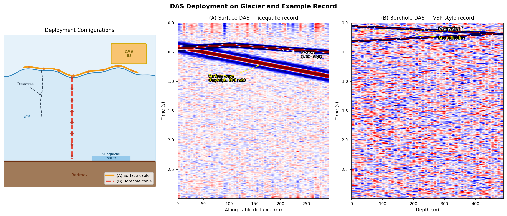

# Glacier Seismology: Instruments, Arrays, and DAS Applications

## Introduction

**Glacioseismology** uses seismic waves to detect and monitor glaciers, ice sheets, and ice shelves, and is the core tool for studying cryospheric dynamics. Ice bodies host diverse elastic wave sources — from millisecond-scale micro-icequakes to glacial earthquakes lasting tens of minutes — spanning a frequency range from 0.001 Hz to several hundred Hz.

$$
\boxed{\text{Glacioseismology} = \text{Source (ice fracture/motion)} + \text{Propagation (ice elasticity)} + \text{Observation (seismometer/DAS)}}
$$

Key challenges in modern glacioseismology:

- **Polar environment**: low temperatures (−60°C to 0°C), strong wind noise, and ice-surface motion make instrument deployment difficult
- **Broadband requirement**: high-frequency crevasse events (>10 Hz) coexist with long-period glacial earthquakes (<0.1 Hz)
- **Sparse coverage**: traditional networks have station spacings of tens of kilometres, insufficient for fine spatial resolution
- **DAS revolution**: distributed acoustic sensing upgrades "point" observation to "line" observation, with channel spacing as small as 1–5 m

---

## Types of Glaciological Seismic Signals

| Signal type | Frequency (Hz) | Magnitude | Duration | Source mechanism |
|-------------|---------------|-----------|---------|-----------------|
| Surface icequake | 10–200 | Mw −3 to 0 | 0.1–2 s | Crevasse opening (tensile crack) |
| Basal icequake | 1–30 | Mw −2 to +1 | 0.2–5 s | Glacier-bed stick-slip motion |
| Deep englacial icequake | 1–20 | Mw −1 to +1 | 0.5–10 s | Thermal stress, phase change |
| Calving / overturning | 0.1–5 | Mw 1 to 4 | 10–300 s | Ice-tongue fracture, iceberg capsizing |
| Glacial earthquake | 0.01–0.1 | Mw 4.5–6.5 | 30–120 s | Rapid glacier/ice-shelf motion; centroid single force |
| Subglacial hydraulic tremor | 1–20 | Continuous | min–hours | Subglacial channel water flow |
| Subglacial-lake drainage | 0.01–1 | Mw 2–4 | Hours | Sudden outburst flood |


*Figure 1: Synthetic waveforms of four typical glaciological seismic signals. From top: high-frequency impulsive surface crevasse; low-frequency emergent basal stick-slip; long-period calving/collapse; continuous narrowband subglacial hydraulic tremor. The wide variation in frequency content and duration demands broadband instruments and multi-window processing.*

---

## Seismic Physical Properties of Ice

Understanding the propagation and attenuation of glaciological seismic signals requires knowledge of ice's elastic parameters. Ice differs from typical crustal rock in three key ways: (1) it is extremely homogeneous, so scattering is weak and coda is short; (2) the firn layer has low and strongly depth-varying velocity; (3) crystal fabric produces significant elastic anisotropy (Podolskiy & Walter, 2016).

### Elastic Wave Velocities and Q

| Medium | $V_P$ (m/s) | $V_S$ (m/s) | $V_R$ (m/s) | $Q_P$ | $Q_S$ |
|--------|------------|------------|------------|--------|--------|
| Cold ice | 3600–3900 | 1700–1950 | 1650–1668 | ~600 | ~300 |
| Temperate ice | 3500–3700 | 1700–1850 | — | <100 | <100 |
| Firn (near surface) | ~500 | — | — | — | — |
| Soft subglacial sediment | 1500–2500 | 300–600 | — | low | low |

*$V_R$ measured at 45 Hz (Roux et al., 2010; Mikesell et al., 2012); Q values from Walter et al. (2009).*

**Effect of attenuation on detection range**: With $Q_S \approx 300$, the effective detection radius for a 10 Hz event is approximately:

$$
r_\text{eff} \approx \frac{Q_S V_S}{\pi f} = \frac{300 \times 1800}{\pi \times 10} \approx 17\;\text{km}
$$

At 50 Hz this shrinks to ~3 km; events above 100 Hz are typically only detectable within ~1 km.

### Crystal Fabric and Elastic Anisotropy

Under ice flow and gravity, $c$-axes gradually align toward vertical, producing a **transversely isotropic (VTI)** elastic structure:

- Horizontal vs vertical $V_P$ difference: ~3–5%; S waves exhibit birefringence (shear-wave splitting)
- Ice effective viscosity varies by a factor of **50–100** with fabric (Dahl-Jensen et al., 2013), making fabric a critical parameter for ice-sheet dynamics models
- Basal stick-slip S waves that traverse the full ice column carry integrated fabric information — the most efficient natural probe of englacial anisotropy

!!! note "Cold vs temperate ice"
    Temperate ice (near 0°C) contains liquid water at grain boundaries, lowering $V_P$ slightly and dramatically reducing $Q$ (< 100). Most Alpine and mountain glaciers are temperate; high attenuation limits propagation of signals above ~30 Hz to within 1–2 km.

### Low Scattering in Glacier Ice

Unlike multi-phase crustal rocks, glacier ice is nearly homogeneous. Icequake waveforms **lack sustained coda** — a defining feature that:

- Makes P- and S-wave onsets easy to pick (clean waveforms)
- Inhibits traditional noise cross-correlation methods (equipartitioned diffuse wavefield cannot be achieved by scattering alone)
- Requires natural icequakes to act as **virtual sources** for seismic interferometry (see Passive Structural Imaging)

---

## Instrumentation

### Broadband Seismometers

Broadband seismometers are essential for capturing glacial earthquakes and long-period calving signals.

| Model | Bandwidth | Sensitivity | Glaciological suitability |
|-------|-----------|-------------|--------------------------|
| Nanometrics Trillium Compact | 0.008–100 Hz | 1500 V·s/m | ★★★★☆ lightweight, good low-T performance |
| Güralp CMG-40T | 0.03–50 Hz | 800 V·s/m | ★★★☆☆ heavier, better on bedrock |
| Streckeisen STS-2 | 0.008–50 Hz | 1500 V·s/m | ★★☆☆☆ large, fixed-station use |
| REF TEK 151B | 0.02–50 Hz | 1500 V·s/m | ★★★★☆ polar-rated version available |

**Ice-surface deployment issues:**

- Ice-surface tilt → **tilt noise** can exceed signal by 10 dB at 0.01–1 Hz
- Solution: gimbal mount + post-processing tilt-to-acceleration correction
- Ice flow velocity 1–100 m/yr → without GPS, long-term source-location errors can reach tens of metres

### Short-Period Geophones

Geophones are lightweight and inexpensive — the workhorse for active-source surveys and dense passive arrays.

| Model | Natural freq. | Sensitivity | Typical use |
|-------|--------------|-------------|------------|
| Sercel L-22 | 2 Hz | 88 V/m/s | Refraction/reflection surveys |
| Geospace GS-11D | 4.5 Hz | 28 V/m/s | Dense ice-surface arrays |

!!! note "Geophone limitation"
    A 4.5 Hz geophone has rapidly falling sensitivity below its natural frequency, and cannot record glacial earthquakes (<0.1 Hz) or large calving events (<2 Hz). Broadband seismometers must be used alongside geophones when multi-signal-type monitoring is required.

### Acquisition Notes

**Battery performance in cold**: LiFePO₄ batteries retain 70–80% capacity at −40°C; standard LiCoO₂ drops to 50% at −20°C.

**GPS clock accuracy**: snow-covered GPS antennas can accumulate clock errors >1 ms, translating to >3.7 m source-location error via P-wave velocity (~3700 m/s).

**Coupling**: freeze-thaw cycles break geophone-to-ice coupling. Fix: drill an ice shaft, insert a spike, and allow it to refreeze.

---

## Seismic Array Methods

### Array Geometry and Design

| Geometry | Advantages | Application |
|----------|-----------|------------|
| Linear array | High resolution along cable; F-K friendly | Glacier-flow-direction monitoring, natural DAS geometry |
| Circular array | Uniform back-azimuth coverage | Omni-directional source location |
| L-shaped array | 2-D imaging at low cost | Temporary field deployments |
| Sparse icecap network | Wide areal coverage | Ice-sheet-scale monitoring |

Key design parameters:
- Minimum spacing $d_\min$ → maximum resolvable wavenumber $k_\max = 1/(2d_\min)$
- Aperture $D$ → slowness resolution $\Delta p \approx 1/(D \cdot f_\max)$

### Beamforming

Delay-and-sum beam power for an $N$-station array:

$$
P(f, \mathbf{p}) = \left|\frac{1}{N}\sum_{i=1}^{N} u_i(f)\, e^{i 2\pi f\, \mathbf{p}\cdot\mathbf{r}_i}\right|^2
$$

where $\mathbf{p}$ is the slowness vector and $\mathbf{r}_i$ is the station position. The maximum gives the apparent velocity and back-azimuth of the incoming wavefield.

For glaciological signals:
- P-wave apparent velocity: $v_P \approx 3500$–$3900$ m/s in ice (depends on temperature and fabric anisotropy)
- Rayleigh wave: $v_R \approx 0.92\,v_S \approx 1700$ m/s at the ice surface
- Very slow energy (<500 m/s) typically indicates crevasse surface waves or subglacial water flow

### TDOA Location (Hyperbolic)

Travel-time difference between stations $i$ and $j$ for source $\mathbf{x}_s$:

$$
\Delta t_{ij} = \frac{|\mathbf{x}_s - \mathbf{r}_j| - |\mathbf{x}_s - \mathbf{r}_i|}{v}
$$

Each station pair defines a hyperboloid. Three or more stations jointly constrain $\mathbf{x}_s$.

!!! tip "Velocity heterogeneity in ice"
    P-wave velocity in ice varies by ±5–10% with temperature and crystal fabric. The shallow firn layer ($v_P \approx 800$ m/s) differs dramatically from glacier ice ($v_P \approx 3700$ m/s). Accurate icequake location requires a velocity model derived from active-source surveys or passive DAS imaging.

### Moment Tensor Inversion for Icequakes

Ice crevasses are dominated by **tensile opening**. Their moment tensor has a characteristic form with a large **positive isotropic (ISO) component**:

$$
\boxed{M_{ii} > 0 \implies \text{tensile crack (crevasse opening)}}
$$

Basal stick-slip events, by contrast, are dominated by double-couple (DC) shear components. Separating the ISO and DC fractions distinguishes ice fracture from basal sliding.

---

## DAS Applications in Glaciology

### Deployment Configurations

DAS measures the phase shift of Rayleigh backscatter continuously along the fibre, turning the whole cable into thousands of seismic channels (see [DAS Fundamentals](das-en.md)). Two principal configurations exist on glaciers:

**Configuration A — surface cable**

- Cable laid on the ice surface, typically buried 0.1–0.5 m to reduce wind noise and thermal strain
- Sensitive to both body waves (P/S) and surface waves (Rayleigh)
- Ice flow displaces the cable over time → periodic GPS surveys of cable position required
- Typical applications: surface-crevasse monitoring, 2-D passive noise imaging

**Configuration B — borehole cable**

- Cable inserted into a hot-water-drilled vertical borehole and frozen in place
- Equivalent to a VSP geometry (see [VSP Principles](vsp-en.md)); separates downgoing and upgoing waves
- Highly sensitive to basal signals (bed friction, subglacial meltwater)
- Typical applications: ice-thickness determination, basal sliding monitoring, englacial velocity profiles


*Figure 2: (Left) Glacier DAS deployment schematic — orange: surface cable (A); red dashed: borehole cable (B); yellow box: DAS interrogator unit. Crevasse and subglacial water features are labelled. (Middle) Surface DAS icequake record showing fast P-wave and slower Rayleigh surface wave. (Right) Borehole DAS VSP-style record with clear downgoing P and bed reflection at opposite apparent velocities.*

### Englacial Structure Imaging

**Passive noise cross-correlation → velocity profile**

Cross-correlating continuous DAS recordings between any two channels:

$$
C_{ij}(\tau) = \int u_i(t)\, u_j(t+\tau)\, \mathrm{d}t
$$

extracts the inter-channel Rayleigh-wave Green's function, from which dispersion curves and $V_S(z)$ are inverted (see [Surface Wave Methods](surface-coda-en.md)).

**Typical ice velocity structure:**

| Layer | $V_P$ (m/s) | $V_S$ (m/s) | Notes |
|-------|-------------|-------------|-------|
| Firn (0–100 m) | 400–2000 | 200–1000 | Density-controlled rapid increase |
| Cold ice (>100 m) | 3700–3900 | 1830–1940 | Fabric anisotropy (±5%) |
| Temperate ice | 3500–3700 | 1800–1850 | Contains liquid water, lower velocity |
| Subglacial sediment | 1800–2500 | 300–900 | Saturated soft layer, strong reflector |

!!! note "Elastic anisotropy of ice"
    Polycrystalline ice has a monoclinic elastic tensor; preferred orientation of $c$-axes (crystal fabric) creates P-wave velocity contrasts of 3–5% between vertical and horizontal directions. This affects DAS-based Q inversion (which requires accurate velocity corrections) and CWI (velocity changes must be distinguished from fabric effects).

**Active-source ice-thickness measurement**

DAS + small surface source (shot or hammer) forms a high-density reflection profile:
$$
H = \frac{v_P \cdot t_\text{TWT}}{2}
$$
where $t_\text{TWT}$ is the two-way travel time of the bed reflection. DAS channel spacing of 1–5 m far exceeds the resolution of conventional geophone arrays (25–50 m).

### Icequake Detection and Precise Location

The high channel density of DAS improves icequake location accuracy from **tens of metres** (traditional sparse array) to **sub-metre** scale.

**Full-waveform cross-correlation location workflow:**
1. Template matching across continuous DAS records to detect candidate events
2. Cross-correlation of each channel against a template to obtain phase-shift arrival times
3. Grid search or gradient descent to solve for source coordinates $(x, y, z)$
4. Exploit the known 3-D cable geometry to constrain source depth

!!! tip "DAS location advantage"
    A surface DAS array with $N_\text{ch} \sim 1000$ channels provides highly redundant arrival-time constraints. Even if 50% of channels are corrupted by surface noise, hundreds of clean channels remain, enabling location residuals < 1 m under ideal conditions.

### Glacier Motion and Basal Sliding

**Stick-slip event detection**

Basal stick-slip motion produces rapid co-seismic displacements (Δd ≈ mm to cm). DAS measures dynamic axial strain:

$$
\varepsilon_{xx}(x, t) = \frac{\partial u_x}{\partial x}
$$

Basal stick-slip generates **low-frequency strain pulses coherent across all channels**.

**Whillans Ice Stream (WIS) characteristic parameters** (Winberry et al., 2009a, 2011; Pratt et al., 2014):

- Single event: ice displacement **0.2–0.5 m**, duration **20–30 min**, peak velocity ~1 m/h
- Rupture propagation: average **150 m/s**, maximum 1.5 km/s (~90% of $V_S$)
- Controlled by **Ross Ice Shelf ocean tides** (near-diurnal period), in two modes:
  - **High-tide events**: recurrence 14–19 h, nucleate at central sticky spot (CSS), critical shear ~0.49 kPa
  - **Low-tide events**: recurrence <9 h, nucleate at grounding-line sticky spot (GLSS), critical shear ~0.42 kPa
- Longer recurrence → larger accumulated elastic strain → larger slip (elastic slider-block model)
- WIS is decelerating at **0.6%/yr²** and may stagnate within a century (Joughin et al., 2005)

This **tidally paced stick-slip** is the clearest empirical analogue in the cryosphere for tectonic fault mechanics: elastic strain accumulation, threshold failure, and frictional healing between events.

**Velocity change monitoring via CWI**

Coda Wave Interferometry on repeated noise cross-correlations detects minute velocity changes:

$$
\frac{\delta v}{v} = -\frac{\delta t}{\bar{t}}
$$

Ice velocity $v$ correlates with temperature, liquid water content, and porosity:
- Summer warming → $\delta v/v < 0$ (~0.1–0.5%/°C)
- Increased basal meltwater → velocity decrease may precede basal acceleration
- DAS + CWI has potential for **early warning of glacier instability**

### Key Case Studies

| Site | Institution | Deployment | Key finding | Reference |
|------|------------|-----------|------------|-----------|
| Rhône Glacier, Switzerland | ETH Zürich | 2 km surface | Crevasse location <1 m; englacial $V_S$ profile | Fichtner et al. 2023 |
| Store Glacier, Greenland | GEUS/Bristol | 600 m borehole | Basal melt imaging, bed-reflector character | Walter et al. 2020 |
| Malaspina Glacier, Alaska | USGS | 5 km surface | Surface-wave dispersion, ice-surface strain rate | Gimbert et al. 2021 |
| Whillans Ice Stream, Antarctica | Consortium | Surface | Spatial propagation of stick-slip events | Lipovsky et al. 2019 |
| Argentière Glacier, France | IPGP | Borehole | CWI seasonal velocity changes in ice | Nanni et al. 2021 |

---

## Passive Structural Imaging

Passive seismic techniques exploit naturally occurring icequakes and ambient noise as sources to image ice structure without active sources. Podolskiy & Walter (2016) identify these methods as one of the major underexploited frontiers in glacioseismology.

### Seismic Interferometry

Cross-correlating two seismometer records recovers the Green's function (impulse response) between the two stations — the virtual-source method:

$$
C_{ij}(\tau) = \int u_i(t)\,u_j(t+\tau)\,\mathrm{d}t \;\xrightarrow{\text{equipartitioned source}}\; \hat{G}(\mathbf{r}_i,\,\mathbf{r}_j,\,\tau)
$$

**Challenge in ice**: weak scattering means a diffuse, equipartitioned wavefield cannot develop naturally. The practical solution is to use **surface icequakes** (10–50 Hz) as distributed virtual sources. When icequakes occur on both sides of a station pair, the cross-correlation surface-wave component converges to the Green's function (Walter et al., 2015a).

| Site | Method | Outcome |
|------|--------|---------|
| Gornergletscher, Switzerland | Icequake virtual sources + dispersion | Ice thickness, $V_S(z)$ profile (Walter et al., 2015a) |
| Ross Ice Shelf, Antarctica | Ambient noise dispersion | Ice-shelf thickness and structure (Diez et al., 2016) |
| Greenland Ice Sheet | Broadband noise cross-correlation | Near-real-time ice mass balance (Mordret et al., 2016) |

### Shear-Wave Splitting and Crystal Fabric

S waves from basal stick-slip events traverse the entire ice column and split into fast and slow components in the anisotropic crystal fabric:

$$
\delta t_\text{split} = H \cdot \frac{\delta V_S}{V_S \cdot \bar{V}_S}
$$

where $H$ is ice thickness and $\delta V_S$ is the fast-slow velocity difference. The time lag $\delta t$ directly measures the column-integrated anisotropy strength.

The **Rutford Ice Stream** study (Harland et al., 2013) used basal-icequake shear-wave splitting to resolve:
- Strong crystal preferred orientation in the high-shear basal zone
- Dominant englacial fracture orientation

This provides a unique deep-penetrating constraint on ice-flow deformation history that surface measurements cannot reach.

### Receiver Functions

Teleseismic P waves incident near-vertically generate P-to-S conversions at velocity contrasts. Deconvolving the radial from the vertical component isolates the conversion time:

$$
\text{RF}(\tau) = \mathcal{F}^{-1}\!\left[\frac{R(\omega)}{Z(\omega)}\right]
$$

**Two applications in glaciology:**

1. **Ice thickness (active-source-free)**: The P-to-S conversion at the ice-bed interface gives delay $\Delta t \approx H(1/V_{S,\text{ice}} - 1/V_{P,\text{ice}})$. Using $V_P/V_S \approx 2.0$ for ice yields $H$ directly.

2. **Subglacial sediment detection**: A second conversion at the sediment-bedrock interface reveals sediment thickness. Tens to hundreds of metres of water-saturated soft sediment have been found beneath the Antarctic and Greenland ice sheets (Anandakrishnan & Winberry, 2004). Such **soft beds** drastically reduce basal friction and control long-term ice-stream velocity — the largest single uncertainty in ice-sheet projections.

### Quantitative Subglacial Hydraulic Tremor

Subglacial channel water flow produces continuous 1.5–10 Hz tremor whose amplitude tracks discharge through an empirical power law:

$$
A_\text{tremor}(t) \propto Q_w(t)^{\,\beta}, \quad \beta \approx 0.4\text{–}0.6
$$

(Bartholomaus et al., 2015b; Gimbert et al., 2016)

This makes passive seismic monitoring a **non-invasive proxy** for subglacial discharge — particularly valuable for tidewater glaciers where subglacial water drives fjord circulation, submarine melting, and calving. The tremor shows a recognisable **diurnal cycle** during the melt season (peak 4–6 h after the afternoon air-temperature maximum), diagnosing subglacial drainage connectivity and response lag (Métaxian, 2003; Röösli et al., 2014).

### Rayleigh-Lamb Waves in Ice Shelves

Floating ice shelves behave as **elastic thin plates** ($H \ll \lambda$); the dominant wave type is the **Rayleigh-Lamb flexural mode** rather than the half-space Rayleigh wave. Long-period ocean swell (50–250 s infragravity waves) impacting the ice front excites flexural waves propagating across the shelf:

$$
\omega^2 = \frac{EH^2}{12\rho(1-\nu^2)}\,k^4 \quad \text{(low-}f\text{ asymptote, }A_0\text{ mode)}
$$

Dispersion analysis of these waves constrains ice-shelf thickness $H$ and elastic modulus $E$ (Bromirski et al., 2010, 2015), enabling passive remote sensing of ice-shelf structure and dynamic response — including early detection of fracture-related rigidity loss.

---

## Integration with Conventional Seismometers

DAS has a fundamental limitation: it measures only **axial strain** along the cable. Three-component motion (vertical and transverse, critical for moment tensors) requires supplementary point seismometers. A typical combined deployment strategy:

```
DAS (dense linear)          → spatial coverage / arrival-time constraints / distributed strain
Broadband seismometers (sparse) → low-frequency content / 3-component / moment tensor
Geophones (intermediate)    → high-frequency detail / active-source surveys
```

**Complementary capabilities:**

| Capability | Broadband seismometer | Geophone | DAS |
|------------|----------------------|----------|-----|
| Low-frequency (<1 Hz) | ★★★★★ | ★ | ★★ |
| High-frequency (>50 Hz) | ★★★ | ★★★★ | ★★★★★ |
| Spatial resolution | ★★ | ★★★ | ★★★★★ |
| Three-component | ★★★★★ | ★★★ | ★ (axial only) |
| Polar deployment cost | High | Medium | Medium (cable cost scales with length) |
| Long-term unattended | ★★★★ | ★★★ | ★★★★★ |

---

## Processing Workflow Overview

```
Continuous raw records
  │
  ├─ Denoising (STA/LTA detector; spectral whitening)
  │
  ├─ Icequake detection (STA/LTA + template matching + ML classification)
  │
  ├─ Phase picking (cross-correlation; AIC auto-picker)
  │
  ├─ Source location (double-difference / grid search / gradient descent)
  │
  ├─ Source mechanism (P-wave polarity, moment tensor inversion)
  │
  ├─ Velocity structure (passive noise cross-correlation → dispersion → Vs(z))
  │
  └─ Time-lapse monitoring (CWI: δv/v; template matching: activity rate)
```

---

## References

- Fichtner, A., Villaseñor, A., & Blom, N. (2023). Distributed acoustic sensing for seismic monitoring of glacier dynamics. *Nature Communications*, 14, 1–12.
- Aster, R. C., & Winberry, J. P. (2017). Glacial seismology. *Reports on Progress in Physics*, 80(12), 126801.
- Podolskiy, E. A., & Walter, F. (2016). Cryoseismology. *Reviews of Geophysics*, 54(4), 708–758.
- Lindsey, N. J., Rademacher, H., & Ajo-Franklin, J. B. (2020). On the broadband instrument response of fiber-optic DAS arrays. *Journal of Geophysical Research: Solid Earth*, 125(2), e2019JB018145.
- Gimbert, F., Nanni, U., Roux, P., Helmstetter, A., Lecointre, A., & Fettweis, X. (2021). A multi-physics experiment with a temporary dense seismic array on the Argentière glacier, French Alps: the RESOLVE project. *Seismological Research Letters*, 92(2A), 1132–1147.
- Lipovsky, B. P., & Dunham, E. M. (2016). Tremor during ice-stream stick slip. *The Cryosphere*, 10(1), 385–399.
- Walter, F., Röösli, C., & Greenwood, A. (2020). Borehole seismology and the study of the glacial environment. *The Cryosphere*, 14(1), 357–380.
- Nanni, U., Gimbert, F., Roux, P., & Lecointre, A. (2021). Observing the subglacial hydrology of the Argentière Glacier using ambient seismic noise. *The Cryosphere*, 15(11), 5003–5020.
- Winberry, J. P., Anandakrishnan, S., Alley, R. B., Bindschadler, R. A., & King, M. A. (2009). Basal mechanics of ice streams: insights from the stick-slip motion of Whillans Ice Stream, West Antarctica. *Journal of Geophysical Research: Earth Surface*, 114(F1).
- Pratt, M. J., et al. (2014). Seismic and geodetic evidence for grounding-line and ice-shelf dynamics at the Whillans Ice Stream. *Journal of Geophysical Research*, 119(3), 651–675.
- Harland, S. R., et al. (2013). Deformation in Rutford Ice Stream, West Antarctica: measuring shear wave anisotropy from icequakes. *Annals of Glaciology*, 54(64), 105–114.
- Walter, F., et al. (2015a). Using glacier seismicity for phase velocity measurements and Green's function retrieval. *Geophysical Journal International*, 201(3), 1722–1738.
- Diez, A., et al. (2016). Ice shelf structure derived from dispersion curve analysis of ambient seismic noise, Ross Ice Shelf, Antarctica. *Geophysical Journal International*, 205(2), 785–795.
- Anandakrishnan, S., & Winberry, J. P. (2004). Antarctic subglacial sedimentary layer thickness from receiver function analysis. *Global and Planetary Change*, 42(1–4), 167–176.
- Bartholomaus, T. C., et al. (2015b). Subglacial discharge at tidewater glaciers revealed by seismic tremor. *Geophysical Research Letters*, 42(15), 6391–6398.
- Bromirski, P. D., et al. (2015). Ross Ice Shelf vibrations. *Geophysical Research Letters*, 42(18), 7589–7597.
