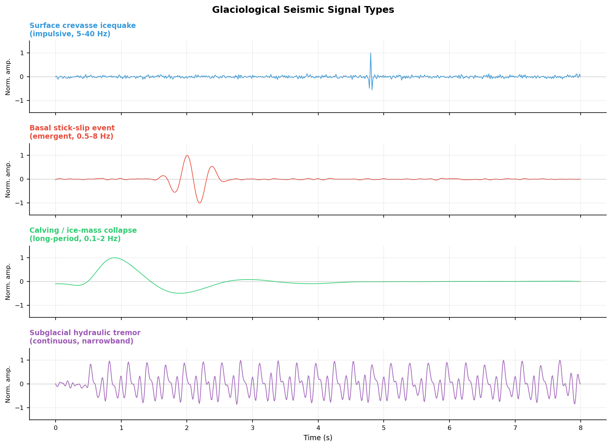

# Glacier Seismology: Instruments, Arrays, and DAS Applications

## Introduction

**Glacioseismology** uses seismic waves to detect and monitor glaciers, ice sheets, and ice shelves, and is the core tool for studying cryospheric dynamics. Ice bodies host diverse elastic wave sources — from millisecond-scale micro-icequakes to glacial earthquakes lasting tens of minutes — spanning a frequency range from 0.001 Hz to several hundred Hz.

$$
\boxed{\text{Glacioseismology} = \text{Source (ice fracture/motion)} + \text{Propagation (ice elasticity)} + \text{Observation (seismometer/DAS)}}
$$

Key challenges in modern glacioseismology:

- **Polar environment**: low temperatures (−60°C to 0°C), strong wind noise, and ice-surface motion make instrument deployment difficult
- **Broadband requirement**: high-frequency crevasse events (>10 Hz) coexist with long-period glacial earthquakes (<0.1 Hz)
- **Sparse coverage**: traditional networks have station spacings of tens of kilometres, insufficient for fine spatial resolution
- **DAS revolution**: distributed acoustic sensing upgrades "point" observation to "line" observation, with channel spacing as small as 1–5 m

---

## Types of Glaciological Seismic Signals

| Signal type | Frequency (Hz) | Magnitude | Duration | Source mechanism |
|-------------|---------------|-----------|---------|-----------------|
| Surface icequake | 10–200 | Mw −3 to 0 | 0.1–2 s | Crevasse opening (tensile crack) |
| Basal icequake | 1–30 | Mw −2 to +1 | 0.2–5 s | Glacier-bed stick-slip motion |
| Deep englacial icequake | 1–20 | Mw −1 to +1 | 0.5–10 s | Thermal stress, phase change |
| Calving / overturning | 0.1–5 | Mw 1 to 4 | 10–300 s | Ice-tongue fracture, iceberg capsizing |
| Glacial earthquake | 0.01–0.1 | Mw 4.5–6.5 | 30–120 s | Rapid glacier/ice-shelf motion; centroid single force |
| Subglacial hydraulic tremor | 1–20 | Continuous | min–hours | Subglacial channel water flow |
| Subglacial-lake drainage | 0.01–1 | Mw 2–4 | Hours | Sudden outburst flood |


*Figure 1: Synthetic waveforms of four typical glaciological seismic signals. From top: high-frequency impulsive surface crevasse; low-frequency emergent basal stick-slip; long-period calving/collapse; continuous narrowband subglacial hydraulic tremor. The wide variation in frequency content and duration demands broadband instruments and multi-window processing.*

---

## Instrumentation

### Broadband Seismometers

Broadband seismometers are essential for capturing glacial earthquakes and long-period calving signals.

| Model | Bandwidth | Sensitivity | Glaciological suitability |
|-------|-----------|-------------|--------------------------|
| Nanometrics Trillium Compact | 0.008–100 Hz | 1500 V·s/m | ★★★★☆ lightweight, good low-T performance |
| Güralp CMG-40T | 0.03–50 Hz | 800 V·s/m | ★★★☆☆ heavier, better on bedrock |
| Streckeisen STS-2 | 0.008–50 Hz | 1500 V·s/m | ★★☆☆☆ large, fixed-station use |
| REF TEK 151B | 0.02–50 Hz | 1500 V·s/m | ★★★★☆ polar-rated version available |

**Ice-surface deployment issues:**

- Ice-surface tilt → **tilt noise** can exceed signal by 10 dB at 0.01–1 Hz
- Solution: gimbal mount + post-processing tilt-to-acceleration correction
- Ice flow velocity 1–100 m/yr → without GPS, long-term source-location errors can reach tens of metres

### Short-Period Geophones

Geophones are lightweight and inexpensive — the workhorse for active-source surveys and dense passive arrays.

| Model | Natural freq. | Sensitivity | Typical use |
|-------|--------------|-------------|------------|
| Sercel L-22 | 2 Hz | 88 V/m/s | Refraction/reflection surveys |
| Geospace GS-11D | 4.5 Hz | 28 V/m/s | Dense ice-surface arrays |

!!! note "Geophone limitation"
    A 4.5 Hz geophone has rapidly falling sensitivity below its natural frequency, and cannot record glacial earthquakes (<0.1 Hz) or large calving events (<2 Hz). Broadband seismometers must be used alongside geophones when multi-signal-type monitoring is required.

### Acquisition Notes

**Battery performance in cold**: LiFePO₄ batteries retain 70–80% capacity at −40°C; standard LiCoO₂ drops to 50% at −20°C.

**GPS clock accuracy**: snow-covered GPS antennas can accumulate clock errors >1 ms, translating to >3.7 m source-location error via P-wave velocity (~3700 m/s).

**Coupling**: freeze-thaw cycles break geophone-to-ice coupling. Fix: drill an ice shaft, insert a spike, and allow it to refreeze.

---

## Seismic Array Methods

### Array Geometry and Design

| Geometry | Advantages | Application |
|----------|-----------|------------|
| Linear array | High resolution along cable; F-K friendly | Glacier-flow-direction monitoring, natural DAS geometry |
| Circular array | Uniform back-azimuth coverage | Omni-directional source location |
| L-shaped array | 2-D imaging at low cost | Temporary field deployments |
| Sparse icecap network | Wide areal coverage | Ice-sheet-scale monitoring |

Key design parameters:
- Minimum spacing $d_\min$ → maximum resolvable wavenumber $k_\max = 1/(2d_\min)$
- Aperture $D$ → slowness resolution $\Delta p \approx 1/(D \cdot f_\max)$

### Beamforming

Delay-and-sum beam power for an $N$-station array:

$$
P(f, \mathbf{p}) = \left|\frac{1}{N}\sum_{i=1}^{N} u_i(f)\, e^{i 2\pi f\, \mathbf{p}\cdot\mathbf{r}_i}\right|^2
$$

where $\mathbf{p}$ is the slowness vector and $\mathbf{r}_i$ is the station position. The maximum gives the apparent velocity and back-azimuth of the incoming wavefield.

For glaciological signals:
- P-wave apparent velocity: $v_P \approx 3500$–$3900$ m/s in ice (depends on temperature and fabric anisotropy)
- Rayleigh wave: $v_R \approx 0.92\,v_S \approx 1700$ m/s at the ice surface
- Very slow energy (<500 m/s) typically indicates crevasse surface waves or subglacial water flow

### TDOA Location (Hyperbolic)

Travel-time difference between stations $i$ and $j$ for source $\mathbf{x}_s$:

$$
\Delta t_{ij} = \frac{|\mathbf{x}_s - \mathbf{r}_j| - |\mathbf{x}_s - \mathbf{r}_i|}{v}
$$

Each station pair defines a hyperboloid. Three or more stations jointly constrain $\mathbf{x}_s$.

!!! tip "Velocity heterogeneity in ice"
    P-wave velocity in ice varies by ±5–10% with temperature and crystal fabric. The shallow firn layer ($v_P \approx 800$ m/s) differs dramatically from glacier ice ($v_P \approx 3700$ m/s). Accurate icequake location requires a velocity model derived from active-source surveys or passive DAS imaging.

### Moment Tensor Inversion for Icequakes

Ice crevasses are dominated by **tensile opening**. Their moment tensor has a characteristic form with a large **positive isotropic (ISO) component**:

$$
\boxed{M_{ii} > 0 \implies \text{tensile crack (crevasse opening)}}
$$

Basal stick-slip events, by contrast, are dominated by double-couple (DC) shear components. Separating the ISO and DC fractions distinguishes ice fracture from basal sliding.

---

## DAS Applications in Glaciology

### Deployment Configurations

DAS measures the phase shift of Rayleigh backscatter continuously along the fibre, turning the whole cable into thousands of seismic channels (see [DAS Fundamentals](das-en.md)). Two principal configurations exist on glaciers:

**Configuration A — surface cable**

- Cable laid on the ice surface, typically buried 0.1–0.5 m to reduce wind noise and thermal strain
- Sensitive to both body waves (P/S) and surface waves (Rayleigh)
- Ice flow displaces the cable over time → periodic GPS surveys of cable position required
- Typical applications: surface-crevasse monitoring, 2-D passive noise imaging

**Configuration B — borehole cable**

- Cable inserted into a hot-water-drilled vertical borehole and frozen in place
- Equivalent to a VSP geometry (see [VSP Principles](vsp-en.md)); separates downgoing and upgoing waves
- Highly sensitive to basal signals (bed friction, subglacial meltwater)
- Typical applications: ice-thickness determination, basal sliding monitoring, englacial velocity profiles


*Figure 2: (Left) Glacier DAS deployment schematic — orange: surface cable (A); red dashed: borehole cable (B); yellow box: DAS interrogator unit. Crevasse and subglacial water features are labelled. (Middle) Surface DAS icequake record showing fast P-wave and slower Rayleigh surface wave. (Right) Borehole DAS VSP-style record with clear downgoing P and bed reflection at opposite apparent velocities.*

### Englacial Structure Imaging

**Passive noise cross-correlation → velocity profile**

Cross-correlating continuous DAS recordings between any two channels:

$$
C_{ij}(\tau) = \int u_i(t)\, u_j(t+\tau)\, \mathrm{d}t
$$

extracts the inter-channel Rayleigh-wave Green's function, from which dispersion curves and $V_S(z)$ are inverted (see [Surface Wave Methods](surface-coda-en.md)).

**Typical ice velocity structure:**

| Layer | $V_P$ (m/s) | $V_S$ (m/s) | Notes |
|-------|-------------|-------------|-------|
| Firn (0–100 m) | 400–2000 | 200–1000 | Density-controlled rapid increase |
| Cold ice (>100 m) | 3700–3900 | 1830–1940 | Fabric anisotropy (±5%) |
| Temperate ice | 3500–3700 | 1800–1850 | Contains liquid water, lower velocity |
| Subglacial sediment | 1800–2500 | 300–900 | Saturated soft layer, strong reflector |

!!! note "Elastic anisotropy of ice"
    Polycrystalline ice has a monoclinic elastic tensor; preferred orientation of $c$-axes (crystal fabric) creates P-wave velocity contrasts of 3–5% between vertical and horizontal directions. This affects DAS-based Q inversion (which requires accurate velocity corrections) and CWI (velocity changes must be distinguished from fabric effects).

**Active-source ice-thickness measurement**

DAS + small surface source (shot or hammer) forms a high-density reflection profile:
$$
H = \frac{v_P \cdot t_\text{TWT}}{2}
$$
where $t_\text{TWT}$ is the two-way travel time of the bed reflection. DAS channel spacing of 1–5 m far exceeds the resolution of conventional geophone arrays (25–50 m).

### Icequake Detection and Precise Location

The high channel density of DAS improves icequake location accuracy from **tens of metres** (traditional sparse array) to **sub-metre** scale.

**Full-waveform cross-correlation location workflow:**
1. Template matching across continuous DAS records to detect candidate events
2. Cross-correlation of each channel against a template to obtain phase-shift arrival times
3. Grid search or gradient descent to solve for source coordinates $(x, y, z)$
4. Exploit the known 3-D cable geometry to constrain source depth

!!! tip "DAS location advantage"
    A surface DAS array with $N_\text{ch} \sim 1000$ channels provides highly redundant arrival-time constraints. Even if 50% of channels are corrupted by surface noise, hundreds of clean channels remain, enabling location residuals < 1 m under ideal conditions.

### Glacier Motion and Basal Sliding

**Stick-slip event detection**

Basal stick-slip motion produces rapid co-seismic displacements (Δd ≈ mm to cm). DAS measures dynamic axial strain:

$$
\varepsilon_{xx}(x, t) = \frac{\partial u_x}{\partial x}
$$

Basal stick-slip generates **low-frequency strain pulses coherent across all channels** (analogous to the large Whillans Ice Stream stick-slip events, but without conventional high-frequency radiation).

**Velocity change monitoring via CWI**

Coda Wave Interferometry on repeated noise cross-correlations detects minute velocity changes:

$$
\frac{\delta v}{v} = -\frac{\delta t}{\bar{t}}
$$

Ice velocity $v$ correlates with temperature, liquid water content, and porosity:
- Summer warming → $\delta v/v < 0$ (~0.1–0.5%/°C)
- Increased basal meltwater → velocity decrease may precede basal acceleration
- DAS + CWI has potential for **early warning of glacier instability**

### Key Case Studies

| Site | Institution | Deployment | Key finding | Reference |
|------|------------|-----------|------------|-----------|
| Rhône Glacier, Switzerland | ETH Zürich | 2 km surface | Crevasse location <1 m; englacial $V_S$ profile | Fichtner et al. 2023 |
| Store Glacier, Greenland | GEUS/Bristol | 600 m borehole | Basal melt imaging, bed-reflector character | Walter et al. 2020 |
| Malaspina Glacier, Alaska | USGS | 5 km surface | Surface-wave dispersion, ice-surface strain rate | Gimbert et al. 2021 |
| Whillans Ice Stream, Antarctica | Consortium | Surface | Spatial propagation of stick-slip events | Lipovsky et al. 2019 |
| Argentière Glacier, France | IPGP | Borehole | CWI seasonal velocity changes in ice | Nanni et al. 2021 |

---

## Integration with Conventional Seismometers

DAS has a fundamental limitation: it measures only **axial strain** along the cable. Three-component motion (vertical and transverse, critical for moment tensors) requires supplementary point seismometers. A typical combined deployment strategy:

```
DAS (dense linear)          → spatial coverage / arrival-time constraints / distributed strain
Broadband seismometers (sparse) → low-frequency content / 3-component / moment tensor
Geophones (intermediate)    → high-frequency detail / active-source surveys
```

**Complementary capabilities:**

| Capability | Broadband seismometer | Geophone | DAS |
|------------|----------------------|----------|-----|
| Low-frequency (<1 Hz) | ★★★★★ | ★ | ★★ |
| High-frequency (>50 Hz) | ★★★ | ★★★★ | ★★★★★ |
| Spatial resolution | ★★ | ★★★ | ★★★★★ |
| Three-component | ★★★★★ | ★★★ | ★ (axial only) |
| Polar deployment cost | High | Medium | Medium (cable cost scales with length) |
| Long-term unattended | ★★★★ | ★★★ | ★★★★★ |

---

## Processing Workflow Overview

```
Continuous raw records
  │
  ├─ Denoising (STA/LTA detector; spectral whitening)
  │
  ├─ Icequake detection (STA/LTA + template matching + ML classification)
  │
  ├─ Phase picking (cross-correlation; AIC auto-picker)
  │
  ├─ Source location (double-difference / grid search / gradient descent)
  │
  ├─ Source mechanism (P-wave polarity, moment tensor inversion)
  │
  ├─ Velocity structure (passive noise cross-correlation → dispersion → Vs(z))
  │
  └─ Time-lapse monitoring (CWI: δv/v; template matching: activity rate)
```

---

## References

- Fichtner, A., Villaseñor, A., & Blom, N. (2023). Distributed acoustic sensing for seismic monitoring of glacier dynamics. *Nature Communications*, 14, 1–12.
- Aster, R. C., & Winberry, J. P. (2017). Glacial seismology. *Reports on Progress in Physics*, 80(12), 126801.
- Podolskiy, E. A., & Walter, F. (2016). Cryoseismology. *Reviews of Geophysics*, 54(4), 708–758.
- Lindsey, N. J., Rademacher, H., & Ajo-Franklin, J. B. (2020). On the broadband instrument response of fiber-optic DAS arrays. *Journal of Geophysical Research: Solid Earth*, 125(2), e2019JB018145.
- Gimbert, F., Nanni, U., Roux, P., Helmstetter, A., Lecointre, A., & Fettweis, X. (2021). A multi-physics experiment with a temporary dense seismic array on the Argentière glacier, French Alps: the RESOLVE project. *Seismological Research Letters*, 92(2A), 1132–1147.
- Lipovsky, B. P., & Dunham, E. M. (2016). Tremor during ice-stream stick slip. *The Cryosphere*, 10(1), 385–399.
- Walter, F., Röösli, C., & Greenwood, A. (2020). Borehole seismology and the study of the glacial environment. *The Cryosphere*, 14(1), 357–380.
- Nanni, U., Gimbert, F., Roux, P., & Lecointre, A. (2021). Observing the subglacial hydrology of the Argentière Glacier using ambient seismic noise. *The Cryosphere*, 15(11), 5003–5020.
- Winberry, J. P., Anandakrishnan, S., Alley, R. B., Bindschadler, R. A., & King, M. A. (2009). Basal mechanics of ice streams: insights from the stick-slip motion of Whillans Ice Stream, West Antarctica. *Journal of Geophysical Research: Earth Surface*, 114(F1).
