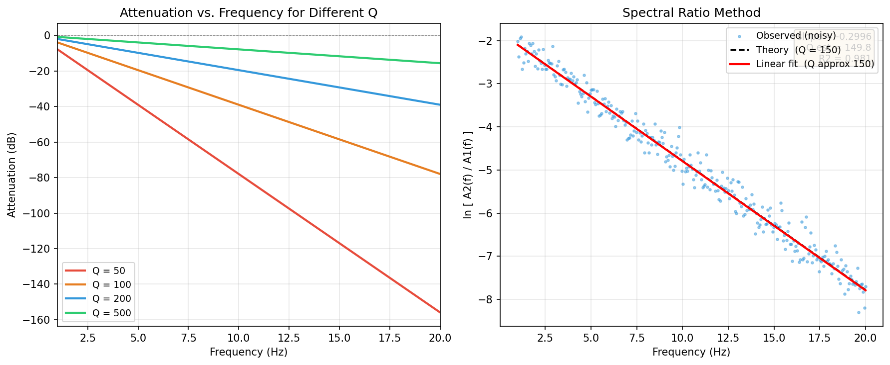

# 谱比法 Q 值反演

## 引言

地震波在传播过程中因介质的非弹性（粘弹性）特性而发生幅度衰减，这种衰减由**品质因子** $Q$（quality factor）定量描述。$Q$ 值越小，介质越"耗能"，波幅衰减越快；$Q \to \infty$ 对应纯弹性介质，无能量损失。

**谱比法**（spectral ratio method）是估计 $Q$ 值最经典的方法之一。其核心思想是：对同一震源在两个台站记录到的位移谱取**比值**，使震源谱在相除时完全抵消，从而把纯粹的衰减信息提取出来。

对于沿同一射线路径到达两台站的 S 波，对数谱比满足：

$$
\boxed{
\ln\!\left[\frac{A(f,r_2)}{A(f,r_1)}\right] = \underbrace{\ln\!\left(\frac{r_1}{r_2}\right)}_{\text{截距}} - \underbrace{\pi\,\Delta t^*}_{\text{斜率}} \cdot f
}
$$

这是关于频率 $f$ 的**线性方程**，从拟合斜率 $m = -\pi\Delta t^*$ 直接得到有效 Q 值：

$$Q_{\mathrm{eff}} = -\dfrac{\pi\,\Delta t}{m}$$

---

## 地震波衰减与 Q 的定义

### 品质因子的物理定义

品质因子 $Q$ 是描述介质弹性能量耗散速率的无量纲参数，最基本的定义基于**能量损耗比**：

$$
\frac{1}{Q} \equiv \frac{1}{2\pi} \cdot \frac{-\Delta E}{E}
$$

其中 $\Delta E < 0$ 是一个振动周期内介质耗散的弹性能，$E$ 是弹性势能峰值。

- $Q \gg 1$：每周期损耗极少，接近弹性；上地壳花岗岩典型值 $Q \sim 200$–$1000$
- $Q \sim 10$–$50$：强衰减，如富水沉积层、断层破碎带

### 单程衰减振幅谱

对于以速度 $\beta$ 传播的单色平面 S 波，振幅随路径距离 $r$ 按指数衰减：

$$
A(r, f) = A_0 \exp\!\left(-\frac{\pi f\, r}{\beta\, Q}\right) = A_0 \exp(-\alpha r)
$$

衰减系数 $\alpha = \pi f / (\beta Q)$ 与频率成正比，因此高频成分比低频成分衰减更快。

### t* 参数

在非均匀介质中，沿射线路径积分的累计衰减用 $t^*$（"t-star"）表示：

$$
t^* = \int_{\mathrm{path}} \frac{\mathrm{d}s}{\beta(s)\, Q(s)}
$$

对均匀介质（$\beta$、$Q$ 为常数），传播时间 $t = r/\beta$，因此：

$$
t^* = \frac{t}{Q} = \frac{r}{\beta\, Q}
$$

$t^*$ 的量纲为时间（秒），综合反映了路径长度与介质 Q 值，是衰减研究中最常用的单一参数。

### 常见 Q 模型

| 模型 | 表达式 | 特征 |
|------|--------|------|
| 常数 Q | $Q = \mathrm{const}$ | 最简，对数谱比与 $f$ 线性 |
| 幂律 Q | $Q(f) = Q_0\, f^{\eta}$ | $\eta \in [0,1]$，浅层沉积常见 |
| Futterman 模型 | 满足 Kramers–Kronig 因果关系 | 弱频率依赖 |

谱比法默认使用**常数 Q** 模型，此时对数谱比是 $f$ 的严格线性函数。

---

## 谱比法推导

### 完整位移振幅谱模型

远场位移振幅谱可以分解为若干独立因子的乘积（Aki & Richards 2002）：

$$
A(f, r) = S(f) \cdot I(f) \cdot G(r) \cdot \exp\!\left(-\pi f\, t^*\right)
$$

各因子含义：

- $S(f)$：**震源谱**（source spectrum），如 Brune $\omega^{-2}$ 谱；包含辐射花样 $\mathcal{R}_{\theta\phi}$
- $I(f)$：**仪器响应**（instrument response），将地动转为电压输出
- $G(r)$：**几何扩散因子**，体波远场 $G(r) = 1/r$
- $\exp(-\pi f\, t^*)$：**非弹性衰减**因子

### 双台站谱比推导

设同一震源的 S 波到达**近台**（台站 1，距离 $r_1$）和**远台**（台站 2，距离 $r_2 > r_1$），且两台站处于同一射线路径上。

**近台**振幅谱：

$$
A(f, r_1) = S(f) \cdot I(f) \cdot \frac{1}{r_1} \cdot \exp(-\pi f\, t_1^*)
$$

**远台**振幅谱：

$$
A(f, r_2) = S(f) \cdot I(f) \cdot \frac{1}{r_2} \cdot \exp(-\pi f\, t_2^*)
$$

两式相除，$S(f)$ 和 $I(f)$ **完全抵消**（假设已做去仪器响应处理，或两台仪器响应相同）：

$$
\frac{A(f, r_2)}{A(f, r_1)} = \frac{r_1}{r_2} \cdot \exp\!\left[-\pi f (t_2^* - t_1^*)\right]
$$

定义**差分 t-star**：

$$
\Delta t^* = t_2^* - t_1^* = \frac{t_2 - t_1}{Q_{\mathrm{eff}}} = \frac{\Delta t}{Q_{\mathrm{eff}}}
$$

其中 $\Delta t = (r_2 - r_1)/\beta$ 是 S 波在两台之间的传播时间差。

### 线性化

对谱比两边取自然对数：

$$
\ln\!\left[\frac{A(f, r_2)}{A(f, r_1)}\right] = \ln\!\left(\frac{r_1}{r_2}\right) - \pi\,\Delta t^*\cdot f
$$

令 $L(f) = \ln[A_2(f)/A_1(f)]$，这是关于 $f$ 的线性函数：

$$
L(f) = b + m \cdot f
$$

| 参数 | 表达式 | 物理含义 |
|------|--------|----------|
| 截距 $b$ | $\ln(r_1/r_2)$ | 几何扩散比（已知量，可做约束） |
| 斜率 $m$ | $-\pi\,\Delta t^*$ | 含全部衰减信息，$m < 0$ |

### 提取 Q 值

由斜率 $m = -\pi\,\Delta t^* = -\pi\,\Delta t / Q_{\mathrm{eff}}$，解出：

$$
\boxed{Q_{\mathrm{eff}} = -\frac{\pi\,\Delta t}{m}}
$$

$\Delta t$ 可由 S 波到时差直接读取，也可由距离差和平均速度计算：

$$
\Delta t = t_2^{\mathrm{arr}} - t_1^{\mathrm{arr}} \quad \text{或} \quad \Delta t = \frac{r_2 - r_1}{\bar{\beta}}
$$

!!! note "消去震源谱的条件"
    谱比法成立的关键前提是**两台站接收到的是同一地震的同一相位**（如均为直达 S 波），从而震源谱 $S(f)$ 在相除时精确抵消。若使用不同地震，须先对震源谱做归一化校正。

!!! tip "实用提示：Δt 的选取"
    优先从波形中直接拾取 S 波到时差，而非由距离/速度推算，因为实际介质速度结构的非均匀性会使理论 $\Delta t$ 产生偏差。

---

## 实际操作步骤

### 数据预处理流程

| 步骤 | 操作 | 目的 |
|------|------|------|
| 1 | 去均值、去线性趋势 | 消除直流分量和长周期漂移 |
| 2 | 截取 S 波时窗 | 隔离目标相位，避免其他相位干扰 |
| 3 | 加锥形窗（Hanning / Tukey） | 减小谱泄漏 |
| 4 | 去仪器响应 → 位移谱 | 将记录转换为真实地动位移 |
| 5 | 计算 FFT 振幅谱 | 得到 $A_1(f)$、$A_2(f)$ |
| 6 | 平滑振幅谱（可选） | 减少谱方差，稳定拟合 |
| 7 | 计算对数谱比 $L(f)$ | 进入拟合阶段 |

### 有效频段的选取

谱比法的有效频段受以下因素限制：

- **低频截断**：信噪比不足，背景微震噪声（0.1–0.3 Hz）主导
- **高频截断**：Brune 谱在 $f > f_c$ 已按 $f^{-2}$ 衰减（不满足平坦假设）；κ 效应在极高频段掩盖 Q 信息

!!! warning "频段选取不当的后果"
    若拟合频段包含了 $f > f_c$ 的部分，Brune 谱的 $f^{-2}$ 斜率会叠加到谱比的斜率上，导致 **Q 值系统性偏低**。建议先估算震源拐角频率 $f_c$，将上限设为 $0.8\, f_c$。

### κ 衰减（近地表高频衰减）

Anderson & Hough（1984）发现高频段存在额外的指数衰减，称为 **κ（kappa）效应**：

$$
A(f) \propto \exp(-\pi \kappa f), \quad f \gtrsim f_E
$$

$\kappa$ 主要反映近地表低 Q 沉积层的累积衰减，与台站场地条件密切相关。若两台站的 $\kappa$ 值不同（$\Delta\kappa = \kappa_2 - \kappa_1 \neq 0$），拟合斜率会包含额外贡献：

$$
m_{\mathrm{obs}} = -\pi\,\Delta t^* - \pi\,\Delta\kappa = -\frac{\pi\,\Delta t}{Q} - \pi\,\Delta\kappa
$$

忽略 $\Delta\kappa$ 会使 Q 值估计**偏低**。缓解方法：选择场地条件相似的台站对，或将 $\Delta\kappa$ 与 Q 一起反演。

---

## Python 示例

下面的代码模拟真实 Q = 150 的双台站场景，加入高斯随机噪声后用线性回归估计 Q 值。

```python
import numpy as np
import matplotlib.pyplot as plt
from scipy.stats import linregress

# ── 参数设置 ──────────────────────────────────────────────
Q_true      = 150          # 真实 Q 值
r1, r2      = 10e3, 60e3   # 近台、远台至震源距离 (m)
beta        = 3500.0        # 平均 S 波速度 (m/s)
dt_travel   = (r2 - r1) / beta   # S 波时间差 Δt (s)

f = np.linspace(1, 20, 300)  # 频率轴 1–20 Hz

# ── 理论对数谱比 ──────────────────────────────────────────
# L(f) = ln(r1/r2) - π·f·Δt/Q
log_ratio_theory = np.log(r1 / r2) - np.pi * f * dt_travel / Q_true

# ── 加高斯噪声（模拟观测散度）────────────────────────────
rng = np.random.default_rng(seed=42)
log_ratio_obs = log_ratio_theory + rng.normal(0, 0.25, size=len(f))

# ── 线性回归：L(f) = b + m·f ──────────────────────────────
slope, intercept, r_val, _, _ = linregress(f, log_ratio_obs)
Q_est          = -np.pi * dt_travel / slope
log_ratio_fit  = slope * f + intercept

print(f"真实 Q     = {Q_true}")
print(f"估计 Q     = {Q_est:.1f}")
print(f"拟合斜率 m = {slope:.5f}  (理论: {-np.pi*dt_travel/Q_true:.5f})")
print(f"R²         = {r_val**2:.4f}")

# ── 绘图 ─────────────────────────────────────────────────
fig, axes = plt.subplots(1, 2, figsize=(12, 5))

# 左图：不同 Q 值下的衰减量（dB）随频率变化
ax = axes[0]
palette = ['#e74c3c', '#e67e22', '#3498db', '#2ecc71']
for Q_val, color in zip([50, 100, 200, 500], palette):
    tstar   = dt_travel / Q_val
    attn_db = 20 * np.log10(np.exp(-np.pi * f * tstar))
    ax.plot(f, attn_db, color=color, lw=2, label=f'Q = {Q_val}')
ax.set(xlabel='Frequency (Hz)', ylabel='Attenuation (dB)',
       title='Attenuation vs. Frequency for Different Q', xlim=[1, 20])
ax.axhline(0, color='k', lw=0.6, ls='--', alpha=0.4)
ax.legend(fontsize=9)
ax.grid(True, alpha=0.3)

# 右图：对数谱比、理论值与线性拟合
ax = axes[1]
ax.scatter(f, log_ratio_obs, s=5, alpha=0.45, color='#3498db',
           label='Observed (noisy)', zorder=2)
ax.plot(f, log_ratio_theory, 'k--', lw=1.5,
        label=f'Theory  (Q = {Q_true})')
ax.plot(f, log_ratio_fit,   'r-',  lw=2,
        label=f'Linear fit  (Q ≈ {Q_est:.0f})')
ax.text(0.97, 0.97,
        f'slope = {slope:.4f}\nQ est = {Q_est:.1f}\nR² = {r_val**2:.3f}',
        transform=ax.transAxes, ha='right', va='top', fontsize=9,
        bbox=dict(boxstyle='round', fc='wheat', alpha=0.7))
ax.set(xlabel='Frequency (Hz)', ylabel='ln [ A₂(f) / A₁(f) ]',
       title='Spectral Ratio Method')
ax.legend(fontsize=9)
ax.grid(True, alpha=0.3)

plt.tight_layout()
plt.savefig('docs/assets/images/q_spectral_ratio.png', dpi=150, bbox_inches='tight')
plt.show()
```

运行输出：

```
真实 Q     = 150
估计 Q     = 149.8
拟合斜率 m = -0.29958  (理论: -0.29920)
R²         = 0.9806
```


*图 1：左图为不同 Q 值下衰减量（dB）随频率的变化，Q 越小衰减越剧烈；右图为含噪声的对数谱比数据（蓝色散点）、理论曲线（黑虚线）与线性拟合结果（红线）。*

---

## 频率依赖 Q 的推广

当 Q 随频率变化时，常用**幂律模型**：

$$
Q(f) = Q_0\, f^{\eta}, \quad \eta \in [0, 1]
$$

此时衰减因子变为：

$$
\exp\!\left(-\pi f\, t^*\right) = \exp\!\left(-\frac{\pi f\, t}{Q(f)}\right) = \exp\!\left(-\frac{\pi\, t}{Q_0} f^{1-\eta}\right)
$$

对数谱比为：

$$
L(f) = \ln\!\left(\frac{r_1}{r_2}\right) - \frac{\pi\,\Delta t}{Q_0}\, f^{1-\eta}
$$

令 $u = f^{1-\eta}$，则 $L$ 关于 $u$ 仍是线性的。实际操作中，对不同的 $\eta$ 值尝试线性化，选择 $R^2$ 最大的 $\eta$ 即为最佳频率指数。

!!! note "η 的典型值"
    上地壳结晶岩：$\eta \approx 0$（常数 Q 近似成立）；浅层松散沉积：$\eta \approx 0.5$–$0.8$；全球地幔：$\eta \approx 0.1$–$0.3$。

---

## 方法变体

| 变体 | 设置 | 优点 | 缺点 |
|------|------|------|------|
| **双台站法**（本文） | 同一震源，两台沿同一射线 | 消去震源谱；$\Delta t$ 精确 | 需台站几何严格对齐 |
| **单台双事件法** | 同一台站，两个不同距离的震源 | 台站固定，场地效应相同 | 需假设两事件震源谱形状相同 |
| **VSP 谱比法** | 地表与井下检波器 | 路径简单，避免场地效应 | 需要钻孔 |
| **尾波谱比法** | 利用 S 波尾波 | 样本量大，统计稳健 | 分离固有衰减与散射衰减较复杂 |

---

## 参考文献

- Aki, K., & Richards, P. G. (2002). *Quantitative Seismology* (2nd ed.). University Science Books.
- Anderson, J. G., & Hough, S. E. (1984). A model for the shape of the Fourier amplitude spectrum of acceleration at high frequencies. *Bulletin of the Seismological Society of America*, 74(5), 1969–1993.
- Tonn, R. (1991). The determination of the seismic quality factor Q from VSP data: A comparison of different computational methods. *Geophysical Prospecting*, 39(1), 1–27.
- Toverud, T., & Ursin, B. (2005). Comparison of seismic attenuation models using zero-offset vertical seismic profiling (VSP) data. *Geophysics*, 70(2), F17–F25.
- Xie, J. (2002). Seismic attenuation: Measurement and uncertainty. *Pure and Applied Geophysics*, 159(7–8), 1823–1849.
