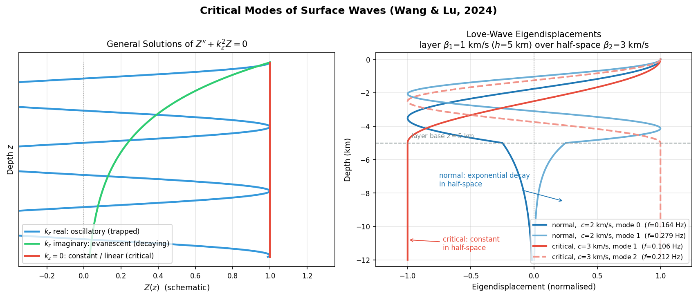
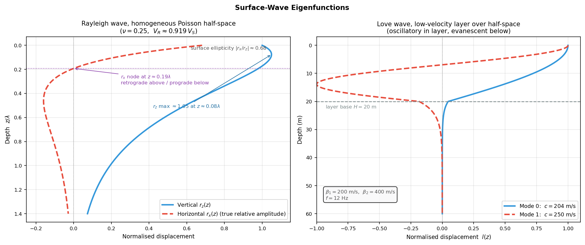
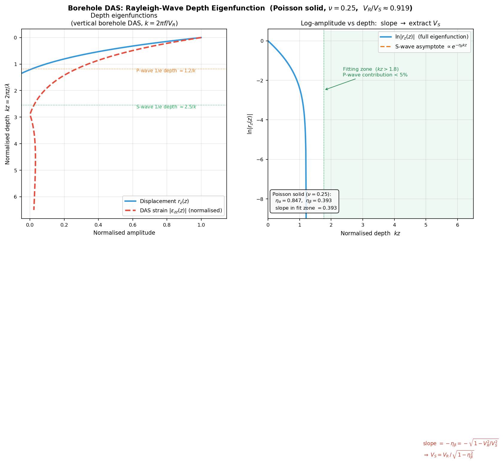
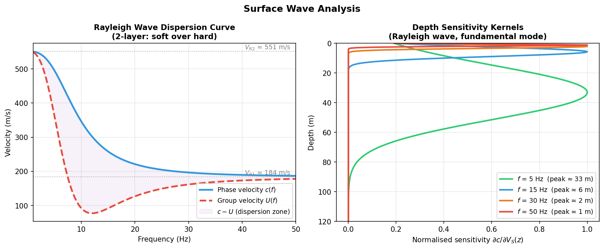
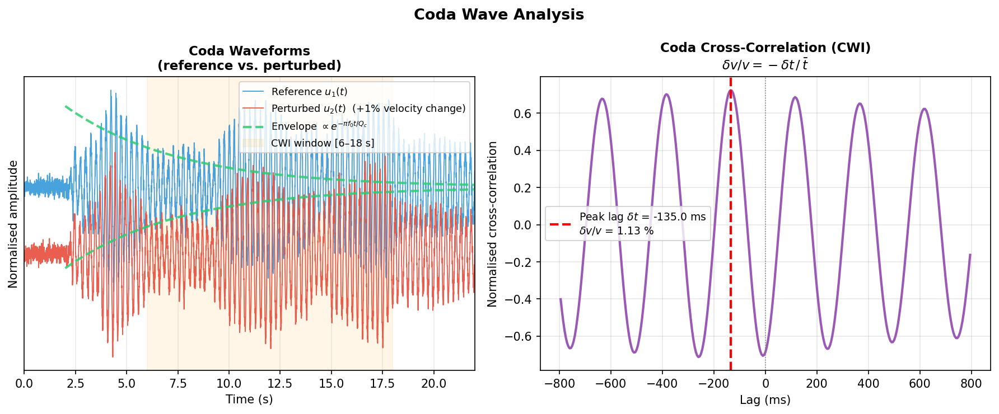

# Surface Waves and Coda Waves: Velocity Extraction and Monitoring

## Introduction

Surface waves and coda waves are two fundamentally different components of a seismic record, each carrying rich information about the medium. **Surface waves** propagate along the Earth's surface and are dispersive — different frequency components travel at different velocities because they sample different depths. The frequency dependence of their phase velocity therefore directly encodes the S-wave velocity structure with depth. **Coda waves** are the scattered arrivals following the direct P- and S-waves; their amplitude decay constrains $Q_c$ (coda quality factor), while their fine time structure is exquisitely sensitive to small velocity changes — this is the physical basis of **Coda Wave Interferometry (CWI)** for velocity monitoring.

| Wave type | Velocity extraction method | Sensitive to | Typical application |
|-----------|--------------------------|-------------|-------------------|
| Rayleigh wave | Dispersion curve → $V_S(z)$ inversion | S-wave velocity structure | Near-surface imaging, engineering |
| Love wave | Dispersion curve → $V_S(z)$ inversion | $V_S$ (SH component) | Anisotropy, S-wave splitting |
| Coda | Envelope decay → $Q_c$ | Scattering/intrinsic attenuation | Post-seismic monitoring |
| Coda (CWI) | Cross-correlation time shift → $\delta v/v$ | Minute velocity changes (0.01%) | Volcano, injection, earthquake precursors |

---

## Observability Conditions

Surface waves and coda waves each have their own recording requirements. Understanding these conditions is the first step in assessing whether a given method is feasible before processing data.

### When Surface Waves Are Clearly Observable

**1. Source depth — the dominant controlling factor**

Surface waves are excited by shallow sources; their amplitude decays rapidly with source depth $h$. The amplitude excited by a source at depth $h$ scales approximately as:

$$
A_\text{SW} \propto e^{-k h} = e^{-2\pi h/\lambda}
$$

where $k = 2\pi/\lambda$ is the horizontal wavenumber. Practical rule of thumb:

| Source depth | Surface-wave development |
|-------------|--------------------------|
| $h < \lambda/2$ | Strong excitation, fundamental mode dominant |
| $\lambda/2 < h < 2\lambda$ | Moderate; dispersion identifiable but amplitude reduced |
| $h > 2\lambda$ | Amplitude strongly attenuated; fundamental mode suppressed |

Practical implications:
- **Shallow earthquakes** ($h < 30$ km) → strong long-period surface waves ($T > 10$ s);
- **Deep earthquakes** ($h > 200$ km) → surface waves with $T < 100$ s are nearly absent;
- **Engineering MASW** ($f = 1$–50 Hz, $\lambda \sim 10$–200 m): natural earthquakes are effectively infinitely deep for near-surface structure — use an artificial source (sledgehammer, drop weight) instead.

!!! warning "Deep-earthquake pitfall"
    Mid-depth earthquakes ($h \sim 100$–200 km) can still produce visible surface-wave envelopes, but higher modes often dominate the fundamental mode, making dispersion picking unreliable. Always verify source depth before processing.

**2. Epicentral distance — dispersion needs propagation distance**

Surface-wave dispersion (different frequencies arriving at different times) requires sufficient distance to temporally separate the frequency components:

- **Regional/global surface waves** ($T = 10$–300 s): $\Delta \gtrsim 10°$ (~1000 km) gives clean separation from multiple body-wave arrivals (PP, SS); at $\Delta < 300$ km, the surface-wave packet overlaps the S-wave coda;
- **Engineering MASW** ($f = 1$–50 Hz): array length $\geq \lambda_\text{max}$ (wavelength at the lowest target frequency); shorter arrays under-sample low-frequency modes and bias the dispersion curve high;
- **Passive noise cross-correlation**: station spacing $d$ determines the extractable wavelength band, typically $\lambda \in [2d,\; 3\,d_\text{array}]$ ($d_\text{array}$ = array aperture).

**3. Site and path conditions**

- **Soft sedimentary basins**: low-velocity layers amplify surface-wave amplitude but also excite higher modes — fundamental-mode picking requires care;
- **Laterally heterogeneous paths**: strong refraction biases apparent phase velocities; azimuth corrections are needed for cross-correlation methods;
- **Noise azimuthal distribution**: passive cross-correlation assumes an isotropic noise field. Coastal stations are often dominated by uni-directional ocean swell — Rayleigh-wave convergence is fast, but Love-wave cross-correlations converge slowly and need longer records.

---

### When Coda Waves Are Clearly Observable

**1. Scattering heterogeneity — directly controls coda energy**

Coda waves arise from multiple scattering by heterogeneities (faults, pores, mineral boundaries). Denser, higher-contrast scatterers produce stronger, longer-lasting coda.

| Tectonic setting | Coda character | Typical $Q_c$ (1 Hz) |
|-----------------|---------------|----------------------|
| Active volcanic area | Strong scattering, long coda | 50–150 |
| Active fault zone | Moderate scattering | 100–300 |
| Stable craton / shield | Weak scattering, short coda | 600–1500 |
| Glacier (within ice) | Strong scattering (grains/cracks) | 50–200 |

**2. Epicentral distance range**

Coda analysis requires clear separation of direct arrivals from the scattered wavefield — too close or too far both violate this:

$$
\boxed{50\;\text{km} \lesssim \Delta \lesssim 300\;\text{km}}
$$

- $\Delta < 20$–30 km: P and S arrive almost simultaneously; the coda onset is too early to isolate from the direct wavefield;
- $\Delta > 400$–500 km: regional phases (Lg, Pn) and surface waves arrive within the coda window, invalidating simple single-scattering models.

!!! tip "Empirical coda onset criterion"
    A coda window starting at $t_\text{start} \geq 2\,t_S$ (twice the S-wave travel time) is the standard choice (Aki & Chouet 1975). By this time, most body-wave phases have arrived and the field has entered a quasi-diffuse scattering regime.

**3. Magnitude range**

| Magnitude | Main issue | Recommendation |
|-----------|-----------|----------------|
| $M < 1$–2 | SNR too low; coda buried in noise | Raise high-pass frequency; deploy stations close to source |
| $M = 1$–5 | **Optimal** for $Q_c$ and CWI | Standard workflow |
| $M > 6$ | Aftershock sequences; nonlinear scattering | Rigorously exclude aftershock windows; interpret cautiously |

**4. Time-window selection — balancing CWI sensitivity against SNR**

The velocity-change uncertainty is $\sigma_{\delta v/v} \approx T/(2\pi f \bar{t}\,\text{CC})$: a later window (larger $\bar{t}$) gives higher sensitivity, but coda energy decays exponentially ($\propto e^{-\pi f t / Q_c}$). A practical upper time limit is:

$$
t_\text{end} \lesssim \frac{Q_c}{\pi f}
$$

Beyond this the cross-correlation coefficient CC drops sharply, and measurement error grows despite the larger $\bar{t}$.

---

## Basic Properties of Surface Waves

### Rayleigh and Love Waves

| Property | Rayleigh wave | Love wave |
|---------|--------------|-----------|
| Particle motion | Vertical + radial elliptical polarisation | Horizontal transverse (SH direction) |
| Existence | Any elastic half-space | Requires a low-velocity surface layer (waveguide) |
| Velocity (half-space) | $V_R \approx 0.92\,V_S$ | Between $V_S$ of top layer and half-space |
| DAS sensitivity | $\cos^2\theta$ (along-cable Rayleigh) | Zero for cable parallel to propagation (SH blind) |

### Dispersion

The most important feature of surface waves is **dispersion**: different frequencies travel at different speeds because they penetrate to different depths.

**Phase velocity** $c(f)$: velocity of equal-phase surfaces; governs waveform shape.

**Group velocity** $U(f)$: velocity of the energy envelope, related to phase velocity by:

$$
U(f) = c(f) + f\,\frac{\mathrm{d}c}{\mathrm{d}f}
$$

!!! note "Normal vs. Inverse Dispersion"
    - **Normal dispersion** ($\mathrm{d}c/\mathrm{d}f < 0$): low frequencies travel faster; typical of a crust where velocity increases with depth (soft surface layer over hard half-space).
    - **Inverse dispersion** ($\mathrm{d}c/\mathrm{d}f > 0$): high frequencies travel faster; occurs when a low-velocity layer is present or velocity decreases with depth.

### Depth Sensitivity Rule

The sensitivity of Rayleigh-wave phase velocity $c(f)$ to $V_S$ at depth $z$ peaks approximately at:

$$
\boxed{z_\mathrm{peak} \approx \frac{\lambda}{3} = \frac{c(f)}{3f}}
$$

where $\lambda$ is the wavelength. This rule gives a rapid **frequency-to-depth mapping**:
- Low frequency → long wavelength → deep structure
- High frequency → short wavelength → shallow structure

### Relationship Between Rayleigh Velocity and S-Wave Velocity

For a homogeneous half-space with Poisson's ratio $\nu$:

$$
V_R \approx \frac{0.862 + 1.14\,\nu}{1 + \nu}\, V_S
$$

For the typical value $\nu = 0.25$:

$$
V_R \approx 0.919\, V_S
$$

!!! warning "Layered Media"
    This formula applies only to a homogeneous half-space. In layered media, $V_R(f)$ is frequency-dependent (the dispersion curve), and $V_S(z)$ must be recovered by inverting the observed dispersion curve using a forward model (e.g., Thomson-Haskell matrix method).

---

## Surface-Wave Eigenfunctions

### From the Wave Equation to an Eigenvalue Problem

In a laterally homogeneous (horizontally layered) medium, a plane surface wave travelling in the $x$ direction separates as:

$$
\mathbf{u}(x, z, t) = \mathbf{r}(z)\, e^{i(kx - \omega t)}
$$

Substituting into the elastic equations of motion, together with two boundary conditions — traction-free surface and decay at depth ($\mathbf{u} \to 0$ as $z \to \infty$) — yields a **Sturm-Liouville-type eigenvalue problem**: at a given frequency $\omega$, non-trivial solutions exist only for a discrete set of wavenumbers $k_n(\omega)$ ($n = 0, 1, 2, \dots$).

- **Eigenvalues** $k_n(\omega)$ → phase velocities $c_n = \omega/k_n$, i.e. the dispersion curves;
- **Eigenfunctions** $\mathbf{r}_n(z)$ → the depth shape of the displacement for each mode.

Dispersion curves and eigenfunctions are two outputs of the same eigenvalue problem: the former answers "how fast the wave travels", the latter "at which depths the wave lives".

| Wave type | Coupled components | Eigenfunctions | Meaning |
|-----------|-------------------|----------------|---------|
| Rayleigh | P-SV ($u_x$, $u_z$) | $r_x(z)$, $r_z(z)$ | Radial / vertical displacement vs depth |
| Love | SH ($u_y$) | $l(z)$ | Transverse displacement vs depth |

### Rayleigh Eigenfunctions in a Half-Space (Analytical)

The homogeneous half-space is the only case with a closed-form solution (no dispersion, fundamental mode only). Normalising each component to unity at the surface:

$$
r_x(z) = \frac{e^{-\eta_\alpha k z} - \dfrac{2\eta_\alpha\eta_\beta}{1+\eta_\beta^2}\, e^{-\eta_\beta k z}}{1 - \dfrac{2\eta_\alpha\eta_\beta}{1+\eta_\beta^2}}, \qquad
r_z(z) = \frac{\dfrac{2}{1+\eta_\beta^2}\, e^{-\eta_\beta k z} - e^{-\eta_\alpha k z}}{\dfrac{1-\eta_\beta^2}{1+\eta_\beta^2}}
$$

where $k = \omega / V_R$ and

$$
\eta_\alpha = \sqrt{1 - \frac{V_R^2}{V_P^2}}, \qquad \eta_\beta = \sqrt{1 - \frac{V_R^2}{V_S^2}}
$$

are the vertical decay coefficients of the P- and S-wave terms. Both components are linear combinations of a fast-decaying P term ($e^{-\eta_\alpha kz}$) and a slow-decaying S term ($e^{-\eta_\beta kz}$), but with **different weights** — which is exactly why the two components behave so differently with depth. Numerical features for a Poisson solid ($\nu = 0.25$):

| Feature | Value | Remark |
|---------|-------|--------|
| Surface ellipticity $\lvert r_x/r_z\rvert_{z=0}$ | $\approx 0.68$ | Theoretical baseline for H/V ratios |
| $r_x$ node depth | $z \approx 0.19\lambda$ | Horizontal component changes sign |
| $r_z$ maximum | $z \approx 0.08\lambda$ (amplitude $\approx 1.05$) | Vertical component slightly amplified below the surface |
| $r_z(\lambda/2)$ | $\approx 0.59$ | Still ~60% amplitude at half a wavelength |
| $r_z(\lambda)$ | $\approx 0.19$ | Quantifies the rule "penetration depth ~ one wavelength" |

!!! note "Retrograde → Prograde"
    At the surface $r_x$ and $r_z$ are $90°$ out of phase and the particle motion is a **retrograde** ellipse. At $z \approx 0.19\lambda$ the horizontal component changes sign and the motion becomes **prograde** below. The frequency dependence of the surface H/V ellipticity is also commonly used as an additional constraint on $V_S$ structure.

### Love Eigenfunctions (Low-Velocity Layer over a Half-Space)

Love waves require a waveguide (a low-velocity surface layer). For a single layer (thickness $H$, velocity $\beta_1$) over a half-space ($\beta_2 > \beta_1$):

$$
l(z) = \begin{cases} \cos(\nu_1 z), & z \le H \\[4pt] \cos(\nu_1 H)\, e^{-\nu_2 (z-H)}, & z > H \end{cases}
\qquad
\nu_1 = \frac{\omega}{c}\sqrt{\frac{c^2}{\beta_1^2} - 1}, \quad \nu_2 = \frac{\omega}{c}\sqrt{1 - \frac{c^2}{\beta_2^2}}
$$

The eigenfunction oscillates (cosine) inside the layer and decays exponentially in the half-space; the phase velocity $c \in (\beta_1, \beta_2)$ is fixed by the dispersion relation:

$$
\boxed{\tan(\nu_1 H) = \frac{\mu_2 \nu_2}{\mu_1 \nu_1}}
$$

Mode structure:

- **Fundamental mode** ($n=0$): no node inside the layer; energy concentrated near the surface;
- **$n$-th higher mode**: $n$ nodes inside the layer; deeper penetration and higher phase velocity;
- The $n$-th mode exists only above its cut-off frequency:

$$
f_n = \frac{n}{2H\sqrt{1/\beta_1^2 - 1/\beta_2^2}}
$$

### Critical Modes: When the Phase Velocity Equals a Body-Wave Velocity

The derivation above tacitly assumes a nonzero vertical wavenumber $\nu$ in every layer. When the phase velocity is **exactly equal to a body-wave velocity of a layer** ($c = \alpha$ or $\beta$), the vertical wavenumber there vanishes ($\nu = 0$) and the formulation hits a **singularity** — this defines the **critical mode**, corresponding to body waves at critical incidence (critical refraction) and marking the boundary between normal and leaky modes (the *cutoff mode* of each branch). Wang & Lu (2024) treated this problem systematically.

The singularity comes from the degeneration of the general solution. The depth-wise wave equation $Z'' + k_z^2 Z = 0$ has three families of solutions:

$$
Z(z) = \begin{cases}
C_1\cos k_z z + C_2\sin k_z z, & k_z \text{ real (propagating, normal modes)}\\[4pt]
C_1 e^{|k_z| z} + C_2 e^{-|k_z| z}, & k_z \text{ imaginary (evanescent)}\\[4pt]
C_1 + C_2 z, & k_z = 0 \text{ (linear — the critical case)}
\end{cases}
$$

Classical transfer-matrix (Thomson–Haskell) and generalized R/T (Chen, 1993) frameworks contain only the first two families, so their matrix elements become singular at the critical phase velocity. Wang & Lu (2024) **embed the linear solution $C_1 + C_2 z$ into the generalized R/T framework**: the constant term $C_1$ and the linear term $C_2 z$ are defined as the "down-going" and "up-going" waves of that layer; together with the traction-free surface condition and the half-space radiation condition ($C_2 = 0$, boundedness at depth), the dispersion equation and eigenfunctions are computed with the original machinery.

**Eigendisplacement characteristics of the critical mode** (markedly different from normal modes):

- **$c$ = S-wave velocity of the bottom half-space**: the eigendisplacement stays **constant with depth** in the half-space (a normal mode would decay exponentially). Physically, the field in the half-space is a horizontally propagating, vertically non-decaying plane wave sharing the ray parameter of the critically refracted head wave — its eigendisplacement maps directly onto the head-wave energy distribution;
- **$c$ = body-wave velocity of an intermediate layer**: the eigendisplacement varies **linearly with depth** in that layer (interference of up/down constant-amplitude plane waves), with exponential decay below;
- **P-SV system**: the vertical component of the critical mode approaches a constant in the half-space while the horizontal component decays exponentially — consistent with the energy distribution of an SV critical-refraction head wave;
- **Continuity**: as the phase velocity approaches the critical value from the normal-mode side, the half-space decay slows progressively until it becomes constant — the critical mode is the natural limit of the normal modes;
- **SH critical mode in a homogeneous half-space**: classical theory admits no Love wave in a homogeneous half-space, but the critical analysis yields a meaningful non-dispersive solution — phase velocity equal to the half-space S velocity, constant eigendisplacement, and vanishing eigenstress. It is the SH analogue of the half-space Rayleigh mode: a "missing" Love mode of the half-space.

*Figure 5: Critical-mode analysis. Left — the three solution families of $Z'' + k_z^2 Z = 0$: real $k_z$ (oscillatory), imaginary $k_z$ (exponentially decaying), and $k_z = 0$ (constant/linear, the critical case); right — Love-wave eigendisplacements for a layer ($\beta_1$ = 1 km/s, $H$ = 5 km) over a half-space ($\beta_2$ = 3 km/s), computed from the exact dispersion relation: the normal modes at $c$ = 2 km/s (blue) decay exponentially in the half-space, while the critical modes at $c = \beta_2$ = 3 km/s (red) remain constant there — as predicted by Wang & Lu (2024).*

!!! note "Why care about critical modes?"
    1. **Completeness of forward modelling**: dispersion-picking-based inversion risks mode misidentification and missing roots, and critical modes are exactly the roots that conventional root-finding tends to lose (the secular function tends to zero near the critical phase velocity);
    2. **Mode–ray correspondence**: critical modes tie surface-wave modes directly to head waves / critically refracted rays — a bridge between modal and ray pictures;
    3. **New observables**: 3-D borehole arrays can measure the depth dependence of eigendisplacements, and the "non-decaying in the half-space" signature of critical modes is a distinctive observable.

### Eigenfunctions Control Depth Sensitivity

The **sensitivity kernels** used in surface-wave inversion are built directly from the eigenfunctions. By Rayleigh's variational principle, a perturbation $\delta\beta(z)$ of the medium perturbs the phase velocity as:

$$
\frac{\delta c}{c} = \int_0^\infty K_\beta(z)\, \frac{\delta \beta(z)}{\beta(z)}\, \mathrm{d}z
$$

where the kernel $K_\beta(z)$ is a quadratic combination of the eigenfunctions and their derivatives, normalised by the modal energy integral. Qualitatively:

- $K_\beta(z)$ is large ⟺ the eigenfunction amplitude is large at that depth (the wave "lives" there);
- The fundamental-mode Rayleigh kernel peaks at $z \approx \lambda/3$ — this is the theoretical origin of the empirical $\lambda/3$ rule in the [Depth Sensitivity Rule](#depth-sensitivity-rule) above;
- Higher-mode eigenfunctions penetrate deeper, so their kernels peak deeper; joint multi-mode inversion markedly improves resolution at depth.

!!! tip "Three practical roles of eigenfunctions"
    1. **Forward modelling**: Thomson-Haskell / propagator-matrix codes return eigenfunctions alongside dispersion curves;
    2. **Inversion**: sensitivity kernels (Fréchet derivatives) are built from eigenfunctions and dictate which depth each frequency constrains;
    3. **Observation**: vertical borehole DAS directly samples $\mathrm{d}r_z/\mathrm{d}z$ (see the [borehole DAS section](#borehole-das-surface-wave-depth-attenuation) below), and the surface H/V ellipticity corresponds to $|r_x/r_z|_{z=0}$.

*Figure 4: Left — Rayleigh-wave displacement eigenfunctions in a Poisson half-space. Blue solid: vertical component $r_z(z)$, slightly amplified ($\approx 1.05$) at $z \approx 0.08\lambda$ before decaying monotonically; red dashed: horizontal component $r_x(z)$ (scaled to true relative amplitude, surface $|r_x/r_z| \approx 0.68$), changing sign at $z \approx 0.19\lambda$ — retrograde particle motion above, prograde below. Right — Love-wave eigenfunctions at 12 Hz for a low-velocity layer ($\beta_1 = 200$ m/s, $H = 20$ m) over a half-space ($\beta_2 = 400$ m/s): the fundamental mode (blue) has no node in the layer and concentrates near the surface; the first higher mode (red) has one node and penetrates deeper. Grey dashed line: layer base.*

---

## Extracting and Inverting Dispersion Curves

### Extraction Methods

#### Active-Source MASW (Multichannel Analysis of Surface Waves)

A linear receiver array records surface waves from an active source (hammer or explosive). A **frequency-velocity (f-v) transform** maps the data to the velocity domain:

$$
P(f, c) = \int e^{i 2\pi f x / c}\, \hat{u}(f, x)\, \mathrm{d}x
$$

where $\hat{u}(f,x)$ is the frequency-domain displacement at offset $x$ and $c$ is the trial phase velocity. Picking the maxima of $|P(f,c)|$ yields the fundamental (and higher) mode dispersion curves.

#### Passive Ambient Noise Cross-Correlation

Without an active source, cross-correlate **ambient seismic noise** (traffic, ocean waves) between station pairs:

$$
C_{ij}(\tau) = \int u_i(t)\, u_j(t+\tau)\, \mathrm{d}t
$$

The envelope of $C_{ij}(\tau)$ approximates the Green's function between the two stations, from which Rayleigh- and Love-wave phase and group velocities can be extracted. DAS arrays are ideal for this approach due to their high channel density and continuous recording.

#### Borehole DAS: Surface-Wave Depth Attenuation

Installing a DAS fibre in a vertical borehole gives direct access to the evanescent depth decay of Rayleigh waves — a dimension unreachable by surface arrays.

**Geometry and measurement**

In a vertical borehole the fibre axis is the depth direction $z$, so DAS records the axial strain:

$$\varepsilon_\text{DAS}(z,\,t) = \frac{\partial u_z}{\partial z}(z,\,t)$$

For a horizontally propagating Rayleigh wave, $u_z(z,t) = r_z(z)\cdot A(t)$, meaning all depths share the **same arrival time** (zero vertical slowness $p_z = 0$). Consequently:

- Phase velocity **cannot** be read from inter-depth time shifts;
- The **amplitude–depth profile** directly yields the eigenfunction $r_z(z)$.

!!! note "Complementarity with surface DAS"
    Surface DAS measures horizontal strain with a $\cos^2\theta$ azimuthal response. Vertical borehole DAS measures vertical strain and responds equally to Rayleigh waves arriving from any azimuth — making it ideal for quantifying depth decay.

**Rayleigh-wave depth eigenfunction**

For a homogeneous half-space the vertical displacement eigenfunction, normalised to unity at the surface (see the Surface-Wave Eigenfunctions section above), is:

$$\boxed{r_z(z) = \frac{\dfrac{2}{1+\eta_\beta^2}\,e^{-\eta_\beta k z} - e^{-\eta_\alpha k z}}{\dfrac{1-\eta_\beta^2}{1+\eta_\beta^2}}}$$

where $k = 2\pi f / V_R(f)$ and

$$\eta_\alpha = \sqrt{1 - \frac{V_R^2}{V_P^2}}, \qquad \eta_\beta = \sqrt{1 - \frac{V_R^2}{V_S^2}}$$

are the P- and S-wave vertical decay coefficients. For a Poisson solid ($\nu = 0.25$, $V_R \approx 0.919\,V_S$):

| Parameter | Value | Depth scale |
|-----------|-------|------------|
| $\eta_\alpha$ | $\approx 0.848$ | $\sim \lambda/5.3$ (P-wave, fast decay) |
| $\eta_\beta$ | $\approx 0.393$ | $\sim \lambda/2.5$ (S-wave, slow decay, dominates at depth) |
| $2/(1+\eta_\beta^2)$ | $\approx 1.732$ | S-term weight (P-term weight is $-1$; opposite signs) |

Because the two terms have opposite signs, $r_z$ has a shallow maximum of about 5% at $z \approx 0.08\lambda$; once $kz \gtrsim 3$ the P-wave contribution drops below 15% and keeps shrinking rapidly, so the eigenfunction approaches a single exponential:

$$r_z(z) \xrightarrow{\;kz \gg 1/\eta_\alpha\;} C_\beta\cdot e^{-\eta_\beta k z}$$

**Extracting $V_S$ from the depth attenuation rate**

*Step 1 — obtain $V_R(f)$ independently*

Because all depths register the same arrival time, phase velocity must come from outside the borehole:
- Surface DAS or seismometers via f-v transform;
- Active source: known source offset divided by Rayleigh-wave arrival time.

*Step 2 — semi-log linear fit of the depth amplitude profile*

In the S-wave-dominated zone ($kz \in [3,\;6]$) fit the slope $-b(f)$ of $\ln|r_z(z, f)|$ versus $z$:

$$b(f) = \eta_\beta \cdot k = \frac{2\pi f}{V_R(f)}\sqrt{1 - \frac{V_R(f)^2}{V_S^2}}$$

*Step 3 — solve for $V_S$*

$$\boxed{V_S = \frac{V_R(f)}{\sqrt{1 - \!\left(\dfrac{b(f)\,V_R(f)}{2\pi f}\right)^{\!2}}}}$$

Combining the surface-measured $V_R$ with the borehole-measured decay slope $b$ gives a direct $V_S$ estimate **without any surface receiver array** — particularly valuable in seafloor, glacier, or mine environments where surface arrays are impractical.

!!! tip "Practical notes"
    - **Fitting range**: $kz \in [3,\;6]$; shallower levels are biased by the two-exponential superposition, deeper levels by low SNR. The residual P-term makes the fitted slope slightly gentler ($V_S$ underestimated by ~2%); fit a two-exponential model when higher accuracy is needed;
    - **Gauge-length correction**: when $\eta_\beta kL > 0.1$, multiply the measured slope by the correction factor $\mathrm{sinc}^{-1}(\eta_\beta kL/2)$;
    - **Layered media**: repeat for each frequency — the inferred $V_S$ corresponds to an effective depth $\approx \lambda/4$, assembling a $V_S(z)$ profile.

*Figure 3: Left — Rayleigh-wave depth eigenfunctions for a Poisson solid. Blue solid: vertical displacement $r_z(z)$, slightly amplified at $kz \approx 0.48$ ($z \approx 0.08\lambda$) before decaying monotonically; red dashed: DAS axial strain $|\varepsilon_{zz}|$, with a node at $kz \approx 0.48$; orange and green horizontal dotted lines mark the P- and S-wave 1/e characteristic depths (vertical axis: normalised depth $kz$). Right — Log-amplitude versus $kz$. In the green zone ($kz > 3$) the curve asymptotes to a straight line with slope $-\eta_\beta$; fitting that slope and combining with a known $V_R(f)$ directly yields $V_S$.*

### Dispersion Curve Inversion

Given observed dispersion curve $c^\text{obs}(f_i)$, estimate the $V_S(z)$ model by minimizing:

$$
\min_{\mathbf{m}} \left\| \mathbf{c}^\text{obs} - \mathbf{c}^\text{pred}(\mathbf{m}) \right\|^2 + \varepsilon^2\| \mathbf{D}\mathbf{m} \|^2
$$

where $\mathbf{m}$ contains the layer $V_S$ values and thicknesses, $\mathbf{c}^\text{pred}$ is computed via the Thomson-Haskell matrix method, and the regularisation term constrains model smoothness.

*Figure 1: Left — Rayleigh wave dispersion for a two-layer model (soft over hard). Blue: phase velocity $c(f)$; red: group velocity $U(f)$. Low frequencies penetrate deeply (high velocity); high frequencies are confined to the shallow soft layer. Right — Depth sensitivity kernels for four frequencies; the peak depth scales as $\approx\lambda/3$.*

---

## Coda Waves

### Physical Origin

When seismic waves propagate through a heterogeneous medium, they are **multiply scattered** by randomly distributed heterogeneities (faults, pores, mineral boundaries, etc.), producing the **coda** — the long, decaying tail that follows the direct P- and S-wave arrivals.

Two key properties:

1. **Amplitude envelope decay**: In the single-backscattering model (Aki & Chouet 1975), the mean-square coda amplitude decays as:

$$
\langle A^2(f, t) \rangle \propto t^{-3}\, \exp\!\left(-\frac{2\pi f\, t}{Q_c}\right)
$$

2. **Path averaging**: Because coda energy has traversed many different scattering paths, its statistics are insensitive to source–receiver geometry and reflect only the medium's average scattering and attenuation properties.

### Coda Q Estimation

Taking the logarithm of the envelope equation:

$$
\ln\!\left[\langle A^2(f,t)\rangle \cdot t^3\right] = \mathrm{const} - \frac{2\pi f}{Q_c}\, t
$$

For a fixed frequency $f$, a linear fit of $\ln[\langle A^2\rangle \cdot t^3]$ versus $t$ gives slope $m = -2\pi f / Q_c$, hence:

$$
\boxed{Q_c = -\frac{2\pi f}{m}}
$$

!!! note "Physical Interpretation of Qc"
    $Q_c$ reflects both **intrinsic attenuation** (inelastic dissipation) and **scattering attenuation** (energy redistribution). Separating the two requires additional analysis (e.g., multiple lapse-time window analysis, MLTWA), but $Q_c$ alone is a useful path-averaged attenuation metric.

---

## Coda Wave Interferometry (CWI)

### Principle

Late coda arrivals have traveled along extremely long scattered paths of total length $L \sim vt$ (where $t$ is lapse time and $v$ is average velocity). A fractional velocity change $\delta v$ shifts the travel time of each path by:

$$
\delta t_i = -\frac{\delta v_i}{v} \cdot \frac{L_i}{v} \approx -\frac{\delta v}{v}\cdot t
$$

Averaging over all coda paths gives the fundamental CWI relation:

$$
\boxed{\frac{\delta v}{v} = -\frac{\delta t}{\bar{t}}}
$$

where $\bar{t}$ is the centre lapse time of the analysis window and $\delta t$ is the measured cross-correlation time shift between two recordings.

**Why coda is so sensitive**: The phase shift accumulated over a path of length $L \sim vt$ is $\delta\phi \propto t\,\delta v/v$. Longer lapse times magnify the signal, allowing detection of velocity changes as small as $\delta v/v \sim 0.01\%$ — impossible with direct waves.

### Doublet Method

For two recordings at the same location — a reference $u_1(t)$ and a current $u_2(t)$ — compute the cross-correlation within a coda window $[t_a, t_b]$:

$$
C(\tau) = \int_{t_a}^{t_b} u_1(t)\, u_2(t + \tau)\, \mathrm{d}t
$$

The peak lag $\hat{\tau}$ equals $\delta t$, giving:

$$
\frac{\delta v}{v} = -\frac{\hat{\tau}}{\bar{t}}, \qquad \bar{t} = \frac{t_a + t_b}{2}
$$

### Stretching Method

When velocity change is spatially uniform, $u_2(t) \approx u_1\!\left(t\,(1 + \delta v/v)\right)$ (the time axis is uniformly compressed). Find the stretching factor $\alpha$ that maximises the correlation coefficient:

$$
\text{CC}(\alpha) = \frac{\int u_1(t)\, u_2(t\,(1+\alpha))\,\mathrm{d}t}{\sqrt{\int u_1^2\,\mathrm{d}t \cdot \int u_2^2\,\mathrm{d}t}}
$$

Then $\delta v/v = -\hat\alpha$. The stretching method is more robust at low SNR but assumes spatially homogeneous velocity perturbations.

!!! tip "Later Windows → Higher Sensitivity"
    The measurement uncertainty scales as $\sigma_{\delta v/v} \approx T/(2\pi f \bar{t}\,\text{CC})$. Using **later coda windows** (larger $\bar{t}$) directly reduces uncertainty, but requires sufficient SNR. Noise correlation methods can circumvent this trade-off by stacking many windows.

*Figure 2: Left — reference coda (blue) and perturbed coda with +1% velocity increase (red); orange band marks the CWI analysis window; green dashed lines show the theoretical envelope $\propto e^{-\pi f_0 t/Q_c}$. Right — coda cross-correlation function; the peak lag $\delta t$ gives $\delta v/v \approx +1.1\%$ (true value: +1.0%).*

---

## Method Selection Guide

| Goal | Recommended method | Required data | Resolution |
|------|-------------------|--------------|-----------|
| Shallow $V_S(z)$ (engineering) | Active-source MASW + inversion | Active source + linear array | Lateral tens of metres |
| Crustal $V_S$ structure | Passive noise + surface wave tomography | Network ambient noise | Tens to hundreds of km |
| Path-averaged attenuation | Coda $Q_c$ estimation | Single station + single event | Path average |
| Time-lapse velocity monitoring | CWI doublet / stretching | Repeating events or periodic noise | $\delta v/v \sim 0.01\%$ |
| Dense near-surface monitoring | DAS noise cross-correlation + CWI | Continuous DAS record | Decimetre-level channel spacing |

### Combining DAS with Surface Waves and Coda

**DAS + noise cross-correlation**: DAS provides thousands of virtual stations with spacing as small as 1 m, sampling Green's functions at unprecedented density. Rayleigh-wave dispersion curves extracted from DAS arrays enable fine-scale $V_S(z)$ profiling.

**DAS + CWI**: Continuous DAS records along a linear cable allow monitoring of velocity changes caused by fluid injection, induced seismicity, or volcanic activity, with spatial resolution matching the cable geometry.

!!! note "DAS Directional Response for Surface Waves"
    DAS measures axial strain; its sensitivity to Rayleigh waves scales as $\cos^2\theta$ (cable–ray angle). Love waves (pure SH motion) produce zero strain along a cable oriented parallel to the propagation direction. See [DAS Distributed Acoustic Sensing](das-en.md) for details.

---

## Python Example

The code below reproduces both figures in this note. See the full code in [the Chinese version](surface-coda.md).

---

## References

- Aki, K., & Chouet, B. (1975). Origin of coda waves: Source, attenuation and scattering effects. *Journal of Geophysical Research*, 80(23), 3322–3342.
- Aki, K., & Richards, P. G. (2002). *Quantitative Seismology* (2nd ed.). University Science Books. [Chapter 7: surface-wave eigenvalue problem and variational principle]
- Haskell, N. A. (1953). The dispersion of surface waves on multilayered media. *Bulletin of the Seismological Society of America*, 43(1), 17–34.
- Wang, S., & Lu, L. (2024). On the eigenvalues and eigendisplacement of the critical mode in horizontally layered media. *Earthquake Science*, 37(1), 13–35.
- Takeuchi, H., & Saito, M. (1972). Seismic surface waves. *Methods in Computational Physics*, 11, 217–295.
- Park, C. B., Miller, R. D., & Xia, J. (1999). Multichannel analysis of surface waves. *Geophysics*, 64(3), 800–808.
- Bensen, G. D., Ritzwoller, M. H., Barmin, M. P., Levshin, A. L., Lin, F., Moschetti, M. P., … & Yang, Y. (2007). Processing seismic ambient noise data to obtain reliable broad-band surface wave dispersion measurements. *Geophysical Journal International*, 169(3), 1239–1260.
- Snieder, R. (2006). The theory of coda wave interferometry. *Pure and Applied Geophysics*, 163(2–3), 455–473.
- Sens-Schönfelder, C., & Wegler, U. (2006). Passive image interferometry and seasonal variations of seismic velocities at Merapi Volcano, Indonesia. *Geophysical Research Letters*, 33(21), L21302.
- Shapiro, N. M., & Campillo, M. (2004). Emergence of broadband Rayleigh waves from correlations of the ambient seismic noise. *Geophysical Research Letters*, 31(7), L07614.
- Lindsey, N. J., Martin, E. R., Dreger, D. S., Freifeld, B., White, S., Monga, S. K., … & Ajo-Franklin, J. B. (2017). Fiber-optic network observations of earthquake wavefields. *Geophysical Research Letters*, 44(23), 11–792.
