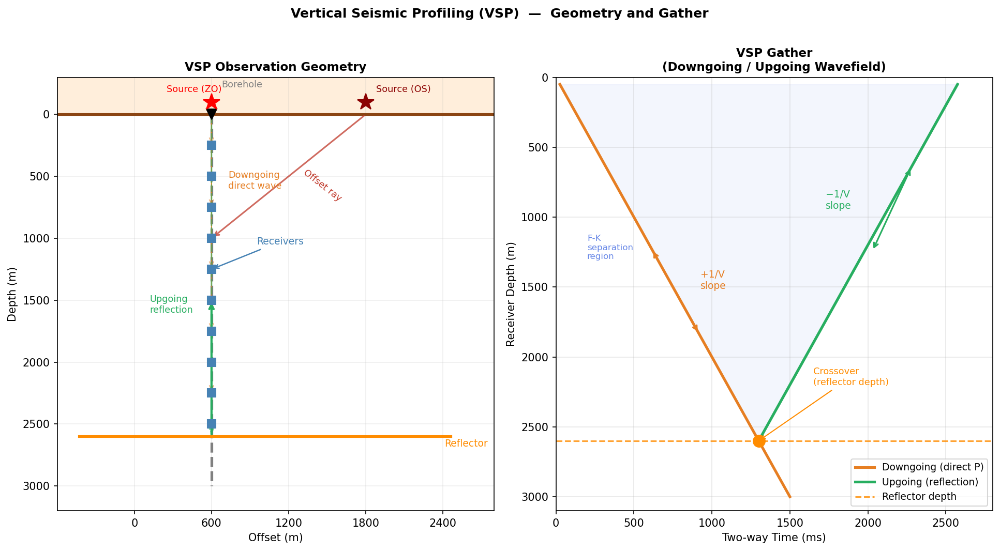
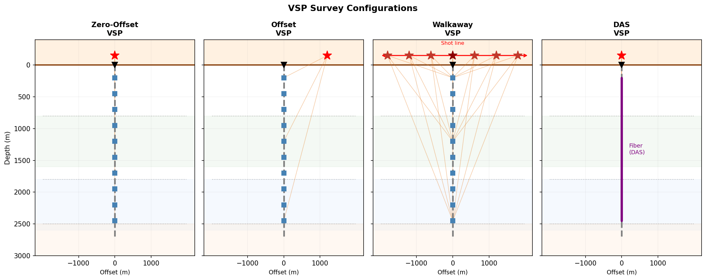

# 垂直地震剖面（VSP）

## 引言

**垂直地震剖面**（Vertical Seismic Profiling，VSP）是一种**井中地震**观测技术：检波器（或 DAS 光纤）布设于钻孔内，震源位于地表（或另一口井中），由此在地下直接记录地震波场。与地表反射地震相比，VSP 具有以下独特优势：

- **更短传播路径**：信号单程通过目的层，高频成分保留更好，分辨率更高
- **直接测量速度**：下行直达波的到时直接给出井旁层速度，无需速度分析
- **双波场记录**：同时记录下行直达波和上行反射波，可对两者分别利用
- **Q 值精确估计**：下行直达波在不同深度道之间传播路径简单，是谱比法估计 Q 的理想数据
- **高分辨率近井成像**：上行反射波经 VSP-CDP 变换可生成井旁精细反射剖面

$$
\boxed{
t_\downarrow(z) = \frac{z}{V}, \qquad
t_\uparrow(z) = \frac{2z_r - z}{V}
}
$$

下行直达波到时与深度**正斜率**相关，上行反射波到时与深度**负斜率**相关——这是 VSP 数据最标志性的特征，也是波场分离的基础。

---

## 观测几何与波场组成

### 基本几何配置

VSP 的标准设置是将**检波串**（或 DAS 光纤）固定于钻孔内，由上至下均匀分布；**震源**在地表激发。

| 要素 | 典型值 | 说明 |
|------|--------|------|
| 检波器深度范围 | 100 m – 全井深 | 最大深度取决于目的层位置 |
| 道间距 | 5–50 m（常规）；1 m（DAS） | 决定空间采样率 |
| 震源偏移距 | 0（零偏）至数公里（非零偏） | 决定照明角度 |
| 采样率 | 0.25–2 ms | 通常比地面采样更精细 |

### 波场组成

VSP 记录比地面地震更复杂，包含多种相位：

| 波型 | 视速度 | 特征 |
|------|--------|------|
| **下行直达 P 波** | $+V_P$ | 最强、最稳定；用于速度建模和 Q 估计 |
| **下行直达 S 波** | $+V_S$ | 转换波或 S 波震源激发 |
| **上行 P 反射波** | $-V_P$ | 来自下方阻抗界面，用于成像 |
| **上行转换波** | $-V_S$ | P 转 S（或 S 转 P），各向异性研究 |
| **管波（tube wave）** | $\approx$ 1000–1500 m/s | 沿井筒传播，干扰信号 |
| **直达波多次波** | $\pm V_P$ | 需压制 |

### 视速度与波场分离原理

在深度-时间（$z$-$t$）剖面（VSP gather）上，各波型呈现不同**视速度斜率**：

对于垂直入射（零偏 VSP），震源在地表（$z=0$），检波器在深度 $z$，反射界面在深度 $z_r$：

$$
t_\downarrow = \frac{z}{V_P} \quad \Rightarrow \quad \frac{\partial t_\downarrow}{\partial z} = +\frac{1}{V_P} \quad \text{（下行，正斜率）}
$$

$$
t_\uparrow = \frac{z_r}{V_P} + \frac{z_r - z}{V_P} = \frac{2z_r - z}{V_P} \quad \Rightarrow \quad \frac{\partial t_\uparrow}{\partial z} = -\frac{1}{V_P} \quad \text{（上行，负斜率）}
$$

两条线在 $z = z_r$ 处相交（交叉点，crossover），交叉点深度即反射界面深度。


*图 1：左图——VSP 观测几何示意（零偏与偏移源、下行直达波与上行反射波射线路径）；右图——典型 VSP 道集，橙色为下行直达波（正斜率），绿色为上行反射波（负斜率），两者在反射界面深度处交叉。*

---

## VSP 的主要类型

| 类型 | 震源设置 | 主要用途 | 特点 |
|------|---------|---------|------|
| **零偏 VSP**（ZVSP） | 单点，正上方 | 速度建模、Q 值、VSP-CDP 成像 | 最常见；直达波垂直入射 |
| **偏移 VSP**（Offset VSP） | 单点，水平偏移 | 成像井旁范围更大；各向异性 | 照明角度倾斜 |
| **走廊叠加 VSP** | 单点；仅利用反射窗口 | 与地面地震剖面对比 | 高分辨率"走廊" |
| **Walkaway VSP** | 地面多点，线状分布 | 侧向速度建模；各向异性测量 | 可类比折射/反射勘探 |
| **3D VSP** | 地面多点，面状分布 | 井周三维成像 | 类比 3D 地面地震 |
| **DAS VSP** | 任意设置 | 高分辨率 Q 剖面、密集阵列成像 | 光纤替代检波器串 |


*图 2：从左至右：零偏 VSP、偏移 VSP、Walkaway VSP（多震源）、DAS VSP（光纤连续接收）。颜色渐变背景表示不同地层。*

---

## 波场分离

### 目的与方法

VSP 数据处理的核心步骤之一是**分离下行波场和上行波场**，以便：
- 利用**下行直达波**估计层速度和 Q 值
- 利用**上行反射波**进行成像

由于两者视速度异号，可在频率-波数域（F-K 域）或时-深域实现分离。

### F-K 滤波法

对 VSP 道集做二维傅里叶变换至 $f$-$k_z$ 域：

$$
D(f, k_z) = \int\!\!\int d(z, t)\, e^{-i(2\pi f t - k_z z)}\, dz\, dt
$$

- **下行波**：$k_z > 0$（相速度 $v = 2\pi f / k_z > 0$，向下传播）
- **上行波**：$k_z < 0$（视速度为负，向上传播）

在 F-K 域施加二值化掩膜（mask），分别保留 $k_z > 0$ 或 $k_z < 0$ 的区域，再反变换回时-深域，即得分离后的两个波场。

!!! warning "空间假频"
    道间距 $\Delta z$ 过大时，深度域会出现**空间假频**，使上、下行波在 F-K 域发生混叠，分离效果变差。Nyquist 空间频率为 $k_{z,\max} = \pi/\Delta z$，要求 $\Delta z < V_P / (2f_\max)$。DAS 的极小道间距（1–5 m）几乎完全消除了这一问题。

### 中值滤波法

沿**等视速度轨迹**（固定斜率直线）对振幅取中值，突出并提取下行直达波，再从原始数据中减去，得到上行波场。计算效率高，对非平稳噪声也有效。

### 多项式减除法

对每个频率分量，用最小二乘多项式拟合下行波在各深度道的相位和振幅，减除后得到上行波场。

---

## VSP 的主要应用

### 层速度与速度建模

下行直达 P 波的到时直接给出各深度段的**层速度**（interval velocity）：

$$
V_P(z_1, z_2) = \frac{z_2 - z_1}{t_\downarrow(z_2) - t_\downarrow(z_1)}
$$

这是目前精度最高的速度建模方法之一，可作为全波形反演（FWI）和速度分析的硬约束。

### Q 值估计——谱比法

下行直达 P 波在 $z_1$、$z_2$ 两深度道之间的振幅谱比，正比于该段的衰减：

$$
\ln\!\left[\frac{A(f, z_2)}{A(f, z_1)}\right] = \ln\!\left(\frac{G_1}{G_2}\right) - \pi f\,\Delta t^*
$$

其中 $\Delta t^* = \Delta t / Q_\text{eff}$，$\Delta t = (z_2 - z_1)/V_P$ 为直达波传播时间差。从拟合斜率即可得到 Q 值。

!!! tip "VSP 谱比法的优点"
    相比地面地震，VSP 谱比法具有三大优势：① 路径简单（近似垂直传播），几何扩散校正容易；② 震源子波直接从井中记录，不依赖假设；③ 道间距密集（DAS VSP 可达 1 m），可获得连续 Q(z) 剖面。详细推导见[谱比法 Q 值反演](q-spectral-ratio.md)。

### 井震标定（Well-Seismic Tie）

VSP 将**测井数据**（声波、密度测井得到的阻抗剖面）与**地面地震**连接起来：

1. 用 VSP 下行直达波提取**零相位化子波**（消除震源子波影响）
2. 将测井阻抗序列与该子波褶积，得到**合成 VSP 记录**
3. 与实测 VSP 对比，建立时深关系，实现精确的层位标定

!!! note "消除 Q 效应"
    地面地震的合成记录通常忽略衰减，而 VSP 子波已经过真实介质传播，天然包含 Q 效应。这使 VSP 在深层目标的井震标定中优于仅用声波测井推算的合成记录。

### VSP-CDP 反射成像

上行反射波携带了井旁反射界面的信息。通过 **VSP-CDP 变换**，将每一对（震源位置，检波器深度，反射旅行时）映射到反射点（Common Depth Point）的空间位置：

对于零偏 VSP，下行直达波到时 $t_\downarrow(z)$ 与上行反射波到时 $t_\uparrow(z)$ 之差，给出从检波器到反射界面的单程旅行时：

$$
t_\text{refl}(z) = \frac{t_\uparrow(z) - t_\downarrow(z)}{2}
$$

利用速度模型将 $t_\text{refl}$ 转换为反射点深度，即可生成**反射成像剖面**。

VSP 成像的横向范围受限于孔径（照明角度），但纵向分辨率高于地面地震（因传播路径短、高频保留好）。

### 各向异性测量

在偏移 VSP 或 Walkaway VSP 中，P 波和转换 S 波（PS）的速度随方位角的变化反映了介质的**弹性各向异性**（如裂缝诱导各向异性 HTI）。快、慢 S 波的时间差和偏振方向可用于确定裂缝方位和密度。

### DAS VSP

将 DAS 光纤布设于钻孔中（DAS VSP）综合了两种技术的优势：

- **连续接收**：全井深同时记录，无死点
- **高空间分辨率**：道间距可低至 1 m，大幅改善波场分离和 Q 剖面精度
- **低部署成本**：无需起下钻，可与永久光缆监测共用一套系统

DAS VSP 的数据处理须额外校正**方向性响应**（$\cos^2\theta$）和**标距效应**（sinc 滤波），详见 [DAS 分布式声学传感](das.md) 及 [谱比法 Q 值反演](q-spectral-ratio.md)。

---

## Python 示例

以下代码生成本节中的两幅图。

```python
import numpy as np
import matplotlib.pyplot as plt

# ── 图 1：VSP 几何与道集 ──────────────────────────────────
fig, axes = plt.subplots(1, 2, figsize=(13, 7))

# 左图：几何截面
ax = axes[0]
ax.set_xlim(-600, 2800); ax.set_ylim(3200, -300)
ax.set_xlabel('Offset (m)'); ax.set_ylabel('Depth (m)')
ax.set_title('VSP Observation Geometry', fontweight='bold')

borehole_x = 600
ax.axhline(0, color='saddlebrown', lw=2.5)
ax.fill_between([-600,2800], [-300,-300], [0,0], color='bisque', alpha=0.6)
ax.plot([borehole_x]*2, [0, 3000], color='gray', lw=2.5, ls='--')
ax.plot(borehole_x, 0, 'v', color='k', ms=10)

recv_depths = np.arange(250, 2750, 250)
for z in recv_depths:
    ax.plot(borehole_x, z, 's', color='steelblue', ms=8)

refl_d = 2600
ax.axhline(refl_d, xmin=0.05, xmax=0.9, color='darkorange', lw=2.5)
ax.text(2750, refl_d+80, 'Reflector', ha='right', color='darkorange', fontsize=9)

for sx, color, label in [(600, 'red', 'Source (ZO)'), (1800, 'darkred', 'Source (OS)')]:
    ax.plot(sx, -100, '*', color=color, ms=16)
    ax.text(sx + (80 if sx > 800 else -350), -200, label, color=color, fontsize=8.5)

# 下行射线（零偏）
for z in recv_depths[::2]:
    ax.annotate('', xy=(borehole_x, z), xytext=(600, 0),
                arrowprops=dict(arrowstyle='->', color='#e67e22', lw=0.9, alpha=0.55))
# 上行射线
ax.plot([borehole_x]*2, [0, refl_d], color='#27ae60', lw=1.5, ls='dashed', alpha=0.6)
ax.annotate('', xy=(borehole_x, 1500), xytext=(borehole_x, refl_d),
            arrowprops=dict(arrowstyle='->', color='#27ae60', lw=2.0))
ax.text(borehole_x-480, 1600, 'Upgoing\nreflection', color='#27ae60', fontsize=8.5)
ax.text(borehole_x+130, 600, 'Downgoing\ndirect wave', color='#e67e22', fontsize=8.5)
ax.grid(True, alpha=0.2)

# 右图：VSP 道集
ax = axes[1]
V = 2000.0; z_r = 2600.0
depths = np.linspace(50, 3000, 500)
t_down = depths / V * 1000
t_up   = (2*z_r - depths) / V * 1000
mask   = depths < z_r

ax.plot(t_down, depths, color='#e67e22', lw=2.5, label='Downgoing (direct P)')
ax.plot(t_up[mask], depths[mask], color='#27ae60', lw=2.5, label='Upgoing (reflection)')
ax.axhline(z_r, color='darkorange', lw=1.5, ls='--', alpha=0.8, label='Reflector depth')
ax.plot(z_r/V*1000, z_r, 'o', color='darkorange', ms=11)
ax.annotate('Crossover', xy=(z_r/V*1000, z_r), xytext=(z_r/V*1000+350, z_r-400),
            fontsize=9, color='darkorange',
            arrowprops=dict(arrowstyle='->', color='darkorange'))
ax.fill_betweenx(depths[mask], t_down[mask], t_up[mask], alpha=0.06, color='royalblue')
ax.set_xlabel('Time (ms)'); ax.set_ylabel('Receiver Depth (m)')
ax.set_title('VSP Gather', fontweight='bold')
ax.set_ylim(3100, 0); ax.set_xlim(0, 2800)
ax.legend(loc='lower right', fontsize=9)
ax.grid(True, alpha=0.3)

plt.tight_layout()
plt.savefig('docs/assets/images/vsp_overview.png', dpi=150, bbox_inches='tight')
plt.show()
```

---

## 参考文献

- Aki, K., & Richards, P. G. (2002). *Quantitative Seismology* (2nd ed.). University Science Books.
- Hardage, B. A. (1983). *Vertical Seismic Profiling. Part A: Principles* (2nd ed.). Geophysical Press.
- Hinds, R. C., Anderson, N. L., & Kuzmiski, R. D. (1996). *VSP Interpretive Processing: Theory and Practice*. Society of Exploration Geophysicists.
- Balch, A. H., & Lee, M. W. (1984). *Vertical Seismic Profiling: Technique, Applications and Case Histories*. International Human Resources Development Corp.
- Mateeva, A., Lopez, J., Potters, H., Mestayer, J., Cox, B., Kiyashchenko, D., … & Berlang, W. (2014). Distributed acoustic sensing for reservoir monitoring with vertical seismic profiling. *Geophysical Prospecting*, 62(4), 679–692.
- Tonn, R. (1991). The determination of the seismic quality factor Q from VSP data: A comparison of different computational methods. *Geophysical Prospecting*, 39(1), 1–27.
- Toverud, T., & Ursin, B. (2005). Comparison of seismic attenuation models using zero-offset vertical seismic profiling (VSP) data. *Geophysics*, 70(2), F17–F25.
